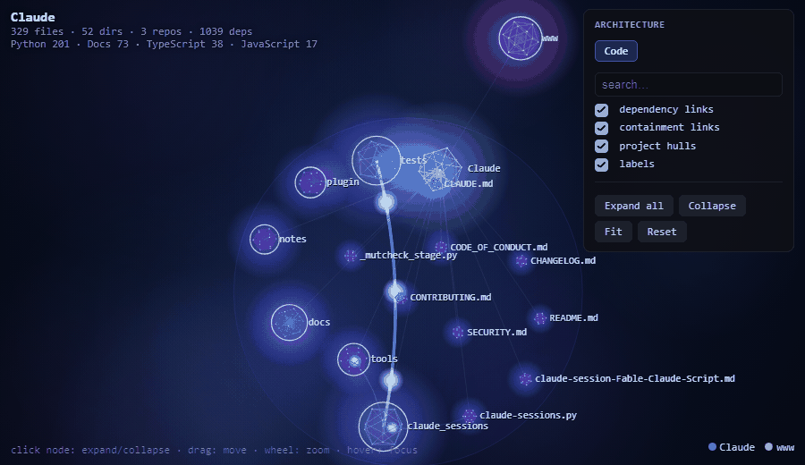

# Architecture graph

Reached with `n` → `o` in the sessions menu, or the **Graph** project tab in the GUI.

An interactive, **whole-project dependency graph** rendered as a self-contained HTML (no
CDN), opened in your browser.

{ width="820" }

- **Expandable hierarchy** — opens at the workspace root + its repos (sized by importance); **click a node to drill in** (repo → module → file) with a smooth opening animation. The complete tree is embedded, so any size is explorable via progressive disclosure; small projects auto-expand fully.
- **Real dependencies, multi-language** — edges come from actual imports: Python `import` (AST) + C/C++ `#include` + C# `using`→namespace + JS/TS `import`/`require`. Edges **lift to the visible level**: collapsed shows repo↔repo bundles, expanded reveals module- and file-level links.
- **Reads as architecture** — each project sits in its **own contained bubble** (never overlaps others), nodes sized by importance (file count + dependency degree), colored per project, drawn as **rotating wireframe cages** — a geodesic hull holding a population of interior points, so a node reads as a thing made of things — with flowing connection particles on a neural-network-style canvas. Detail follows apparent size: a node large enough on screen gets the subdivided cage (42 vertices, 120 edges) and its interior cloud, a small one gets the plain icosahedron, and below ~6px a dot.
- **Controls** — search (expands the path to matches), filters (dependency / containment / hulls / labels), Fit / Reset / Expand-all / Collapse; zoom-aware labels; hover highlights neighbors. Built graph is **cached** (`.archeus/connections-cache.json`) so reopening is instant; `r` forces a rebuild.

The animation above is captured from the real HTML view (`docs/graph-real.gif`, regenerate
with `py tools/capture_graph_gif.py`).

The same dependency edges and importance ranks feed [project memory](memory.md) and
[adaptive agent selection](agents.md#adaptive-agent-selection-g) — the graph is not a
separate analysis, it is the one archeus already runs.
