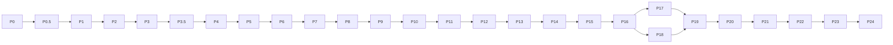

# Archeus V1 — Rearchitecture Plan

Status: planning complete, implementation not started. Branch `archeus-v1-rearchitecture`,
written 2026-09-23 against `main` @ `b778226`.

This is the entry point. It states decisions and links the topic documents instead of
restating them; where a topic has no document of its own (policy, planning, security,
observability, phases) the detail is here.

| Topic | Document |
|---|---|
| Design research, IA, flows, wireframes | [../design/ARCHEUS_V1_DESIGN_RESEARCH.md](../design/ARCHEUS_V1_DESIGN_RESEARCH.md) |
| Design system | [../design/ARCHEUS_V1_DESIGN_SYSTEM.md](../design/ARCHEUS_V1_DESIGN_SYSTEM.md) |
| Target architecture | [target-architecture.md](target-architecture.md) |
| Domain model | [domain-model.md](domain-model.md) |
| State machines | [state-machines.md](state-machines.md) |
| Resource router | [resource-router.md](resource-router.md) |
| Execution | [execution-architecture.md](execution-architecture.md) |
| Context and knowledge | [context-and-knowledge.md](context-and-knowledge.md) |
| API and realtime | [api-and-realtime.md](api-and-realtime.md) |
| UI architecture | [ui-architecture.md](ui-architecture.md) |
| Migration and gap analysis | [migration-plan.md](migration-plan.md) |
| Testing | [testing-strategy.md](testing-strategy.md) |
| Decisions | [decisions/](decisions/) |
| External research | [../research/external-references.md](../research/external-references.md) |

Source documents (local, gitignored — summarised faithfully here, not committed):
`docs/architecture/reference/Archeus_v1_System_Specification.md`, `Archeus_v1_Implementation_Plan.md`,
`Archeus_v1_Architecture_Design_and_Plan_FIXED.pdf`, `Archeus_v1_Architecture_Designs.pptx`.

---

## 1. Executive summary

Archeus today is a memory and workspace layer around Claude Code / Codex / pi sessions that the
user drives. Archeus V1 becomes a **persistent AI colleague that drives the work**: the user
states outcomes; Archeus turns them into missions, assembles context, plans, asks when policy
says so, routes work across harnesses/accounts/models by the user's priority and allocation,
executes on the user's machine, verifies and reviews, updates a trustworthy picture of the
world, and learns — controllable from desktop, phone and terminal.

The build is a **stdlib-only Python modular monolith ("Archeus Core")** with SQLite as the
source of truth and a transactional event log, a local execution node running harness CLIs
under capability-removal policy, an SSE event stream, and **one TypeScript/React SPA** for
desktop, web and a PWA on phones. It grows beside the current package (strangler); working
capabilities are reused through narrow seams; the legacy app retires only when a capability
checklist passes.

The minimal V1 slice that passes all acceptance scenarios is in §31.2; the release gate in §34.

## 2. Product definition

> **Tell Archeus what you want. It figures out what needs to happen.**

Archeus is a persistent AI operating layer for a person's digital and project world. It
understands current state, history and durable knowledge; turns intent into missions; gathers
relevant context; plans and executes work; coordinates agents and resources; verifies results;
updates state; learns from meaningful feedback; and remains controllable across devices.

The operating loop: **observe → understand → reason → suggest → plan → ask/approve → act →
verify → update state → learn → continue**. Stage-to-module mapping:
[target-architecture.md §6](target-architecture.md).

Principles: the prompt's 22 principles are condensed into eight checkable design rules in
[design research §15](../design/ARCHEUS_V1_DESIGN_RESEARCH.md).

## 3. Current-state findings

Detailed archaeology: [design research §2–8](../design/ARCHEUS_V1_DESIGN_RESEARCH.md) and
[migration-plan.md §2](migration-plan.md). Key facts:

- 91 Python modules (~43k lines), ~16k lines of vanilla web, zero runtime dependencies, Windows
  first, ~1,300 tests with many mutation-verified gates.
- No database: JSON/JSONL files across `~/.claude`, each account's config dir and each project's
  `.archeus/`. No domain event log (the event file is diagnostics).
- ~150 UI-shaped HTTP routes, polling only; jobs are in-process threads; approvals are job gates.
- The strongest coupling: `gui_api._install_bridge` monkeypatches TUI prompt functions so domain
  flows written for the terminal can run inside GUI jobs; the headless model runner and quota
  preflight branch on which UI is active; cancellation reads a thread-local.
- Real, reusable capabilities: multi-account rotation and quota latching, usage polling,
  newest-model following, memory graph + BM25 recall with relation expansion, lessons,
  repository discovery (submodules/worktrees), import-graph extraction, worktree board, provider
  failover proxies, notifications, a platform seam for terminal input, a hex-first palette system
  with contrast tests.
- Gaps against V1: no mission/plan/task objects, no policy engine, no router, no verification,
  no automation beyond scheduled memory refresh and loops, no remote/mobile surface, hook guard
  fails open, pi has no interception point.

## 4. Why the current architecture is insufficient

| V1 requirement | Why today's architecture cannot meet it by extension |
|---|---|
| Missions survive restarts and session rotation | work state lives in thread memory and a markdown file; there is nothing to resume |
| Trustworthy, auditable current state | no transactions, no event log, state reconstructed by polling many files |
| Policy-controlled autonomy | permissions are Claude Code settings the user edits; no per-action evaluation, no approvals bound to actions |
| Explainable routing across accounts | rotation is a sticky threshold with no record of why |
| Multi-device control | loopback-only server, per-run token, no device identity, polling |
| Clients without business logic | domain flows are written against TUI prompts |
| Knowledge that evolves | memory graph has implicit schema, no supersession links, written to two places |

## 5. Target product model

- Mental model and IA: [design research §16–17](../design/ARCHEUS_V1_DESIGN_RESEARCH.md) —
  **Now · Work · World · Control** plus the **Attention** layer and **command bar** (ADR-0014).
- Conversation model: one primary conversation + mission threads, live cards, deterministic
  control verbs (ADR-0006, ADR-0015).
- Presence comes from continuity: since-you-left digest, specific progress, the thread.

## 6. Target domain model

[domain-model.md](domain-model.md). Key choices: current state / history / knowledge kept in
different stores; Principal model (only user devices approve; executions cannot create
missions); Session bound to (harness, account); model is a per-execution attribute; Approvals
bound to action hashes; RouteDecision and PolicyDecision persisted.

## 7. Target technical architecture

[target-architecture.md](target-architecture.md): modular monolith Core (ADR-0001), stdlib only
(ADR-0003), single writer + transactional outbox (ADR-0002), outbox consumers for every side
effect, local in-process execution node with a remote-node contract (ADR-0008), SSE
wake-and-requery (ADR-0009), one SPA (ADR-0011). Core lifecycle: single-instance lock,
discovery file, runs with the GUI closed, optional autostart, sleep → GRACE → reconcile.

## 8. Target data architecture

[target-architecture.md §5](target-architecture.md): `~/.archeus/archeus.db` (SQLite WAL,
`user_version` migrations, daily + pre-migration backups), content-addressed artifacts,
`run/` for liveness and e-stop. Harness homes and legacy stores are read, not owned (ADR-0019).

## 9. Context architecture

[context-and-knowledge.md §2](context-and-knowledge.md): levels L0–L4 with budget shares,
deterministic retrieval (BM25 reuse + anchors + relation expansion + temporal + explicit pins),
deterministic scoring, stored context packages with reasons, conflicts, gaps and exclusions.

## 10. Knowledge architecture

[context-and-knowledge.md §3–5](context-and-knowledge.md): typed items with provenance, scope,
confidence, validity windows and supersession; EXTRACTED/INFERRED/AMBIGUOUS relations;
promotion pipeline with corroboration; forget with dry-run; SQLite graph via recursive CTEs;
no vector store in V1 (ADR-0012, ADR-0013).

## 11. Mission architecture

- Lifecycle: [state-machines.md §2](state-machines.md). Learning is not a state (`learned_at`).
- **Intent pipeline** (`core/missions/intent.py`):
  1. Deterministic grammar (`application/grammar.py`) recognises control verbs and object
     references (`pause <mission>`, `approve`, `why <x>`, `status`, `stop all`, `remember …`).
     Matched → executed/answered with no model call.
  2. Otherwise a brain call (structured output, schema `intent.v1`) classifies: question /
     new_work / continue_work / feedback / preference / idea, with target refs, ambiguities and
     a confidence.
  3. Ambiguity above threshold or a **conflict with CONFIRMED knowledge** → a Challenge block
     (the user chooses) instead of a mission. Archeus is expected to disagree when evidence
     disagrees (spec principle 15).
  4. new_work → Mission in CREATED with explicit/inferred requirements separated; the mission
     card asks for confirmation unless the autonomy profile allows auto-start for this scope.
- **The brain** (ADR-0006): Core-side structured-output calls through the router (brain is a
  routed consumer with `brain_reserve_pct`), stable prompt prefixes for cache hits, outputs
  validated against JSON schemas in `core/brain/schemas/`, then applied as commands by Core.
  The brain's principal can *propose*; it can never approve.
- Progress is computed from the task DAG weighted by estimates — never reported by an agent.

## 12. Planning architecture

- Planner (`core/planning/planner.py`) = brain call on a `large` tier model (blast radius: a
  plan error replicates into every task), schema `plan.v1`: tasks with the four-part dispatch
  contract (objective, expected output, allowed action classes/tools, boundaries),
  `depends_on`, `touches[]` globs, `kind`, `capabilities_required`, `min_model_tier`,
  `estimate`, verification per task, approval points, risks, rollback, cost band.
- Validation (deterministic, `dag.py`): acyclic; every `touches` overlap between parallel tasks
  serialised; every task has a verifier or is `human`; action classes known; cost band computed
  from task count × tier × size (bands only).
- Policy pre-evaluation of the whole plan decides `plan_auto_approved` vs `APPROVAL_REQUIRED`
  (state-machines §2) and marks approval points on tasks that will ASK at action time.
- Editing a plan creates a new version; approvals of old versions are SUPERSEDED.
- Replanning receives: previous plan, failing evidence, checkpoints, review verdict; budget 2.

## 13. Policy architecture

Status **DECIDED** (ADR-0007).

**Question answered:** *May Archeus perform this exact action, in this exact context, right now?*

**Inputs:** canonical action `{class, target, argv?, diff_hash?, environment?, cost?}`, actor
principal, mission/task/execution, project/workspace, resource, current state (e.g. mission
paused, e-stop armed).

**Action classes** (closed list in `core/domain/actions.py`): `read`, `web`, `write_repo`,
`exec`, `git_commit`, `git_push`, `deploy`, `external_comm`, `destructive`, `spend`,
`personal_data`, `install`, `credential`.

**Evaluation** (`core/policy/engine.py`), pure and deterministic:

```python
def evaluate(action, ctx) -> PolicyDecision:
    if estop_armed():                       return deny("emergency stop armed")
    rules = matching_rules(action, ctx)     # all scopes GLOBAL→USER→WORKSPACE→PROJECT→MISSION→TASK→ACTION
    for r in rules_by_scope_desc(rules):    # most specific first...
        if locked_above(r, rules):          #   ...but a locked rule at a broader scope cannot be loosened
            continue
    decision = strictest(                   # combine: DENY > ASK > ALLOW_WITHIN_BOUNDARY > ALLOW
        effective(rules))                   # effective = most specific non-shadowed rule per class,
                                            # locked broader rules always included
    if decision is ASK and one_shot_allow_matches(action):  return allow(consume=approval)
    if decision is ALLOW_WITHIN_BOUNDARY and not inside(action, boundary): return ask_or_deny(...)
    return record(decision, rules, reason=render(rules))
```

- DENY is always locked. A broader locked ASK cannot be turned into ALLOW by a project rule.
- `unclassified` exec actions (shell pipelines, eval, decoding into a shell) are evaluated as the
  strictest class active for the task.
- **Profiles** are named rule bundles applied at a scope: *Careful* (everything but read/web =
  ASK), *Standard* (read/web ALLOW; write_repo/exec ALLOW_WITHIN_BOUNDARY of the project worktree;
  git_commit on task branches ALLOW; merge to main, push, install, spend > band ASK; deploy,
  external_comm ASK; destructive on prod DENY), *Autonomous* (Standard + merge/push to non-default
  branches ALLOW). Default profile at first run: **Standard**.
- Spec examples as rules: web research ALLOW (GLOBAL); modify project repository
  ALLOW_WITHIN_BOUNDARY (PROJECT, paths = project roots, branches = `archeus/*`); production
  deployment ASK (GLOBAL, `environment: prod`, locked); external communication ASK (GLOBAL);
  destructive production operation DENY (GLOBAL, locked).
- **Enforcement points:** (1) Core before its own actions (merge, push, deploy, notifications to
  third parties); (2) the execution environment (capability removal —
  [execution-architecture.md §2](execution-architecture.md)); (3) the per-tool hook (Claude Code)
  or sandbox (Codex). Harnesses with `enforcement: none` only receive all-ALLOW tasks.
- **Audit:** every ASK/DENY and every mission-scoped ALLOW produces a PolicyDecision; policies
  are versioned and every change is an event; `POST /v1/policies/simulate` answers "what would
  happen if…" without acting.

## 14. Resource Router

[resource-router.md](resource-router.md) (ADR-0005): capability → enforcement → policy →
restrictions → health → allocation (ceiling semantics, stale-usage penalty, budgets when the
window is unknown, brain reserve) → ordering (affinity, preference, priority, tier fit, health,
cost, latency) → persisted, replayable, explainable decision → fallback only as policy allows.

## 15. Execution architecture

[execution-architecture.md](execution-architecture.md): INTENT-before-spawn, process registry
with pid + create_time, boot reconciliation, cooperative pause, stop by verified pid, ASK
mid-execution via hook halt + resume with a one-shot allow, Core-derived checkpoints, worktrees
at node-computed paths, Core-only merge/push, e-stop with and without Core.

## 16. Verification

[execution-architecture.md §8](execution-architecture.md) and
[state-machines.md §6–7](state-machines.md): verifier per artifact kind, GenericVerifier = human
acceptance, verification ERROR ≠ FAILED, review on an independent resource when possible
(`independent=false` recorded otherwise). Only verified + reviewed missions become COMPLETED.

## 17. Automation

Status **DECIDED** (ADR-0020). Model in [domain-model.md §9.4](domain-model.md), lifecycle in
[state-machines.md §8](state-machines.md).

- Triggers: `event` (type + subject pattern + payload predicate, e.g.
  `repository.model_added where project=Payments and path !~ tests/`), `schedule` (cron subset:
  minute hour dom month dow, evaluated in Core's scheduler), `condition` (a query evaluated on a
  schedule, e.g. "any mission blocked > 24 h"), `state` (entity enters a state).
- Pipeline: event → matcher (outbox consumer) → claim run (single transaction) → conditions →
  policy (template action classes under the automation's overlay) → mission from template →
  normal mission loop → verify → update → notify.
- Guards: cause-chain depth cap (escalate), rate limit, suspension after repeated escalation,
  simulation against the last 30 days before enabling.
- First templates (from the implementation plan): document a new model file; update project
  state after a mission completes (built-in, not user-visible); notify on blocked; reroute on
  account limit (built-in router behaviour); refresh architecture on repository change; scheduled
  research briefing; plus migrated legacy loops and auto-memory refresh.

## 18. Event system

[api-and-realtime.md §3](api-and-realtime.md) and [state-machines.md §14](state-machines.md):
events written in the same transaction as state; integer `seq` cursor; typed registry in one
file; consumers with cursors and idempotent effects; retention with 410 resync; events describe
facts, consumers decide meaning.

## 19. Repository understanding

[context-and-knowledge.md §6](context-and-knowledge.md): registration via `repos.find_git_repos`,
cheap HEAD check, deterministic pass (languages, manifests, docs, agent config, import graph via
`connections.build_hierarchy`, commands) with content-hash caches, optional model pass,
inspection diffs, architecture constraints with drift detection and a three-way resolution.

## 20. External source understanding

REFERENCE knowledge items with URL, inspected_at, revision, observations, design area,
confidence, adopted/adapted/rejected/deferred — the format used for this plan's own research in
[../research/external-references.md](../research/external-references.md).

## 21. GUI architecture

[ui-architecture.md](ui-architecture.md): one SPA, one navigation table, surfaces Now / Work /
World / Control + Attention + command bar, canonical inspector with a Why tab, approval contract,
2D graph view, repo UI gates carried over.

## 22. Mobile architecture

PWA of the same SPA over a user-operated HTTPS tunnel (Tailscale Serve recommended), device
pairing with one-time codes, scoped revocable tokens, ntfy push with deep links, step-up PIN for
destructive approvals, bottom-tab adaptation. Status **PROPOSED** (ADR-0010); decided parts:
no native app in V1, no Mac or Apple developer account required.

## 23. TUI architecture

[ui-architecture.md §6](ui-architecture.md): thin CLI in the slice (status, approve, pause,
route why, estop, pair); full TUI on the API later in V1 reusing `term.py` and `render.py`;
glyphs from the design system; legacy TUI until retirement.

## 24. Spatial visualization

[design research §26](../design/ARCHEUS_V1_DESIGN_RESEARCH.md) and
[ui-architecture.md §5](ui-architecture.md): 2D fine-line graph, every visual variable mapped to
a domain fact, energy only for live executions, list equivalent, 3D optional later (ADR-0016).

## 25. Design system

[../design/ARCHEUS_V1_DESIGN_SYSTEM.md](../design/ARCHEUS_V1_DESIGN_SYSTEM.md): quiet
instrument, fixed state colours with glyphs, one signature element (the thread), tokens from one
table for CSS/TS/ANSI, accessibility floors gated (ADR-0017).

## 26. API / realtime

[api-and-realtime.md](api-and-realtime.md): commands/queries, one route table generating docs
and the TS client, idempotency keys, typed errors, SSE ids-only with replay, separate stream
pool, leader-tab stream sharing.

## 27. Security

| Concern | Design |
|---|---|
| Authentication | device tokens (typed `dev_`/`node_`/`exe_`, 256-bit, hashed at rest, `hmac.compare_digest` on bytes); local token via 0600 discovery file; pairing with 2-minute single-use rate-limited codes shown only in a local session |
| Authorization | Principal scopes (observe/control/approve/admin; propose for brain; report/checkpoint/request_approval for executions); route table declares the required scope per route |
| Transport | loopback by default; remote only via HTTPS tunnel; Host/Origin allowlist includes paired hostnames only; fetch-metadata allowlist for browsers; never trust source address; tokens never in query strings |
| Web | strict CSP `script-src 'self'`, no inline handlers; agent output rendered as text or sanitised markdown; approval cards show canonical actions, never model prose alone |
| Policy enforcement | capability removal first (no push credentials in executions, sandbox flags, tool allowlists), fail-closed hook for Archeus executions, Core-only merge/push/deploy/external_comm |
| Credential isolation | accounts are node-bound; Core stores metadata and usage only; API keys at rest via DPAPI (`ctypes`) on Windows, 0600 files on POSIX; env scrubbed per execution (`config.account_env`) |
| Destructive actions | `destructive` class; DENY on prod by default (locked); ASK elsewhere with step-up |
| Approvals | bound to hash(action + policy version + plan version); single-use; expiring; superseded on replan; idempotent decisions |
| Remote access | opt-in; documented threat model: whoever holds an `approve` device can approve anything policy lets be asked; revoke closes streams immediately |
| Event security | events carry scope; SSE filters by device scope; payloads small and secret-free; artifacts referenced by hash, served only with a scoped token |
| E-stop | Core-side (all executions stop, automations disabled, routing refused) and Core-less (STOP sentinel + `archeus estop`) |
| Supply chain | Core stdlib-only; SPA dependencies pinned with lockfile, built in CI, audited (`npm audit` gate); `git clone` of anything uses `proc.remote_url_ok` + `--` (existing rule) |
| Prompt injection | fetched content, meeting notes and agent output are data: never parsed as commands; control verbs only from user principals; brain outputs validated against schemas before any command |

## 28. Observability

Everything is reconstructable from the event log plus decision records:

| Question | Answered by |
|---|---|
| What happened / what changed | events filtered by subject/time; mission Timeline |
| Why did it happen | PolicyDecision, RouteDecision, context package reasons, plan version, cause_chain |
| What resource was selected | RouteDecision (+ input snapshot for replay) |
| What failed / what was retried | execution exit reasons, attempts, three-strikes records, verification outputs |
| Model usage and cost | UsageLedger (per execution/mission/account/model), UsageSnapshots |
| Context size | context package token totals per level |
| Hand-offs | checkpoints with triggers |
| Automations | AutomationRun rows with skip/escalate reasons |
| What the user needs to do | Attention query |

Metrics derived nightly into a `metrics_daily` table (missions completed/failed, median time to
complete, approvals per mission, fallback rate, verification failure rate, cost per mission
band, context tokens per task kind) and shown in Control → About → Health. Diagnostics (Core
crashes, consumer errors) go to `~/.archeus/logs/core.log` with rotation; the `archeus doctor`
command checks DB integrity, consumer lag, stuck executions, hook installation.

## 29. Migration

[migration-plan.md](migration-plan.md): strangler, subsystem-by-subsystem classification, P0.5
seams, data importers, ownership table, retirement checklist, rollback.

## 30. Testing

[testing-strategy.md](testing-strategy.md): judge-first acceptance suite with a traceability
table over all four acceptance sources, contract tests for adapters, property tests for router
and policy, design gates, mutation verification and floors.

## 31. Implementation phases

Sequencing changes from the source plan (0–24), each justified:

| Change | Why |
|---|---|
| **P0.5 Seams** inserted, deliberately narrow | V1 must import working logic (process control, structured model call, quota assessment, import graph) without dragging in UI modules; restructuring retiring code has no V1 value |
| Judge + fake harness + frozen adapter contract **in P1** | migration-kit rule: no judge, no exit condition; everything after P1 is measured against it |
| Security basics (principals, tokens, audit) **in P2** instead of P20 | identity and audit are properties of every row; retrofitting them is a rewrite |
| **P3.5 API + SSE + walking skeleton** added | a disposable end-to-end run (the migration kit's substitute for a bakeoff in redesigns) that makes every later phase visible; skeleton uses the fake harness only |
| **Policy (P9) gates real adapters** | no real harness may run before the policy engine and capability removal exist |
| Brain as structured-output calls (P7), not an MCP server | P7 would otherwise depend on the execution stack (P11); calls go through the router seam with a fixed account until P10 |
| P20 = hardening, P21 = observability *views* | the mechanisms exist from P2 (events, decisions); these phases add breaker drills, secrets review, trace UI and metrics |

### 31.1 Phase table

Every phase ends at a gate: evidence produced, acceptance met, sign-off = starting the next
phase. Legacy tests stay green in every phase.

**P0 — Archaeology, feasibility and research** · *done in this planning phase, except the gate
item below*
- Objective: understand the current product and references; decide whether V1 proceeds.
- Deliverables: this document set; ADRs; external references.
- Gate: user sign-off on this plan **and** the subscription-terms question (ADR-0021).
- Risk: building an agent that uses subscription accounts headlessly in a way the provider does
  not permit → the design must run unchanged with API-key accounts.

**P0.5 — Seams**
- Depends: P0. Affected: `proc`, `memory`, `quota`, `connections` (migration-plan §3).
- New: none (functions added to legacy modules; re-exports).
- Tests: existing suite green; new unit tests for each extracted function; mutation check that
  legacy callers still route through the extracted function.
- Acceptance: `archeus/` can import the four seams without importing `ui`, `gui_api` or `main`
  (an import-graph test asserts it).

**P1 — Domain model, contracts and the judge**
- Depends: P0.5. New: `archeus/core/domain/*` (entities, values, states table, events registry,
  action classes, ids), `harnesses/base.py` (frozen contract), `harnesses/fake.py`,
  `tests/v1/judge/*` (all scenarios written, failing/xfail), `tests/v1/unit/test_state_tables.py`.
- Tests: invariants, serialisation, state-table ↔ diagram parity, fake-harness scripts.
- Acceptance: every entity of domain-model.md exists as a dataclass with validation; the judge
  runs and reports N scenarios pending; the adapter contract has a docstring spec and a fake.
- Risks: over-modelling → rule: fields not needed by a judge scenario are deferred.

**P2 — Persistence, event log, identity basics**
- Depends: P1. New: `infra/db` (connection, writer thread with futures + idempotency, migrations
  `0001_init.sql`, backup), `infra/eventlog` (outbox, consumer cursors/effects, retention),
  `infra/artifacts`, Principal/Device/token tables, audit fields.
- Tests: crash-safety (kill between write and consumer), idempotent re-delivery, optimistic
  concurrency conflicts, migration + backup, writer throughput (≥ 500 commands/s on the dev box).
- Acceptance: G1 and G4 judge tests pass at the persistence level.
- Risks: SQLite contention → single writer by design; readers `query_only`.

**P3 — State machines**
- Depends: P2. New: `transition()`, guards, all machines of state-machines.md.
- Tests: every edge allowed, every non-edge rejected (generated), guards pure.
- Acceptance: illegal transitions return 422 with machine/from/to.

**P3.5 — API, SSE, walking skeleton**
- Depends: P3. New: `api/server.py` (pools), `api/routes.py`, `api/sse.py`, `api/auth.py` (local
  token, host/origin, CSP), `cli/main.py` (`core`, `status`), minimal SPA shell (Now + Work
  lists), generated API doc + TS client, Core lifecycle (lock, discovery file).
- Flow: create mission via API → fake plan → fake execution → events → SPA updates.
- Tests: SSE replay with Last-Event-ID, 410 resync, pool isolation (streams cannot starve
  commands), CSP headers, generated artefacts fresh.
- Acceptance: skeleton demo recorded; judge S1 passes with fake brain + fake harness.

**P4 — World model and repository inspection**
- Depends: P3.5. New: `world/projects.py`, `world/inspection.py` (reusing `repos`,
  `connections`), `world/drift.py`, `world/digest.py`; architecture constraints.
- Tests: fixture repos (Python, TS, submodule, worktree), drift positive/negative per
  constraint kind, cheap HEAD check.
- Acceptance: S7, S13 (deterministic part), S14 pass.

**P5 — Context engine**
- Depends: P4. New: `context/*`, `infra/search/bm25.py` (reusing `recall`).
- Tests: budgeting per level, reasons present for every item, superseded excluded, stale
  labelled, conflicts detected, deterministic ordering.
- Acceptance: G2 passes; context preview endpoint.

**P6 — Knowledge and learning**
- Depends: P5. New: `knowledge/*` (items, relations, promote, forget, ingest), learning pass
  consumer; meeting import.
- Tests: supersession chains, corroboration gating, forget dry-run, idempotent import.
- Acceptance: S8, S9 pass.

**P7 — Intent, brain, mission engine**
- Depends: P6. New: `application/grammar.py`, `missions/intent.py`, `brain/calls.py`
  (runner from P0.5 seam, fixed account until P10), schemas, challenge logic, mission service.
- Tests: grammar table tests (every control verb, no model call), schema validation failures
  handled (retry once, then ask the user), challenge on conflicting knowledge.
- Acceptance: S15, SP3 pass; S1 passes with the real brain against a recorded fixture.

**P8 — Plan engine**
- Depends: P7. New: `planning/*`.
- Tests: DAG validation, serialisation of overlapping `touches`, versioning, supersession of
  approvals, cost bands.
- Acceptance: plans for all judge scenarios validate; S6 replan path passes with the fake harness.

**P9 — Policy and autonomy**
- Depends: P8. New: `policy/*` (engine, rules, profiles, approvals, simulate), hook evaluate
  endpoint, step-up.
- Tests: precedence/lock property tests, approval replay/expiry/supersede/idempotency,
  unclassified exec, e-stop deny.
- Acceptance: S5, G6 (policy part) pass. **Gate:** real adapters may be enabled after this.

**P10 — Resource Router**
- Depends: P9. New: `routing/*`; UsageSnapshot consumer (reusing `usage.fetch_usage`), ledger.
- Tests: property tests (never exceed ceiling at start, DENY never selected, replay equality),
  fake usage feed scenarios.
- Acceptance: S3, S4 (routing part), S12 pass.

**P11 — Execution orchestrator**
- Depends: P10. New: `execution/manager.py`, `node/*` (supervisor, registry, worktrees, estop),
  `harnesses/claude_code` (headless + policy hook + pressure), `harnesses/codex`.
- Tests: contract tests on recorded streams; reconciliation with real child processes (a Python
  stub CLI); PID-reuse safety; cooperative pause; stop; e-stop without Core.
- Acceptance: S1 and S5 pass against the **real** Claude Code adapter in the opt-in contract
  suite; G5, G7 pass.
- Risks: CLI flag drift → adapters pin tested versions and report `MISCONFIGURED` on mismatch.

**P12 — Session and context continuity**
- Depends: P11. New: `execution/checkpoint.py`, `execution/handoff.py`.
- Tests: pressure from recorded usage, PreCompact backstop, account-change hand-off creates a new
  session, mission state unchanged.
- Acceptance: S2, S4 (hand-off part) pass.

**P13 — Verification and review**
- Depends: P12. New: `verification/*`, integration (merge-back) machine.
- Tests: verifier ERROR vs FAILED, human acceptance path, independent flag, merge conflict →
  BLOCKED + follow-up task.
- Acceptance: S6 passes end-to-end; S1 completes only after verification + review.

**P14 — Event bus and automation**
- Depends: P13. New: `automation/*`, templates, simulation.
- Tests: loop guard, claim-and-advance under concurrent ticks, schedule parsing, suspension.
- Acceptance: S10, S10b pass.

**P15 — Presence, pairing, remote, mobile**
- Depends: P14 (and P3.5). New: pairing routes, device scopes enforcement, remote host
  allowlist, ntfy notifier, PWA manifest + service worker (offline shell only), mobile layouts.
- Tests: pairing expiry/rate limits, revoked device stream closes, token-in-query rejected,
  PWA install on Android/iOS (manual checklist), ntfy payload contains no secrets.
- Acceptance: S11, S14 (cross-device) pass.

**P16 — GUI information architecture**
- Depends: P15. New: full SPA surfaces, tokens pipeline, design gates, Qt shell attach.
- Tests: E2E per surface, contrast, keyframes, dead-space/overflow audit, accessibility checks
  (axe-core in Playwright), floors.
- Acceptance: G3 (GUI part); Apple-skill five-lens review passes with no Critical findings.

**P17 — TUI**
- Depends: P16 (shares nav table and presentation table). New: `cli/tui/*`.
- Tests: scripted keys per screen; monochrome rendering; parity with nav table.
- Acceptance: G3 (TUI part).

**P18 — Spatial visualization**
- Depends: P16. New: `clients/app/src/graph/*`, `/v1/world/graph`.
- Tests: encoding table ↔ renderer parity test; keyboard traversal; 1,000-node budget; reduced
  motion.
- Acceptance: drill world → project → mission → execution; list equivalent.

**P19 — Client unification**
- Depends: P16–P18. Work: remove any logic that crept into clients; generated client everywhere.
- Test: the implementation plan's unification scenario (create on desktop → observe on mobile →
  approve on mobile → execute on PC → review on desktop → inspect on TUI).
- Acceptance: G3 fully passes.

**P20 — Security and trust hardening**
- Depends: P19. Work: breaker drills, e-stop drills, secrets review (DPAPI path), threat-model
  review of remote access, dependency audit, fuzzing of the command API and hook canonicaliser.
- Acceptance: G6 fully passes; no High findings open.

**P21 — Observability views**
- Depends: P20. New: trace view per mission, metrics_daily, Health page, `archeus doctor`.
- Acceptance: every question in §28 answerable from the UI.

**P22 — Legacy migration**
- Depends: P21. New: `legacy/importers.py`, onboarding import flow, ownership cutover.
- Tests: fixture legacy homes (multi-account, codex, pi), idempotency, counts.
- Acceptance: G8 passes; retirement checklist (migration-plan §6) evaluated.

**P23 — Acceptance program**
- Depends: P22. Run the whole judge + E2E + contract (real harness) + manual mobile checklist on
  Windows (primary), macOS, Linux.
- Acceptance: all traceability rows green.

**P24 — V1 release gate** — §34.

### 31.2 Minimal V1 slice (what "V1 exists" requires)

Core + SQLite/outbox/SSE · structured-output brain · mission/plan/task · policy + approvals +
fail-closed hook · router with ≥ 2 Claude accounts (ceiling, affinity, fallback modes) · Claude
Code + fake adapters · checkpoint hand-off · CodeVerifier + human acceptance · bounded replan ·
repository re-inspection with drift · file-import knowledge (meetings) · lessons with
supersession · event + schedule automations with loop guard · since-you-left digest · SPA with
Now/Work/World/Control/Attention as lists · PWA over Tailscale Serve · ntfy · thin CLI.
**V1 release additionally requires** the Codex adapter (provider neutrality proven with a second
real harness) and the full TUI.

**Deferred past V1:** remote execution nodes, pi/generic-CLI adapters, 3D spatial mode, Web
Push, FTS5, vector search, EMA reinforcement and contradiction edges, Archeus-as-MCP-server,
multi-user workspaces, WebAuthn step-up.

### 31.3 Dependency graph



P4–P6 and P16's static parts can overlap once P3.5 is in; the table above is the dependency
order, not a staffing plan.

## 32. Risks

| Risk | Likelihood | Impact | Mitigation |
|---|---|---|---|
| Provider terms do not allow headless automated use / multi-subscription rotation | unknown | high | P0 gate (ADR-0021); API-key accounts supported unchanged; router is provider-neutral |
| Harness CLI flags or stream formats change | high | medium | adapter contract tests on recorded streams; version pinning; `MISCONFIGURED` state |
| Hook bypass inside agent shells | medium | high | capability removal is primary; Core-only push/deploy; unclassified exec = strictest |
| stdlib HTTP server limits (HTTP/1.1, threads) | medium | medium | separate SSE pool, leader-tab stream, single user by design; revisit only if measured |
| Brain cost and latency | medium | medium | deterministic grammar for control, brain reserve, small/mid tiers for classification, prompt-cache-friendly prefixes |
| Scope size (25 phases) | high | high | minimal slice first; each phase gated; walking skeleton early |
| Two apps during the strangler period confuse users | medium | medium | V1 opened from the legacy app as a preview; one owner per artifact |
| Remote access misconfiguration exposes Core | low | high | HTTPS tunnel only, tokens required even on loopback, host allowlist, pairing only from a local session |
| Knowledge rot / stale context | medium | medium | validity windows, supersession, drift, staleness labels, forget |
| Windows specifics (no SIGSTOP, PID reuse, console windows) | high | medium | cooperative pause, create_time checks, `CREATE_NO_WINDOW` for headless runs |

## 33. Open questions

| # | Question | Status | Owner | Needed by |
|---|---|---|---|---|
| Q1 | Provider terms for automated headless use of subscription accounts and rotation across several subscriptions | OPEN (ADR-0021) | user | P0 gate |
| Q2 | Remote access via Tailscale Serve as the documented default | PROPOSED (ADR-0010) | user | P15 |
| Q3 | ntfy as the default push channel (vs a native wrapper later) | PROPOSED | user | P15 |
| Q4 | SPA libraries (TanStack Query, React Router) | PROPOSED | engineering | P3.5 |
| Q5 | Exact hex values of the design tokens | PROPOSED | design review | P16 |
| Q6 | Voice channel in V1? | OPEN (research D1) | user | P16 |
| Q7 | Legacy worlds as a "Classic" appearance? | OPEN (research D3) | user | P16 |
| Q8 | UI languages at launch | OPEN (research D4) | user | P16 |
| Q9 | Import-all vs choose-projects onboarding | OPEN (research D5) | user | P22 |
| Q10 | Remote execution nodes timing | DEFERRED | user | after V1 |
| Q11 | Web Push via optional extra | DEFERRED | engineering | after V1 |
| Q12 | Vector search / FTS5 | DEFERRED | engineering | when retrieval quality is measured insufficient |
| Q13 | Archeus as an MCP server for other harnesses | DEFERRED | engineering | after V1 |
| Q14 | Multi-user workspaces | DEFERRED | user | after V1 |

## 34. Definition of done

**Architecture phase (this deliverable) is done when** (implementation plan's list): domain
objects, relationships, state machines, event contracts, mission/plan/task/execution contracts,
context contract, policy contract, routing contract, harness adapter contract, persistence
boundaries, presence/realtime contract, UI IA derived from the above, external research
recorded, decisions documented with reasons — each is linked from the table at the top.

**V1 release gate:**
- [ ] Mission state durable and independent of any session (G1)
- [ ] Mission lifecycle reliable across restarts, pauses, hand-offs (S2, G1)
- [ ] Context selection works, explainable and provenance-aware (G2)
- [ ] Policies enforced deterministically; approvals single-use and bound to actions (S5, G6)
- [ ] Routing deterministic and explainable; priority and allocation respected (S3, S4, S12)
- [ ] Harness adapters normalised and replaceable; Claude Code + Codex real (G7)
- [ ] Execution resumes after hand-off (S2)
- [ ] Verification and review prevent false completion (S6)
- [ ] Event-driven automation with loop guard (S10)
- [ ] Remote control works from a paired phone (S11)
- [ ] GUI, TUI, web and mobile expose the same world model (G3)
- [ ] Audit trail exists (G4)
- [ ] Emergency stop works with and without Core (G5)
- [ ] Repository re-inspection and drift work (S7)
- [ ] Legacy data migration tested (G8)
- [ ] Every traceability row green; no Critical design-review findings; no High security findings

---

## Appendix A — Adversarial review record

Following the migration kit's substitute for a bakeoff in redesigns, the draft plan was
red-teamed before these documents were written. 25 findings; outcomes:

| # | Finding (severity) | Outcome |
|---|---|---|
| 1 | Hook-based policy enforcement doesn't hold: pi has no hooks, Codex hooks gated, `guard_hook` fails open, regex classification bypassable (critical) | Fixed: capability removal first; Core-only push/deploy; fail-closed hook for Archeus executions; `enforcement` capability in routing; unclassified exec = strictest (ADR-0007) |
| 2 | ASK during a running headless execution undefined (critical) | Fixed: hook deny + halt → AWAITING_APPROVAL → resume with one-shot allow (execution §5) |
| 3 | Pause/stop not implementable on Windows as written (critical) | Fixed: cooperative pause, stop by pid+create_time, INTENT before spawn, boot reconciliation (state-machines §4) |
| 4 | Brain-as-MCP phase dependency, cost, self-approval (critical) | Fixed: structured-output brain; MCP deferred; brain cannot approve; deterministic control verbs (ADR-0006) |
| 5 | Allocation undefined for utilisation % (critical) | Fixed: ceiling semantics, halt on crossing, stale penalty, budgets when unknown (router §4) |
| 6 | SSE + single writer under stdlib server underspecified (critical) | Fixed: separate pools, heartbeats, ids-only events, leader tab, reader discipline (API §4) |
| 7 | No e-stop when Core is down (critical) | Fixed: STOP sentinel + `archeus estop` (execution §10) |
| 8 | Remote PWA needs HTTPS; guards loopback-hardcoded (critical) | Fixed: Tailscale Serve, paired-host allowlist, tokens always (API §5) |
| 9 | Subscription-terms feasibility unverified (high) | Recorded as OPEN gate (ADR-0021, Q1) |
| 10 | Context-pressure signal source missing (high) | Fixed: usage/window + PreCompact + compact_boundary; Core-derived checkpoints |
| 11 | Approval replay, non-idempotent commands (high) | Fixed: action-hash binding, single use, idempotency keys, step-up |
| 12 | No principal/actor model (high) | Fixed: Principal entity and scopes (domain §3.3) |
| 13 | Missing state machines (high) | Fixed: 14 machines in state-machines.md |
| 14 | Legacy/V1 data ownership undefined (high) | Fixed: ownership table (ADR-0019, migration §5) |
| 15 | Core lifecycle unspecified (high) | Fixed: target-architecture §4 |
| 16 | Phase dependency errors (high) | Fixed: P3.5, P9 gates adapters, narrowed P0.5, adapter contract frozen in P1 |
| 17 | Minimal slice not stated; meeting-note ingest missing (high) | Fixed: §31.2; context-and-knowledge §8 |
| 18 | Acceptance sources conflated (high) | Fixed: one traceability table (testing §2) |
| 19 | Verification with no verifier undefined (high) | Fixed: GenericVerifier = human acceptance; replan budget; independent flag |
| 20 | IA gaps: manual sessions, activity timeline, conversation model, settings placement (medium) | Fixed: Work manual sessions, Now activity, ADR-0015, Control sub-sections |
| 21 | Agent output as injection vector (medium) | Fixed: strict CSP, sanitised rendering, canonical approval cards |
| 22 | Secrets handling (medium) | Fixed: node-bound accounts, DPAPI, typed hashed tokens, pairing limits |
| 23 | Event retention and schema migrations (medium) | Fixed: API §3.4, target-architecture §5 |
| 24 | Router determinism and affinity (medium) | Fixed: input snapshot + affinity step (router §5) |
| 25 | Weak deliverable verification; gitignored sources; SPA build pipeline (medium) | Fixed: doc-lint gates; sources summarised and cited (kept gitignored by user decision); build pipeline in ui-architecture §2 |

The design review is Appendix B; the 30 self-review questions are Appendix C.

## Appendix B — Design review (Apple Design Skill, five lenses)

Run with the Apple Design Skill (`dickwu/apple-design-skill`) over the design system, the
wireframes (research Appendix A) and the UI architecture. Platforms: Windows desktop (SPA in the
Qt shell), web, PWA on iOS/Android, terminal. Contrast was **computed from the token hex values**
(WCAG relative luminance), colour distance as CIE76 ΔE; wireframes are low-fidelity, so spacing
and hit regions are specified rather than measured. HIG files opened: `accessibility.md`,
`layout.md`, `typography.md`, `color.md`, `dark-mode.md`, `tab-bars.md`, `sidebars.md`,
`sheets.md`, `feedback.md`, `loading.md`, `generative-ai.md`, plus `cross-platform.md`.

**Summary.** Rating after fixes: **Good**. Thesis: *a colleague whose work you glance at, verify
and direct*; remembered by the thread and by state being the only colour on screen. Before the
fixes the rating was *Needs work* (two High findings on colour meaning and sidebar placement).

| # | Severity | What | Why | Fix (applied) |
|---|---|---|---|---|
| B.1 | High | Hue accent `#7CC4FF` was ΔE 18 from `state.active` `#5AA9FF` on dark (1.31:1 between them) — below the design system's own ΔE ≥ 20 rule — and in Light the accent **was** the active colour (`#0B63CE` both). Blocked `#F07178` vs Failed `#FF8A65` ΔE 22 (dark) and 11 (light) | `color.md`: colours must stay distinguishable and mean one thing consistently | Removed the hue accent: primary = neutral inverted fill, links = underlined text, thread = near-white ink (`#F4F1EA`) / black ink on light; Failed shares the Blocked red with a different glyph and label; thread tints must be ΔE ≥ 30 from every state |
| B.2 | High | *Pause all* and *Devices* sat at the bottom of the sidebar (wireframe A.1) | `sidebars.md`: "Avoid putting critical information or actions at the bottom of a sidebar. People often relocate a window in a way that hides its bottom edge." | *Pause all* moved to the Now header, the tray and the command bar; Devices lives in Control |
| B.3 | Medium | App-level Dark/Light/High Contrast theme choice | `dark-mode.md`: "Avoid offering an app-specific appearance setting." | Appearance follows `prefers-color-scheme`, `prefers-contrast`, `forced-colors`, `prefers-reduced-transparency`; user choices reduced to thread tint, density, motion |
| B.4 | Medium | Swiping an approval sheet away had no defined meaning | `sheets.md`: "Support swiping to dismiss a sheet" and "Provide an alternative to the Done button" | Swipe = decide later (item stays in Attention); Approve/Reject are explicit |
| B.5 | Medium (judgment) | The active glyph "breathed" continuously while output flowed — an ambient loop on the most-watched element | Design rule 7 (research §15); `generative-ai.md`: specific progress text carries the meaning | One 240 ms pulse per batch of real output, at most every 2 s |
| B.6 | Medium (judgment) | TUI glyphs (◌ ‖ ◆) may be missing from Windows console fonts | information must not depend on glyphs the device cannot render | ASCII fallback set chosen by a startup probe |
| B.7 | Low | No menu bar in the Qt shell | `cross-platform.md`: desktop commands reachable from menus | Every command reachable from the command bar, row context menus and the tray; platform note, no change |

Measured after fixes: text 14.6:1 (dark) / 18.3:1 (light); `text-2` 8.3:1 / 7.7:1; state glyph
colours 6.2–9.6:1 on dark `surface-1`, 5.0–6.5:1 on white; focus ring 12.2:1 on dark — all above
4.5:1, so state colours may also carry state *labels*.

**What works (keep).** Glyph + label + colour for every state; the Why tab; approvals rendering
canonical actions; one-level sidebar with a two-level Control; container-query layout; specific
progress language; a four-tab mobile bar where every tab navigates (`tab-bars.md`: "Use a tab bar
to support navigation, not to provide actions").

**Removal test.** Removed the hue accent (B.1) and the breathing loop (B.5). The thread survives:
without it the link between what Archeus said and what it did disappears.

## Appendix C — Self-review (the prompt's 30 questions)

| # | Question | Answer | Where |
|---|---|---|---|
| 1 | Persistent AI colleague? | Missions owned by Archeus, presence from continuity, conversation acting on the world | §2, research §1 |
| 2 | Redesigned the old dashboard by accident? | No: home is Now (presence + attention + conversation); metrics moved to Control → Resources | research §17 |
| 3 | Conversation integrated with the operating model? | Messages create intents; cards are live domain objects; control verbs act directly | ADR-0015, §11 |
| 4 | Missions first-class? | Own entity, machine, inspector, API | domain §7.1 |
| 5 | Current state trustworthy? | Single writer, same-transaction events, Core-decided liveness, computed progress | target-architecture §7 |
| 6 | History distinct from knowledge? | Separate stores; promotion required | context-and-knowledge §1 |
| 7 | Context dynamically assembled? | Levels, retrieval, scoring, packages with reasons | context-and-knowledge §2 |
| 8 | Knowledge allowed to evolve? | Lifecycle, supersession, decay, forget, corroboration | context-and-knowledge §3 |
| 9 | Autonomy policy-controlled? | Policy engine, profiles, capability removal, approvals | §13, ADR-0007 |
| 10 | Harness, Account, Model, Session distinct? | Separate entities; session bound to account | router §1, domain §8 |
| 11 | Resource routing first-class? | Router module; decisions persisted and explained | resource-router.md |
| 12 | Missions survive session rotation? | Checkpoint hand-off; mission state unchanged | execution §6 |
| 13 | Verify rather than trust agent output? | Verification + review gate COMPLETED; progress not agent-reported | state-machines §2, §6 |
| 14 | Can Archeus replan? | REPLANNING with a budget; approvals superseded | §12 |
| 15 | Continuous repository understanding? | Re-inspection on change, schedule and merge | context-and-knowledge §6 |
| 16 | Architecture drift detected? | Checkable constraints, DRIFTED state, three-way resolution | state-machines §10 |
| 17 | Automations event-driven and policy-controlled? | Yes, with loop guard and simulation | §17 |
| 18 | Works across multiple devices? | Device pairing, SSE, per-user digest cursor | api-and-realtime §5 |
| 19 | Mobile as control surface? | PWA with Attention, pause/resume/stop, approvals with step-up | research §28 |
| 20 | GUI and TUI share the conceptual model? | One API, one nav table, one presentation table | ui-architecture §3 |
| 21 | Spatial visualisation meaningful? | Every visual variable mapped to a fact; list equivalent | research §26 |
| 22 | Design system uniquely Archeus? | State-only colour + thread + Why; passes the template check after B.1 | design system §1–2 |
| 23 | Accessibility built in? | Floors gated; OS appearance; reduced motion/transparency; keyboard; screen readers | design system §12 |
| 24 | Anthropic redesign research influenced the process? | Judge-first, red-team instead of bakeoff, walking skeleton, subsystem phases, three-strikes, feasibility gate | research §9, §31 |
| 25 | Apple Design Skill influenced quality? | Floors, template check, Appendix B fixes | Appendix B |
| 26 | External projects inspected? | Four repos at pinned SHAs + migration kit + skill | external-references.md |
| 27 | Verified vs interpretation distinguished? | [V]/[D]/[S]/[I] labels | research, references |
| 28 | Avoided copying blindly? | Adopted and rejected lists per reference; AGPL code not reused | research §11–14 |
| 29 | Implementable without guessing major decisions? | 21 ADRs; open items listed with owners; remaining PROPOSED items are library/hex choices and remote access | §33 |
| 30 | Acceptance scenarios supported? | Traceability table maps every scenario to phases and tests | testing-strategy §2 |

Known limitations: exact harness CLI flags are verified in P11 contract tests (execution §3);
provider terms (Q1) are unresolved; the source documents are gitignored, so readers on other
clones rely on the summaries here.
