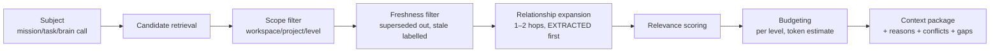
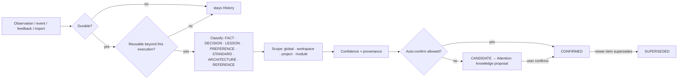

# Archeus V1 — Context Engine and Knowledge

Status: **DECIDED** (ADR-0012, ADR-0013) unless marked. Entities: KnowledgeItem, Relation,
RepositoryInspection, Decision, Meeting, Feedback in [domain-model.md](domain-model.md).

## 1. Three stores of truth, one retrieval surface

| | Current state | History | Knowledge |
|---|---|---|---|
| Question it answers | what is true now | what happened | what stays useful |
| Where | entity tables | `events` + artifacts | `knowledge_items` + `relations` |
| Written by | commands | the writer, in the same transaction | the promotion pipeline only |
| Goes stale? | no — it *is* now | never (it is the past) | yes: validity window, supersession, decay |
| Injected into context as | facts about the present, always L0/L1 | evidence ("last attempt failed because…"), only when relevant | guidance, ranked and labelled |

A stale historical fact must never silently override current state (spec §5.1). The context
package therefore labels every item with its store, and the renderer orders them
**current state → knowledge → history** within each level.

## 2. The context engine

### 2.1 Levels

| Level | Meaning | Typical contents | Default budget share |
|---|---|---|---|
| L0 Immediate | the current task/execution | task contract, files named by the task, last error, checkpoint | 40% |
| L1 Project | project-local operating context | project status line, CONFIRMED ARCHITECTURE/DECISION/STANDARD items, latest inspection summary (modules, commands), open blockers | 30% |
| L2 Related | connected world entities | dependencies (repos, systems), related projects, people, meetings/decisions linked to the mission | 15% |
| L3 Historical | relevant prior evidence | previous attempts of this task/mission, failures, LESSON items, worklog-derived history | 10% |
| L4 Global | durable user/workspace knowledge | PREFERENCE and global STANDARD items, policies that shape behaviour | 5% |

Unused budget flows down to the next level. The mission's `context_scope` can disable levels
(e.g. a quick fix with L0–L1 only) or pin/exclude specific refs.

### 2.2 Pipeline



**Candidate retrieval (no model calls):**
- Lexical: BM25 over `title + body + anchors` of knowledge items and entity summaries. V1 reuses
  the scorer in `claude_sessions/recall.py` (`_bm25`, camelCase/snake_case tokenisation, path
  hints) behind `infra/search/bm25.py`. FTS5 is DEFERRED (it is an index optimisation, not a
  capability change).
- Structural: items anchored to the files/modules the task touches (glob match on `anchors`,
  the same idea as today's `.claude/rules` globs), and the task's project/mission links.
- Temporal: the mission's own events and checkpoints; recent events in the project (7 days).
- Explicit: refs the user pinned in the conversation ("use the notes from Monday's meeting" →
  the brain resolves the Meeting and pins it; the resolution is shown as a card).

**Relationship expansion:** recursive CTE over `relations` from the seed set, max 2 hops,
EXTRACTED edges first, INFERRED edges only if confidence tier allows, AMBIGUOUS never. This is
today's `recall.expand_relations` generalised from the memory graph to the whole world graph.

**Relevance score** (deterministic, tunable weights in one table):

```text
score = w_lex·bm25_norm + w_anchor·anchor_match + w_link·graph_proximity
      + w_rec·recency_decay + w_auth·authority + w_conf·confidence
      − w_stale·stale − w_useless·useless_ratio
authority: explicit user item 1.0 > CONFIRMED decision/standard 0.9 > EXTRACTED fact 0.8
           > INFERRED fact 0.5 > CANDIDATE 0.3
```

**Budgeting:** token estimate (chars/4, the estimator already used by `recall.render_context`),
per-level shares above, rendered as a subgraph text block like Graphify's token-budgeted
`_subgraph_to_text`.

### 2.3 The context package

```yaml
context_package:
  id: ctx_…
  subject: {kind: task, id: tsk_…}
  budget_tokens: 12000
  items:
    - ref: {kind: knowledge, id: kn_…}
      level: L1
      store: knowledge            # state | knowledge | history
      type: DECISION
      source: {kind: meeting, id: mtg_…, observed_at: 2026-09-21T10:00Z}
      confidence: 0.9
      freshness: current          # current | stale | superseded (never included unless asked)
      relevance: 0.83
      reason: "Decision from Monday's meeting constrains the dashboard layout; linked to this mission by the user."
      tokens: 180
  assumptions: ["Dashboard targets desktop first (inferred from meeting notes)"]
  missing_information: ["No design reference for mobile layout"]
  conflicts:
    - [kn_a, kn_b]: "Two decisions disagree on chart library; newer one (kn_b) preferred, older flagged."
  excluded:
    - ref: kn_c
      reason: superseded by kn_d
```

The package is stored (as an artifact + row) and linked from the execution, so the *Why* tab can
answer **"I included this because …"** and "what did you not include and why".

## 3. Knowledge lifecycle



Sources of observations and what they may produce:

| Source | Produces | Auto-confirm? |
|---|---|---|
| User says "remember that …" / "I don't want this architecture" | PREFERENCE / DECISION, origin explicit | yes (explicit) — shown as a card with Undo |
| Feedback on a mission/route/plan | candidate PREFERENCE or LESSON | no |
| Mission learning pass (after COMPLETED) | LESSON (what worked/failed), ARCHITECTURE updates, FACT | LESSON: only if corroborated by ≥ 2 missions or confidence ≥ threshold; ARCHITECTURE: never (drift flow, §6) |
| Failed execution / verification | LESSON candidate "approach X fails because Y" | no (corroboration-gated, like Graphify's reflect) |
| Repository inspection | FACT (languages, commands, modules), ENTITY | yes when EXTRACTED |
| Meeting-note import | Meeting, Decision candidates, Person links | Meeting yes; decisions no |
| Legacy memory graph | ENTITY + relations | per legacy confidence (migration-plan §4) |

**Supersession:** a new item with the same `(type, scope, subject anchor)` and conflicting body
proposes `supersedes_id`; confirming it sets the old one SUPERSEDED with `valid_until`. Nothing
is deleted by supersession. "Remember that I don't want this architecture" becomes a DECISION
(explicit) that supersedes the earlier one and is linked `constrains` → the ARCHITECTURE item.

**Decay and staleness:**
- FACTs from inspection go stale when their anchored files change revision (cheap check on
  inspection).
- LESSONs decay by *usage*: `last_used_at` older than N sessions of that project and not pinned →
  EXPIRED (generalises today's `lessons.apply_decay`). Expired is reversible (`revalidated`).
- PREFERENCE/STANDARD never decay automatically; they are superseded or retracted.

**Forget:** one entry point `knowledge.forget(selector, mode, dry_run=True)` (Cognee's shape):
`mode = retract` (keeps row, excluded from context) or `purge` (deletes body, keeps a tombstone
with provenance for audit). Default is dry-run showing what would change.

**Consolidation:** the existing `memory._consolidate` logic (merge by normalised name, Jaccard
conflict flag, cap by rank + hits) becomes a knowledge maintenance pass, run by an automation,
producing merge *proposals* rather than silent merges for anything not EXTRACTED.

**Backup → verify → swap** for any bulk LLM rewrite of knowledge (summaries, consolidation): the
pass writes new rows as CANDIDATE, verifies counts and required fields, then flips in one
transaction; a failed verification leaves the old rows untouched (Munder Difflin's `reflect.ts`
discipline).

## 4. Knowledge storage

- `knowledge_items` and `relations` tables (domain-model §5). Graph traversal via recursive CTEs;
  indices on `(src_kind, src_id, rel)` and `(dst_kind, dst_id, rel)`.
- Why not a graph database: V1 needs 1–2 hop neighbourhoods over ≤ 10⁵ items for one user; SQLite
  does that in milliseconds, and a second store would break the single-writer/outbox guarantees.
  Revisit when multi-hop analytics or > 10⁶ edges appear (ADR-0013).
- Why no vector store in V1: the current product already retrieves well with BM25 + path anchors
  + relation expansion; semantic embeddings need either a model dependency or a network call per
  item. Interface `infra/search` keeps it swappable (ADR-0012). Cognee's 20 search types are
  rejected; V1 has three retrieval modes: lexical, graph neighbourhood, hybrid (the score above).

## 5. Session vs permanent memory

Cognee's split applies directly:

| Layer | Contents | Lifetime | Bridge |
|---|---|---|---|
| Execution-local ("session memory") | what the agent sees in its own context window, its scratch notes | one execution | checkpoint (Core-derived) |
| Mission memory | mission events, checkpoints, decisions made during the mission, context packages | mission lifetime, then history | learning pass after COMPLETED (debounced: one pass per mission, re-run on feedback) |
| Permanent knowledge | CONFIRMED items | until superseded/retracted/expired | — |

Per-prompt injection into *user interactive sessions* (today's `recall_hook` / worklog hook /
CLAUDE.md micro-index) continues to exist as a **harness integration**: the hook asks Core for a
context package for "interactive prompt in project P" instead of reading `graph.json` itself.
Until cutover the legacy hook stays the owner (ADR-0019).

## 6. Repository understanding and architecture drift

**Inspection pipeline** (deterministic first, model second — Graphify's ordering):

1. Resolve repos (`repos.find_git_repos`, depth 4, submodule/worktree classifier).
2. Cheap change check: HEAD SHA from `.git/HEAD` vs last inspection `revision`; skip if equal and
   no dirty files matter.
3. Deterministic pass: languages (extensions), frameworks/dependencies (manifest files), docs,
   agent config (CLAUDE.md, AGENTS.md, `.claude/`), module graph via
   `connections.build_hierarchy` (Python AST + regex import graph for C/C#/JS/TS), test/build
   commands (manifest scripts). All edges EXTRACTED. Content-hash cache per file; the cache is
   keyed by extractor version so extractor fixes invalidate it; the inspection manifest is
   written only on success.
4. Model pass (optional, policy class `spend`): summarise modules whose hash changed (today's
   `memory` unit extraction), INFERRED edges.
5. Diff vs previous inspection → `diff_from_previous` (modules added/removed, dependency changes,
   new frameworks, changed commands, changed agent config).
6. **Drift check** against CONFIRMED ARCHITECTURE / DECISION items that declare constraints in a
   checkable form:

```yaml
architecture_constraint:
  id: kn_arch_…
  kind: forbid_dependency | require_layering | module_exists | framework_pinned | doc_matches_code
  spec: {from: "archeus/core/**", to: "archeus/api/**"}   # core must not import api
  statement: "Domain code never imports the API layer."
```

   Violations → `Repository.architecture_state = DRIFTED` + Attention drift proposal (update
   architecture / accept change / create fix mission). Unverifiable constraints (prose-only) are
   listed as "cannot check automatically" rather than assumed satisfied.

**When:** on project open (throttled), on `PROJECT_CHANGED` (a post-commit hook or file watcher
event, debounced), on a schedule automation (default daily for active projects), and after a
mission's merge-back.

## 7. External source understanding

External references (docs, repos, articles) are REFERENCE knowledge items with:
`source_url`, `inspected_at`, `source_revision` (commit SHA when available), `observations[]`,
`design_area`, `confidence`, `status` (adopted / adapted / rejected / deferred). The research
for this blueprint is recorded in exactly this format in
[../research/external-references.md](../research/external-references.md), which doubles as the
first import fixture.

## 8. Meeting notes as context (Scenario 8)

Import path (V1 slice): drop or pick a markdown/text file (or paste) → `knowledge.ingest`:
creates a Meeting (date parsed from the file or asked), an artifact for the notes, Person links
for recognised attendees (EXTRACTED when matching known handles, else AMBIGUOUS), and DECISION
*candidates* extracted by a brain call. When a later message says "use the notes from Monday's
meeting", intent resolution finds the Meeting by date/project, pins it into the mission's
context scope, and the context package cites it with its reason.

## 9. Since-you-left digest (Scenario 14)

`world/digest.py` builds the digest from events with `seq > user.last_ack_event_seq`,
`visibility = user`, grouped by mission/project: completed, progressed (progress delta),
blocked/needs-you, automations run, knowledge proposals, drift found, resource incidents
(limits, fallbacks). Deterministic grouping and ranking; an optional brain call may phrase the
top line, but every bullet links to its event/object. Acknowledging on any device advances the
per-user cursor.
