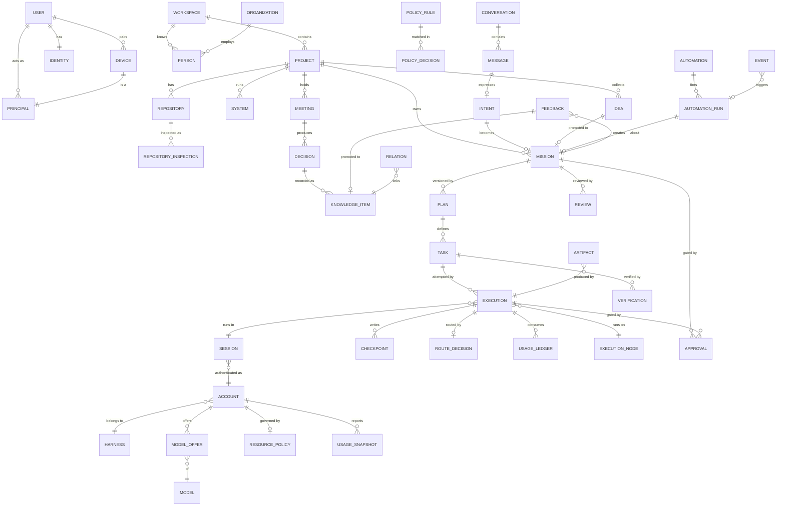

# Archeus V1 — Domain Model

Status: **DECIDED** unless a section says otherwise. Companion documents:
[state-machines.md](state-machines.md) (every lifecycle below),
[target-architecture.md](target-architecture.md) (where each entity lives in code),
[resource-router.md](resource-router.md), [context-and-knowledge.md](context-and-knowledge.md).

This document is the single definition of Archeus V1's nouns. Other documents link here
instead of redefining an entity. If two documents disagree about a field, this one wins and the
other is a bug.

---

## 1. Modelling rules

1. **Three kinds of truth, never merged.**
   - *Current state* lives in entity tables (`missions.state`, `accounts.health`, …). It answers
     "what is true now".
   - *History* is the append-only `events` table. It answers "what happened, when, caused by
     whom". Every state change writes an event in the same transaction as the change.
   - *Knowledge* is `knowledge_items` + `relations`. It answers "what stays useful". Knowledge
     is never inferred from history implicitly: something must *promote* it (see
     [context-and-knowledge.md §4](context-and-knowledge.md)).
2. **Explicit state.** Every mutable entity has a `state` column whose values and transitions
   are defined once in `archeus/core/domain/states.py` (a flat table: `(machine, from, to,
   trigger, guard)`). No code sets `state` directly; it calls `transition()`, which validates
   the edge, stamps actor and reason, and emits the event.
3. **Provenance on anything Archeus did not get from the user directly.** Columns
   `source_kind` (user | brain | execution | inspection | import | automation | legacy),
   `source_ref` (id or URL), `observed_at`, `confidence` (0–1, or a named tier where noted).
4. **Inferred ≠ explicit.** Mission requirements, plan assumptions and knowledge carry
   `origin: explicit | inferred`. The UI shows inferred items differently and they can be
   promoted by the user (spec §8: "inferred assumptions must remain distinguishable").
5. **IDs.** ULIDs (time-sortable, 26 chars, generated in stdlib from `time` + `secrets`),
   prefixed by kind: `msn_…`, `tsk_…`, `exe_…`. Events use an integer sequence (the SSE
   cursor) plus a ULID. One prefix names one kind (`archeus/core/domain/ids.py`). Credentials
   are not ids: token prefixes (`dev_`, `node_`, `hook_` — api-and-realtime §5.3) are a
   separate namespace that shares no prefix with any id, so `exe_…` is always an Execution.
6. **Versioned rows.** Every entity table has `version INTEGER` (optimistic concurrency —
   commands carry `expected_version`), `created_at`, `updated_at`, and where deletion is
   user-visible, `archived_at` (soft delete).
7. **No provider concepts in the domain.** "Claude session id", "CODEX_HOME", "--resume" live
   in harness adapters and in opaque `adapter_state` JSON columns, never in domain fields.
8. **Scope is a pair.** Every scoped row carries `workspace_id` and nullable `project_id`.
   `project_id = NULL` means workspace-wide. Global rows use the reserved workspace `ws_global`.

---

## 2. Entity map

The `RELATION` table is generic: any two addressable objects (`kind`, `id`) can be related, so
"Meeting → Decision → Architecture → Mission" and "Failed execution → Lesson → future context"
are rows, not schema. The ER diagram shows only the structural (foreign-key) relationships.

---

## 3. Identity, principals and devices

### 3.1 User
The human owner. V1 is **single-user per Core** (multi-user is DEFERRED; every table still
carries `workspace_id`, so adding members later is additive).

| Field | Notes |
|---|---|
| `id`, `display_name`, `created_at` | |
| `last_ack_event_seq` | Per-user acknowledged cursor for "what changed while I was away". Advances only when the user dismisses the digest on *any* device. |

### 3.2 Identity
What makes this Archeus "mine": owner, default workspace, working-style preferences,
notification preferences, default autonomy profile. Durable learned preferences are **not**
stored here — they are `knowledge_items` of type PREFERENCE with scope `global`, so they have
provenance and can be superseded. Identity only points at the active ones.

### 3.3 Principal
Every actor that can cause an event. Every event carries `actor_principal_id`.

| `kind` | Examples | Scopes it can hold |
|---|---|---|
| `user_device` | Desktop GUI, phone, TUI | `observe`, `control`, `approve`, `admin` (per device) |
| `brain` | Archeus's own reasoning calls | `propose` (create missions/plans in PROPOSED state, suggest routes). **Never `approve`.** |
| `execution` | A running agent | `report`, `checkpoint`, `request_approval`. Cannot create missions. |
| `automation` | A fired automation | `create_mission` from its template only, within its policy |
| `node` | An execution node daemon | `node_report` (heartbeat, process events, results) |
| `system` | Core internals (scheduler, reconciler) | `system` |

Rule enforced in the application layer, not the UI: **only `user_device` principals with the
`approve` scope can move an Approval to APPROVED.**

### 3.4 Device
A paired client. Fields: `id`, `principal_id`, `name`, `platform` (desktop | web | ios | android
| tui), `scopes[]`, `token_hash` (SHA-256 of the device token; the token itself is shown once),
`paired_at`, `last_seen_at`, `last_seen_event_seq`, `state` (PAIRING | ACTIVE | REVOKED),
`push` (optional ntfy topic / desktop). The local desktop shell and a locally opened browser are devices too; they obtain their token through the local launch-code bootstrap (see [api-and-realtime.md §5.1](api-and-realtime.md)).

---

## 4. World entities

All world entities share: `id`, `workspace_id`, `project_id?`, `name`, `summary`, provenance
columns, `state` (ACTIVE | ARCHIVED unless noted), `version`, timestamps.

| Entity | Purpose | Notable fields |
|---|---|---|
| **Workspace** | A top-level context boundary (e.g. "Work", "Personal"). Policies and routing preferences can be set per workspace. | `name`, `default_policy_profile` |
| **Organization** | A company/team the user deals with. | `kind` (employer, client, community) |
| **Person** | Someone relevant to projects. | `organization_id?`, `handles` (json: email, github), `role`. Contact data is optional and never sent to a model unless a mission needs it (policy class `personal_data`). |
| **Project** | The main unit of work. Replaces today's "project = Claude Code project folder". | `root_paths[]` (a project can span several dirs), `legacy_enc[]` (today's encoded folder names, for migration), `status_line` (one sentence of current state, maintained by Archeus), `health` (on_track / at_risk / blocked / idle), `priority` |
| **Repository** | A git repository belonging to a project. | `path`, `path_key` (its real, case-folded path: unique per workspace), `remote_url`, `kind` (repo / submodule / worktree — the `.git` gitdir classifier from `repos.py`), `default_branch`, `last_inspection_id`, and the current drift assessment: `last_revision`, `findings[]`, `evaluated_against` (the constraint-set token) and `evaluated_constraints[]` (knowledge item id, version) — an assessment is state, so it lives here and not on an inspection |
| **RepositoryInspection** | One inspection of a repository at a revision ("Codebase" in the spec is *a repository at a revision*, i.e. this row). | `revision` (HEAD SHA), `inspected_at`, `languages`, `frameworks`, `dependencies`, `docs[]`, `agent_config` (CLAUDE.md/AGENTS.md/.claude), `modules` (from `connections.build_hierarchy`), `test_commands`, `build_commands`, `findings[]`, `confidence`, `diff_from_previous` |
| **System** | A running thing a project owns (service, DB, deployment target). | `kind`, `environment` (dev/staging/prod — drives policy), `endpoints` |
| **Idea** | A captured, not-yet-committed thought. First-class so it can be explored before becoming work. | `text`, `state` (Idea machine), `explorations[]` (artifact ids), `promoted_mission_id?` |
| **Meeting** | A meeting whose notes are context. | `held_at`, `attendees[]` (person ids), `notes_artifact_id`, `imported_from` (file path) |
| **Decision** | A choice that constrains future work. | `statement`, `rationale`, `decided_at`, `decided_by` (person/user), `status` (active / superseded / reversed), `supersedes_id?`, `source` (meeting / mission / conversation). Every decision is mirrored as a DECISION knowledge item so context retrieval has one index. |

---

## 5. Knowledge

### 5.1 KnowledgeItem

| Field | Notes |
|---|---|
| `id`, `workspace_id`, `project_id?` | scope; `scope_level` derived: global / workspace / project / module |
| `type` | FACT, DECISION, LESSON, PREFERENCE, STANDARD, ARCHITECTURE, REFERENCE, ENTITY (a code/world entity summary imported from the memory graph) |
| `title`, `body` | body ≤ 2 KB; longer material is an artifact referenced by `artifact_id`. The entity field is named `text`: `body` is the row codec's JSON column (resolved when P4 persisted the table) |
| `constraint` | `{kind, spec}` on an ARCHITECTURE or DECISION item that declares a checkable architecture constraint (context-and-knowledge §6); `null` for prose |
| `origin` | explicit (user said it) / inferred |
| provenance | `source_kind`, `source_ref`, `observed_at`, `confidence` |
| `state` | CANDIDATE → CONFIRMED → SUPERSEDED / RETRACTED / EXPIRED (see state-machines §11) |
| `valid_from`, `valid_until` | validity window; `valid_until` set when superseded |
| `supersedes_id`, `superseded_by_id` | explicit chain — never delete a superseded item |
| `stale_after` | decay policy: absolute date or `null`; a FACT observed from a repo inspection goes stale when the repository's revision moves past the files it cites |
| `anchors[]` | file globs / module ids / entity ids the item is about (used for path matching like today's `.claude/rules` globs) |
| `hits`, `last_used_at`, `useful_count`, `useless_count` | usage signals (feedback reinforcement is DEFERRED past the V1 slice; the columns exist from P6) |
| `pinned` | exempt from eviction and decay |

### 5.2 Relation
`(id, src_kind, src_id, rel, dst_kind, dst_id, confidence_tier, source_kind, source_ref,
created_at, valid_until)`.

- `rel` vocabulary (closed set, extendable by migration): `contains`, `depends_on`, `uses`,
  `calls`, `implements`, `mentions`, `decided_in`, `constrains`, `motivated`, `produced`,
  `learned_from`, `supersedes`, `contradicts`, `blocks`, `relates_to`, `owns`, `attended`.
- `confidence_tier`: **EXTRACTED** (deterministic: AST/import graph, explicit user link),
  **INFERRED** (model-derived), **AMBIGUOUS** (model unsure → surfaced in Attention as a
  knowledge proposal). Adopted from Graphify; tiers are labels, not probabilities.

---

## 6. Conversation and intent

| Entity | Purpose | Fields |
|---|---|---|
| **Conversation** | A thread with Archeus. Exactly one `primary` conversation per user (the Now surface) plus one `mission` thread per mission. | `kind` (primary / mission), `mission_id?`, `last_message_at` |
| **Message** | One turn. | `conversation_id`, `author` (user / archeus / system), `principal_id`, `text`, `cards[]` (typed references: `{type: mission_proposal|plan|approval|route_explanation|diff|verification|digest, ref: {kind,id}}`), `links[]` (world objects the message touched — drives the *thread* visual), `in_reply_to?` |
| **Intent** | What the user wants, extracted from a message. | `message_id`, `utterance`, `kind` (control_verb / question / new_work / continue_work / feedback / preference / idea), `target_refs[]`, `ambiguities[]`, `confidence`, `resolution` (answered / mission_created / mission_updated / clarification_requested / declined) |

Control verbs (pause, resume, stop, approve, reject, reprioritize, status, route-why) are parsed by
a deterministic grammar and never need a model (ADR-0006).

---

## 7. Work

### 7.1 Mission — the outcome Archeus owns

| Field | Notes |
|---|---|
| `id`, `workspace_id`, `project_id?` | |
| `title`, `objective`, `desired_outcome` | objective = what; desired_outcome = how we'll know |
| `requirements[]`, `constraints[]` | each `{text, origin: explicit|inferred, source_ref}` |
| `success_criteria[]` | each `{text, check: automatic|human, verifier?, origin: explicit|inferred}` — inferred when the plan supplied them because the mission had none |
| `context_scope` | levels allowed (L0–L4), extra refs pinned by the user, refs excluded |
| `dependencies[]` | other missions/decisions this waits on |
| `priority` | integer; user-set; reprioritize = command |
| `max_replans` | default 2: replans allowed after the initial plan (0 = none); `replan_budget_exhausted` (state-machines §2) |
| `held_from?` | the state the mission was in when it entered BLOCKED/PAUSED; `resume` and the `redispatch` guard read it (state-machines §2) |
| `decided_plan_version?` | the `plan_version` the mission last decided (auto-approved or sent for approval); both plan-decision guards refuse that plan again (state-machines §2) |
| `autonomy_profile` | named policy overlay (e.g. `careful`, `standard`, `autonomous`) — see policy |
| `resource_preferences` | optional per-mission routing overrides (preferred accounts, forbidden harnesses, cost ceiling) |
| `verification_strategy`, `review_strategy` | chosen at planning; editable |
| `state` | Mission machine (state-machines §2) |
| `active_plan_id` | current Plan version |
| `origin` | conversation / idea / automation / legacy_import |
| `origin_ref` | message id / idea id / automation_run id |
| `progress` | 0–1, computed from task graph (weighted by task estimates), never typed by an agent |
| `learned_at` | set when the learning pass has run; **learning is not a mission state** |
| `blocked_reason?`, `paused_by?` | |

### 7.2 Plan
Immutable once approved; a replan creates a new version (`plan_version` increments,
`supersedes_plan_id`). Fields: `mission_id`, `plan_version` (the plan's number within its
mission — distinct from the row's optimistic-concurrency `version`), `summary`, `assumptions[]` (origin-tagged),
`risks[]`, `approval_points[]` (task ids / action classes that will need ASK), `rollback`,
`estimated_cost` (bands, never precise — migration-kit rule), `state` (DRAFT → PROPOSED →
APPROVED → SUPERSEDED / REJECTED), `authored_by` (brain principal + model used).
*As built (P3.5):* the plan lifecycle has no declared edges, so a plan stays DRAFT and is the
versioned strategy attached to its mission; the mission's states carry approval and
supersession.

### 7.3 Task
An executable unit in the plan's DAG.

| Field | Notes |
|---|---|
| `plan_id`, `mission_id`, `key` (stable within plan) | |
| `title`, `instructions` | the 4-part dispatch contract (from Munder Difflin): **objective, expected output, allowed tools/action classes, boundaries** |
| `depends_on[]` | task keys; DAG validated at plan approval |
| `kind` | code_change / research / document / presentation / inspection / verification / human |
| `capabilities_required` | e.g. `{code_edit, shell, web, long_context, vision}` |
| `action_classes[]` | policy classes it will exercise (write_repo, exec, web, …) |
| `workspace_mode` | in_place / worktree (default for code_change) |
| `max_attempts` | default 2 |
| `failure_class` | why the task FAILED (`execution`, `verification`, …; policy / credential / human are not retryable); written with the move to FAILED, read by `task_failed_retryable` |
| `estimate` | relative weight for progress |
| `state` | Task machine |
| `integration_state` | Integration machine (state-machines §13): the merge-back of this task's worktree branch into the mission branch. NULL when `workspace_mode = in_place`. Arrives with the machine in P13 |

**Integration is not an entity.** It is a lifecycle *of a task* — a task has at most one
merge-back, and its CONFLICT blocks that task — so it is a second state column on Task, the
same pattern as `Repository.architecture_state`. (The other use of the word, a *harness
integration* such as the recall hook or `.claude/rules` files, is a capability of a Harness,
configured under Resources, not a row.)

### 7.4 Execution — one concrete attempt

| Field | Notes |
|---|---|
| `task_id`, `mission_id`, `attempt` | |
| `route_decision_id` | why this harness/account/model |
| `harness_id`, `account_id`, `model_id` | denormalised for queries |
| `session_id` | the Session row (provider session identity lives in its `adapter_state`) |
| `node_id` | where it runs (V1: always the local node) |
| `mode` | headless / interactive_attached (user launched it themselves) / manual (user session tracked, not driven) |
| `workdir` | real path or worktree path |
| `process` | `{pid, create_time, registry_path}` — pid **plus creation time** guards against PID reuse |
| `state` | Execution machine |
| `started_at`, `ended_at`, `exit_reason` | `exit_reason`: ok / error / killed / lost / abandoned, with `exit_code` and the harness's reported summary (never the completion signal) |
| `usage` | tokens in/out/cache, cost where known |
| `context_pressure` | last computed ratio (continuity §) |
| `adapter_state` | opaque JSON owned by the harness adapter |

### 7.5 Session
Infrastructure. A provider conversation that one or more executions ran inside.
`harness_id`, `account_id`, `provider_session_ref` (e.g. Claude session UUID), `transcript_path`,
`started_at`, `last_active_at`, `state` (OPEN / CLOSED / LOST). **A session is bound to its
account** (a Claude session lives under one config dir), which is why an account change always
goes through a checkpoint hand-off to a *new* session.

### 7.6 Checkpoint
Core-derived mission state for hand-off (execution-architecture §6).
`execution_id`, `mission_id`, `task_id`, `created_at`, `trigger` (task_boundary / pressure /
account_change / pause / failure), `objective`, `completed_steps[]`, `current_step`,
`decisions[]`, `open_problems[]`, `files_changed[]` (from git diff), `verification[]`,
`next_action`, `relevant_context_refs[]`, `artifact_id` (rendered markdown).

### 7.7 Verification and Review

| Entity | Fields |
|---|---|
| **Verification** | `task_id` or `mission_id`, `verifier` (code / research / document / presentation / automation / generic_human), `checks[]` (`{name, command?, result, output_artifact_id}`), `state`, `independent` (bool), `plan_id` (the plan in force when it ran — it counts for that plan only, so a replan is verified afresh), `criterion` (for a mission: which success criterion) |
| **Review** | `mission_id`, `reviewer` (brain on a different model/account, or user), `independent` (false when no different resource was free), `requirements_met[]`, `requirements_missing[]`, `risks[]`, `regressions[]`, `follow_up[]`, `verdict` (accept / changes_requested / reject), `state`, `plan_id` (the plan whose result was reviewed) |

### 7.8 Feedback
`subject` (`{kind,id}` — message, mission, plan, route decision, knowledge item), `signal`
(positive / negative / correction), `text`, `principal_id`, `promoted_knowledge_id?`. Feedback
is history; promotion into a PREFERENCE or LESSON is an explicit step (candidate → confirmed).

### 7.9 Artifact
Content-addressed blob: `sha256`, `media_type`, `size`, `path` (under
`<ARCHEUS_HOME>/artifacts/ab/cd/<sha>`), `produced_by` (`{kind,id}`), `label`. Transcripts,
reports, diffs, rendered checkpoints, meeting notes and screenshots are artifacts. Artifacts
are immutable; "editing" produces a new artifact.

---

## 8. Resources

### 8.1 Harness
A coding-agent runtime. `id` (`claude_code`, `codex`, `pi`, `generic_cli:<name>`),
`installed_version`, `executable`, `capabilities` (code_edit, shell, web, mcp, long_context,
structured_output, resume, headless, interactive), `enforcement` (**hook** | **sandbox** |
**none** — how policy can be enforced inside it; resource-router §3), `state` (AVAILABLE /
MISSING / MISCONFIGURED). Mirrors today's `harnesses.HARNESSES` descriptors.

### 8.2 Account
An authenticated instance of a harness: one Claude config dir, one Codex home, one API key.

| Field | Notes |
|---|---|
| `harness_id`, `label` | |
| `auth_kind` | subscription_oauth / api_key / provider_proxy |
| `node_id` | **accounts are node-bound**: credentials never leave the node that holds them |
| `home_ref` | the config dir (opaque to Core except for display) |
| `health` | Account health machine (state-machines §9) |
| `limited_until?` | reset time when a window is exhausted |
| `resource_policy_id` | priority + allocation |

### 8.3 Model and ModelOffer
`Model` is a capability definition independent of accounts: `id` (e.g. `claude-opus-5-5`),
`family`, `context_window`, `strengths` tags, `tier` (large / mid / small). `ModelOffer` says an
account can use a model: `(account_id, model_id, available, discovered_at)`. The newest-model-
following logic of `config.current_model()` / `models.roster()` produces offers.

### 8.4 ResourcePolicy (priority + allocation)

| Field | Meaning |
|---|---|
| `priority` | integer, 1 = most preferred. Ordering only. |
| `allocation_pct` | ceiling on the provider's reported window utilisation that Archeus may drive the account to (resource-router §4) |
| `reserve_pct` | headroom kept for the user's own interactive use |
| `budgets` | optional `{tokens_per_day, cost_per_day, cost_per_month, concurrency, hours}` enforced from the usage ledger |
| `project_allow[]`, `project_deny[]` | project restrictions |
| `fallback` | allow / ask / deny — may the router fall back *to* this account without asking |
| `brain_reserve_pct` | share reserved for Archeus's own reasoning calls |

### 8.5 UsageSnapshot and UsageLedger
`UsageSnapshot`: what the provider reports (`account_id`, `window` 5h/7d/monthly,
`utilisation_pct`, `resets_at`, `observed_at`, `source` usage_api / rate_limit_headers /
rollout_file). `UsageLedger`: what Archeus itself consumed (`execution_id`, `account_id`,
`tokens_in`, `tokens_out`, `cache_read`, `cache_write`, `cost_usd?`, `at`). Snapshots are
*observed truth*; the ledger is *attributable truth*. The router uses both (resource-router §4).

### 8.6 RouteDecision
Persisted for every routing call: `subject` (task / brain call / review), `requirements`,
`candidates[]` each `{resource, eliminated_at_step, reason}`, `selected`, `input_snapshot`
(usage + age, health, policy version, ledger totals), `policy_decision_id`, `fallback_from?`,
`explanation` (generated text, derived from the structured fields, never free-authored).

### 8.7 ExecutionNode
A machine that can run executions. `id`, `name`, `platform`, `kind` (local / remote),
`state` (ONLINE / GRACE / OFFLINE / RETIRED), `last_heartbeat_at`, `capabilities`,
`harnesses[]`, `token_hash` (remote only). V1 ships only the `local` node, in-process
(ADR-0008).

---

## 9. Control

### 9.1 PolicyRule

| Field | Notes |
|---|---|
| `scope_level` | GLOBAL / USER / WORKSPACE / PROJECT / MISSION / TASK |
| `scope_ref` | id at that level |
| `action_class` | read, web, write_repo, exec, git_commit, git_push, deploy, external_comm, destructive, spend, personal_data, install, credential (closed list; extended by migration) |
| `match` | optional predicate: `{environment: prod, path_glob, command_glob, host_glob, max_cost_usd}` |
| `decision` | ALLOW / ASK / ALLOW_WITHIN_BOUNDARY / DENY |
| `boundary` | for ALLOW_WITHIN_BOUNDARY: `{paths[], branches[], max_files, max_cost_usd, hosts[], time_window}` |
| `locked` | when true, lower scopes cannot loosen it (DENY is always locked) |
| `version`, `author_principal_id`, `note` | policies are versioned; every change is an event |

### 9.2 PolicyDecision
Recorded for every ASK/DENY and sampled ALLOW (all ALLOWs inside a mission are recorded; ALLOWs
for Archeus's internal reads are counted, not recorded individually). Fields: `action`
(canonical: `{class, target, argv?, diff_hash?}`), `context` (mission/task/execution/principal),
`matched_rules[]` (in precedence order), `decision`, `boundary`, `policy_version`, `reason`
(generated from the matched rules), `approval_id?`.

### 9.3 Approval

| Field | Notes |
|---|---|
| `subject` | plan / action / automation enable / knowledge promotion / merge |
| `action_hash` | SHA-256 of the canonical action + `policy_version` + `plan_version` — the approval is valid for **exactly this** action |
| `requested_by` | principal |
| `presented` | canonical rendering (argv, target, diff hash, files) — never model prose alone |
| `step_up` | true for destructive/deploy → device must re-confirm (biometric/OS prompt on mobile PWA via WebAuthn is DEFERRED; V1 step-up = re-enter the device PIN set at pairing) |
| `expires_at` | default 24 h for plans, 2 h for mid-execution actions |
| `decided_by`, `decided_at`, `decision_note` | |
| `state` | Approval machine (PENDING → APPROVED/REJECTED/EXPIRED/SUPERSEDED; APPROVED → CONSUMED) |
| `idempotency_key` | of the deciding command — a double-tap on a phone is one decision |

### 9.4 Automation and AutomationRun
Automation: `name`, `trigger` (`{kind: event|schedule|condition|state, pattern|cron|predicate}`),
`conditions[]`, `mission_template` (objective template, task hints, verification), `policy`
(overlay applied to missions it creates), `notify`, `max_depth` (cause-chain cap, default 3),
`rate_limit` (default 6/hour), `state`. AutomationRun: `automation_id`, `triggering_event_seq`,
`cause_chain[]`, `claimed_at`, `state`, `mission_id?`, `skip_reason?`.

### 9.5 Event
See [api-and-realtime.md §3](api-and-realtime.md) for the envelope. Core columns:
`seq` (INTEGER PRIMARY KEY — the cursor), `id` (ULID), `type` (`mission.state_changed`,
`task.completed`, `account.limit_reached`, …), `at`, `actor_principal_id`, `cause_chain` (list of
event ids, ≤ 16), `subject_kind`, `subject_id`, `workspace_id`, `project_id?`, `payload` (JSON,
small; big things are artifacts), `visibility` (user / system — system events are not shown in
activity feeds but are kept for audit).

---

## 10. Ownership and audit

| Entity group | Written by | Audit requirement |
|---|---|---|
| Identity, Device, PolicyRule, ResourcePolicy | user_device principals only | every change → event with before/after |
| World entities | user, brain (proposed), inspection, import | provenance mandatory for non-user writes |
| Knowledge | promotion pipeline only | supersession chain never broken; RETRACTED keeps the row |
| Mission, Plan, Task | application commands (brain proposes, user approves per policy) | every transition → event with actor + reason |
| Execution, Session, Checkpoint | Execution Manager, node reports | process registry mirrored on disk for e-stop |
| Approval | requester creates; user_device decides | immutable after decision; consumption recorded |
| RouteDecision, PolicyDecision | router / policy engine | immutable |
| Events | the writer thread, same transaction as the change | append-only; retention per api-and-realtime §3.4 |

---

## 11. Mapping from today's data

Full table in [migration-plan.md §4](migration-plan.md). Summary: encoded project folders →
Project (+`legacy_enc`); memory `graph.json` entities → KnowledgeItem type ENTITY with
EXTRACTED/INFERRED relations; lessons → LESSON (pending → CANDIDATE, approved/pinned →
CONFIRMED); worklog → events of type `legacy.worklog` (history, not knowledge); accounts +
homes → Account; `settings['providers']` → Harness `generic`/proxy accounts; plan-latest.md →
an imported Mission in COMPLETED or PAUSED with one Plan; loops → Automations (disabled until
the user re-enables them under V1 policy).
