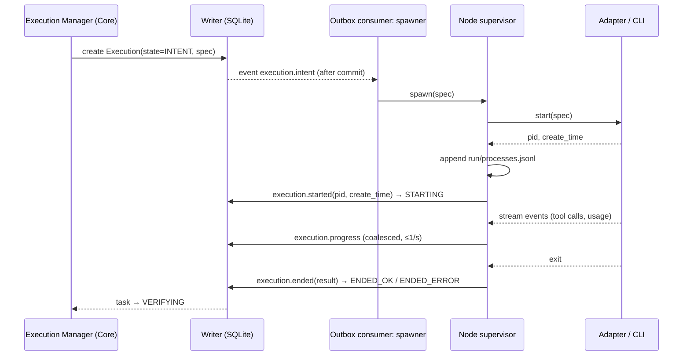
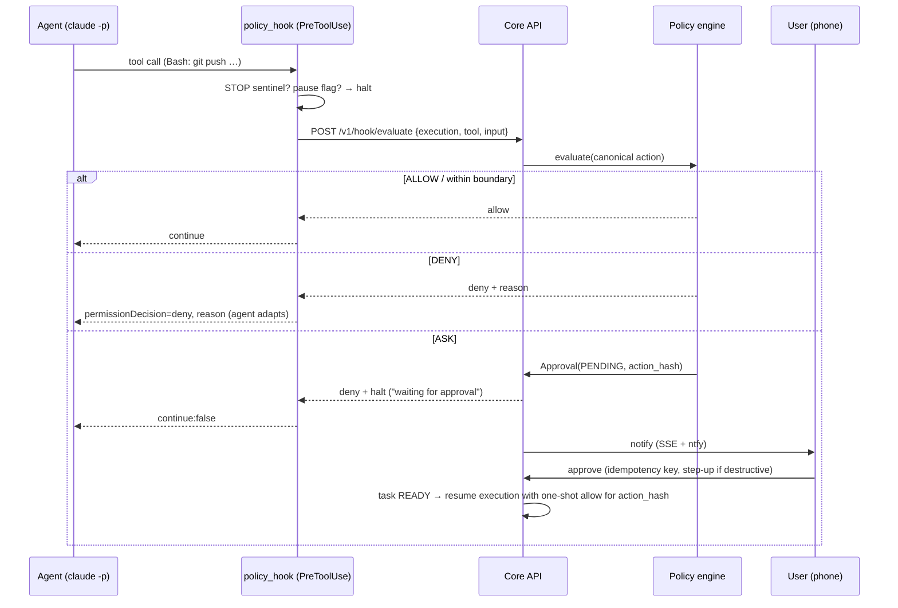

# Archeus V1 — Execution Architecture

Status: **DECIDED** (ADR-0004, ADR-0007, ADR-0008) unless marked. Entities: Execution, Session,
Checkpoint, ExecutionNode, Approval in [domain-model.md](domain-model.md). Lifecycles:
[state-machines.md §3, §4, §13](state-machines.md).

## 1. Chain of responsibility

```text
Mission → Plan → Task DAG → Resource Router → Execution Manager → Node → Harness adapter
        → Account (credentials on the node) → Model (per-execution parameter) → Session → process
```

| Component | Lives in | Responsibility | Must never |
|---|---|---|---|
| Execution Manager | Core (`core/execution/manager.py`) | turn READY tasks into Executions, apply policy to the *execution environment*, track state, derive checkpoints, merge back | spawn a process inside a DB transaction |
| Node (V1: local, in-process) | `node/local.py` | spawn/kill/adopt processes, maintain the process registry, compute worktree paths, relay adapter events | decide policy or routing |
| Harness adapter | `harnesses/<id>/adapter.py` | translate the normalised contract into a CLI invocation and parse its output stream | leak provider concepts into Core (they go in `adapter_state`) |
| Policy hook | `harnesses/claude_code/hooks/policy_hook.py` | per-tool-call ALLOW/DENY/halt, pause flag, STOP sentinel | fail open for Archeus-launched executions |

## 2. Execution environment (capability removal)

Before spawn, the manager builds the environment from the task's evaluated policy — this is the
**primary** enforcement layer (ADR-0007); hooks are secondary.

| Concern | Rule |
|---|---|
| Account env | `config.account_env(cfgdir)` sets the harness home var and pops API keys that would override the intended login (existing, reused) |
| Push/publish credentials | removed: `GIT_TERMINAL_PROMPT=0`, `GIT_ASKPASS=` (empty), `SSH_AUTH_SOCK` unset, `GIT_CONFIG_COUNT` injects `credential.helper=` (empty) — the agent can commit locally but cannot push. `git_push`, `deploy`, `external_comm`, merge-back are **performed by Core** after policy + approval |
| Filesystem | workdir = task worktree (code_change) or project root (read-only tasks). Claude Code gets `--add-dir` only for allowed extra paths; Codex gets `--sandbox workspace-write` |
| Network | Codex: network access off unless `web` is ALLOW. Claude Code: `WebFetch`/`WebSearch` removed from allowed tools unless `web` is ALLOW; Bash network cannot be blocked by Archeus → tasks whose policy denies network are routed only to `sandbox` harnesses (router §3) |
| Tools | Claude Code `--allowedTools` / `--disallowedTools` derived from action classes (e.g. no `Bash` for a pure `document` task) |
| Limits | `--max-turns` from task size; `--max-budget-usd` where the harness supports it; wall-clock timeout per task kind |
| Tagging | `ARCHEUS_EXECUTION_ID`, `ARCHEUS_CORE_URL`, `ARCHEUS_HOOK_TOKEN` (execution-scoped, report/checkpoint/request_approval only) and the legacy `HEADLESS_MARK` so today's session lists and auto-memory skip these transcripts |

## 3. Harness adapter contract

Frozen in P1 so the fake harness and the acceptance judge can be written first.

```python
class HarnessAdapter(Protocol):
    id: str
    def discover(self) -> HarnessInfo: ...                      # installed? version? executable
    def capabilities(self, account: AccountRef) -> Capabilities: ...   # incl. models offered, enforcement
    def authenticate(self, account: AccountRef) -> AuthStatus: ...     # cheap probe, no inference
    def start(self, spec: ExecutionSpec) -> ProcessHandle: ...        # spawn; returns pid+create_time
    def send(self, handle, message: str) -> None: ...           # interactive/streaming input (optional)
    def pause(self, handle) -> PauseResult: ...                 # cooperative: set flag, await boundary
    def resume(self, spec: ExecutionSpec, state: AdapterState) -> ProcessHandle: ...
    def stop(self, handle, *, grace_s: float) -> None: ...
    def inspect(self, handle) -> Snapshot: ...                  # tail of stream, usage so far, pressure
    def status(self, handle) -> ProcStatus: ...
    def handoff(self, checkpoint: Checkpoint) -> ExecutionSpec: ...   # render checkpoint into next start
    def collect_result(self, handle) -> ExecutionResult: ...    # exit, summary, usage, artifacts, session ref
```

`ExecutionSpec` = `{task_contract, prompt (stable prefix + variable suffix), workdir, env,
model, effort, limits, allowed_tools, resume_ref?, hook_settings}`. `ExecutionResult` =
`{exit_reason, reported_summary, usage, session_ref, transcript_path, files_changed?}` — the
reported summary is **never** the completion signal (verification is).

| Adapter | Headless invocation (verify exact flags in the P11 contract test) | Stream | Resume | Enforcement |
|---|---|---|---|---|
| `fake` | Python script driven by a scenario file | JSON lines | yes | simulated hook |
| `claude_code` | `claude -p --output-format stream-json --verbose --session-id <uuid> --model … --effort … --max-turns … --settings <per-execution settings file with the policy hook>` | stream-json (assistant/tool events, `usage`, `compact_boundary`) | `--resume <session uuid>` | hook (PreToolUse, PreCompact) |
| `claude_code` interactive | existing `main.build_launch_command` + `proc.spawn_terminal` | transcript tail | n/a | hook in fail-open mode (user's own session) |
| `codex` | `codex exec --json --sandbox workspace-write -m …` | JSON events | `codex exec resume <id>` | sandbox |
| `pi` (DEFERRED) | RPC mode | JSON | yes | none |

Hooks are installed **per execution** through the settings file passed at start, not by editing
the user's global `settings.json`, so V1 executions never collide with legacy hook ownership
(ADR-0019).

## 4. Process lifecycle



- **Registry.** `~/.archeus/run/processes.jsonl` lines `{execution_id, pid, create_time, argv0,
  started_at}`; tombstoned on exit. It exists so `archeus estop` and boot reconciliation work
  without the database.
- **Boot reconciliation.** For every execution in STARTING/RUNNING/PAUSING/LOST: check pid +
  `create_time` (Windows: `GetProcessTimes` via `ctypes`; POSIX: `/proc/<pid>/stat` or `ps`).
  Alive and the stream file still growing → adopt (re-attach the stream reader). Dead → derive a
  checkpoint, mark ENDED_ERROR or LOST → task retry per policy. INTENT with no process →
  ABANDONED.
- **Stop.** `stop` → hook halt flag (graceful, ≤ `grace_s`) → `proc.kill_tree` by pid after
  verifying `create_time` (never kill a recycled PID).
- **Pause.** cooperative (state-machines §4). The mission shows "pausing…" until every execution
  reports PAUSED or escalates to stop at `pause_timeout`.

## 5. Policy at action time (ASK mid-execution)



- **Fail-closed** for Archeus-launched executions: if Core is unreachable (timeout 5 s) the hook
  denies write/exec/network actions and allows pure reads. For the user's own interactive
  sessions the same hook fails open (today's `guard_hook` behaviour), because blocking a human's
  terminal when Core is down is worse than the risk.
- **Canonicalisation:** the hook sends raw tool input; Core canonicalises it into
  `{class, target, argv, diff_hash}`. Bash commands are classified by a conservative parser
  (known git/deploy/package-manager verbs → specific classes; anything with pipes into a shell,
  `eval`, base64 decoding, or unknown binaries in a denied-network task → `exec` with
  `unclassified=true`, which policy treats as the *strictest* class active for the task). The
  classifier is a convenience; capability removal (§2) is the guarantee.
- The one-shot allow is a signed token `hmac(hook_token, action_hash)` delivered in the resumed
  execution's environment and consumed on first use (Approval → CONSUMED).

## 6. Continuity: checkpoints and hand-off

**When:** task boundary (always), context pressure ≥ 0.75, account change (limit/fallback),
pause-timeout stop, failure, user request "continue in a fresh session".

**Context pressure signal** (headless): after each assistant message in stream-json,
`pressure = (usage.input_tokens + usage.cache_read_input_tokens + usage.cache_creation_input_tokens)
/ model.context_window` (window from `models.roster`). Backstops: the PreCompact hook fires →
treat as pressure 0.9; a `compact_boundary` event → record that compaction happened (the
execution continues; the checkpoint is still derived at the next boundary). Bounded tasks and
`--max-turns` keep pressure rare — hand-off is the exception path, not the design.

**What a checkpoint contains** — **derived by Core**, not asked of an agent whose context is
already full:

| Field | Source |
|---|---|
| objective, constraints, success criteria | Mission + Task rows |
| completed_steps | task graph + events |
| files_changed | `git diff --stat` + diff artifact in the workdir |
| verification | latest Verification rows |
| decisions | `report_decision` calls the agent made through the execution-scoped API during the run, plus DECISION items created in the mission |
| open_problems | failing checks, hook denials, last error |
| next_action | planner's next step for the task; if unknown, "continue the task from the diff" |
| relevant_context_refs | context package ids used, re-assembled for the next execution |

Rendered as markdown artifact → the next Execution's prompt gets it as the variable suffix
(today's `context_inject` writes a transcript dump to `.archeus/injected-context.md`; V1 replaces
the dump with the checkpoint, reusing the injection mechanism).

**Hand-off flow:** HANDING_OFF → checkpoint written → ENDED_HANDOFF → router (affinity kept
unless the trigger was an account problem) → new Execution with `handoff_from`. Mission and task
states do not change. The user sees "Dashboard implementation is continuing", not "session 19
has 83k tokens" (spec §17).

## 7. Worktrees and merge-back

- Code-change tasks run in a worktree at a **node-computed path**:
  `~/.archeus/worktrees/<project-slug>/<mission-id>/<task-key>` (outside the repository, as
  Vicoa does), branch `archeus/<mission-id>/<task-key>`. Removal is allowed only for paths the
  node created *and* `git worktree list` confirms (reuses `worktrees.py` helpers and the
  `.git`-is-a-file classifier from `repos.py`).
- After the task verifies, the Integration machine (state-machines §13) merges into the mission
  branch; mission-level verification runs on the mission branch; final integration into the
  user's working branch and any push are separate policy-checked actions performed by Core.
- Parallel tasks in a DAG each get a worktree, which is what makes parallelism safe. Tasks that
  touch the same files are serialised by the planner (declared `touches[]` globs).

## 8. Verification providers

| Verifier | Checks | Independence |
|---|---|---|
| CodeVerifier | `test_commands` and `build_commands` from the latest RepositoryInspection (fallback: detected by marker files — `pyproject.toml` → pytest, `package.json` → `npm test`, …), plus lint if configured, plus architecture consistency check (drift) on changed modules | deterministic; runs on the node, in the worktree, with network per policy |
| ResearchVerifier | every claim in the report cites a source; sources fetched and quoted; contradictions flagged; confidence recorded | model call on a different account/model when possible |
| DocumentVerifier | required sections present, links resolve, spelling/format checks | deterministic + optional model |
| PresentationVerifier | export exists and opens, slide/scene count, requirement checklist; visual quality → human acceptance | mostly human |
| AutomationVerifier | trigger fired, action executed, expected outcome observable | deterministic |
| GenericVerifier | creates an Attention "accept this result?" item | human |

Review is separate (verification-and-review in state-machines §6–7).

## 9. Execution nodes

**V1:** one local node, in-process, implementing the node contract below. **DEFERRED:** remote
nodes (a second PC, a server) — specified now so V1 code does not assume locality.

| Contract | Local (V1) | Remote (deferred) |
|---|---|---|
| Transport | function calls | node opens outbound HTTPS to Core: `GET /v1/node/stream` (SSE commands: spawn, stop, pause, inspect) and `POST /v1/node/events` (reports). Outbound-only so nodes behind NAT work. |
| Identity | implicit | node principal + node token (typed, hashed at rest, revocable), paired like a device |
| Liveness | process-registry check | socket-as-liveness + 30 s heartbeat; GRACE 90 s; OFFLINE after |
| Credentials | accounts registered on this node | accounts are node-bound; Core never receives credentials, only usage snapshots and auth status |
| Artifacts | same disk | node uploads artifacts by sha256; Core dedups |
| Offline | n/a | node keeps running executions, buffers events (bounded), replays on reconnect; Core marks executions LOST after grace and reconciles on reconnect |

## 10. Emergency stop

Two paths, both documented in the UI:

1. **Core running:** "Stop everything" (desktop, phone, CLI `archeus pause all --now`) → all
   executions STOPPING; automations DISABLED; new routing refused until the user re-arms.
2. **Core down or unreachable:** `archeus estop` (or the desktop shell's tray item, which runs
   the same code) writes `~/.archeus/run/STOP` — the fail-closed hook halts every Archeus
   execution at its next tool call — and kills every live process in `processes.jsonl` whose
   create_time matches. Remote stop from a phone needs Core running; the docs and the pairing
   screen say so plainly. Worst case with Core down is bounded by capability removal (no push, no
   deploy) and the STOP sentinel.
