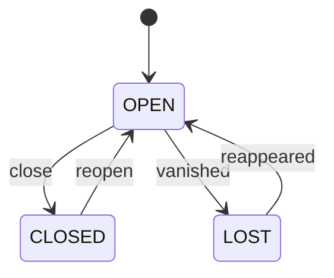

# P12 design gate: session and context continuity

Status: **FROZEN (P12), implemented; as built in §31.** Written 2026-09-27 on the P11 baseline
(`d8b5a3d`), **before any P12 code**; the as-built record and its deviations are §31. Items are
marked as in the earlier gates:

- **[spec]** already specified by the V1 architecture (plan, domain model, state machines, ADRs);
- **[clar]** a clarification of an existing contract the documents leave open, or that the code has
  already settled differently;
- **[new]** a new contract decision.

Every [new] item and every change to a frozen P1–P11 contract is a numbered decision (§30); the
conflicts with frozen documents are listed on their own (§25) with their resolution.

Sources read, in precedence order: the plan (§12, §31.1 **P11, P12, P13**), **ADR-0004,
ADR-0019, ADR-0021, ADR-0022, ADR-0023**, execution-architecture **§3, §4, §6**, state-machines
**§2, §4** and `STATE_SETS`, domain-model **§6, §7.4–§7.6**, api-and-realtime **§2**,
context-and-knowledge **§2, §9**, resource-router **§7**, testing-strategy **§2 (S2, S4), §6 (R1,
H1)**, the P11 gate (**§8, §13, §14, §15, §20, §27, §28, D9, D21, D29, D30**); the code:
`core/domain/{entities,states,events}.py` (Session, Checkpoint, ContextPackage, the execution
table), `core/application/{executions,work,commands,conversation,world}.py`,
`core/execution/manager.py`, `core/context/assemble.py`, `core/world/digest.py`,
`core/planning/planner.py`, `harnesses/{base,fake,fake_agent,calls,hook}.py`,
`harnesses/claude_code/adapter.py`, `node/local.py`, `infra/artifacts/store.py`, the judge
(`test_s02_long_mission_handoffs.py`, `test_s04_limit_and_fallback.py`), and the legacy session
code: `claude_sessions/main.py` (`build_launch_command`, 1038–1219), `context_inject.py`,
`transcript.py`, `pi.py`, `codex.py`, `harnesses.py`, `sessions.py`, `store.py`, `rotate.py`,
`gui_api.py` (the hand-off and quick-resume endpoints), `docs/context-handoff.md` and the
uncommitted `docs/pi-sessions.md`. Where a document and the code disagree, the code says what
exists.

The prompt that opened this phase names its acceptance scenarios S1–S14. The judge already uses
S1–S15 for the testing-strategy §2 rows, so this gate calls them **C1–C14** (continuity); the
mapping is §21.

---

## 1. Scope

P12 makes two kinds of continuity durable, reusing everything P5–P11 built:

1. **Work continuity inside a mission** [spec, plan P12, execution-architecture §6]: Core-derived
   **checkpoints**, and the **checkpoint hand-off** of an execution to a fresh one when its
   context is under pressure, when its account changes (a provider limit, a ceiling crossing) or
   when the user asks for a fresh session. Mission and task states do not change on the way.
   This is what S2's first function and S4's third function have been waiting for since P1.
2. **Session continuity for the user's own sessions** [spec, ADR-0023; D29 of P11]: a Session is a
   durable row; a user's session **resumes on its own harness's configuration** (R1); it can be
   **handed off** to another harness or account as a new, linked Session carrying a Core-rendered
   artifact (H1); and resuming or returning to one reconstructs **what changed** since it was last
   seen, from current durable state and a fresh P5 context package, never from a replayed
   transcript.

The two share one model (Session, Checkpoint, one artifact renderer, one freshness rule) and one
rule: **current durable state wins over anything a session or checkpoint remembers.**

## 2. Non-goals

- Verification, review, integration, merge-back, worktree removal (P13).
- Automations (P14); pairing, presence, remote devices beyond the existing routes (P15); any UI
  (P16 consumes the routes of §19); TUI (P17).
- A second context engine: P5 assembles every package P12 uses (§11).
- A second policy engine, router or execution manager: P9 authorises, P10 routes, P11 runs every
  process an execution has; P12's code runs inside those, through their entry points (§24).
- Importing the legacy product's existing sessions in bulk (the migration, P22). P12 gives the
  command a migration will call (`register_session`, §19).
- The Codex adapter and Codex user sessions (P20, P11 D30).
- Tool-using pi executions (execution-architecture §3: DEFERRED, RPC mode); pi is an
  interactive user-session harness in P12 and keeps its P6 `call()`.
- A per-mission conversation thread (P16; domain-model §6).
- Supervising a user's interactive terminal: Archeus launches it and records what it launched,
  it does not watch it (§14.3).

## 3. Existing architecture inspected

| Area | What exists | P12 reads it as |
|---|---|---|
| P1 domain | `Session(id, harness_id, account_id, state)` with `STATE_SETS['session'] = (OPEN, CLOSED, LOST)` and no edges; `Checkpoint(id, execution_id, mission_id, trigger, next_action)`; execution edges `RUNNING → HANDING_OFF` (`pressure_or_account_change`) and `HANDING_OFF → ENDED_HANDOFF` (`checkpoint_written`), never fired | the skeleton P12 fills; no table exists for either |
| P2 persistence | one writer, optimistic versions, idempotency keys, the event log with `project`/`workspace` columns, content-addressed artifacts (`infra/artifacts/store.put/get`) | reused as is |
| P3 lifecycle | `lifecycle.fire` is the only way a state moves; `Missions._fire` the only way a mission moves | P12 adds edges, never a second path |
| P3.5b API | route table, scopes, `Idempotency-Key`, SSE, device auth | new routes join the table (§19) |
| P4 world | `world/digest.py`: user-visible events after the owner's cursor, grouped by mission / repository / project / knowledge item with a headline | the "what changed" engine, reused with a session's own cursor (§11.4) |
| P5 context | `context.assemble(conn, subject_kind, subject_id)` for `mission`, `project`, `message`; `commands.record_context_package` the one place a package is built; packages immutable, `as_of_seq` = the snapshot's last event | P12 asks for packages; it never assembles (§11) |
| P6 knowledge | knowledge items with provenance; DECISION items mirror decisions | read into checkpoints and artifacts |
| P7 conversation | `Conversation(kind primary/mission)`, `Message`, `Intent`; one primary thread per user | untouched: a Session is a provider conversation, not an Archeus conversation (§6) |
| P8 planning | `planner.prompt(..., replan=)`; the plan says "checkpoints join the replan inputs in P12" | P12 adds the latest checkpoint per failed task to the replan input (§8.4) |
| P9 policy | `authorization.check_dispatch`, single-use action approvals, the e-stop DENY | every new execution a hand-off creates goes through `check_dispatch` (§16) |
| P10 routing | `ResourceRouter.route` for a task; `_affinity` drops a resource an execution was stopped by | every continuation is routed by P10 (§13) |
| P11 execution | `ExecutionManager` (tick, watch, control flags, boot adoption), `executions.py` commands, `resume_checked` (binding + P9 + P10 again), `LocalNode`, the hook, the Claude Code adapter whose `handoff()` raises "hand-off is P12" | P12 adds the HANDING_OFF branch to the manager's pass and the checkpoint to its end command (§8, §10) |

## 4. Existing session implementation inventory

V1 (`archeus/`): no Session is ever written; `ExecutionResult.session_ref` and `adapter_state
{'session': uuid}` (Claude Code) and `{'step': n}` (fake) are recorded on the Execution; the
manager resumes a paused execution through `adapter.resume(spec, adapter_state)`;
`harnesses/calls.py` has `PiCaller` (P6 `call()` only, capabilities `{headless,
structured_output, interactive}`, no `resume`).

Legacy (`claude_sessions/`, the current product; file:line from the inventory):

| Legacy behaviour | Where | P12 classification |
|---|---|---|
| `build_launch_command(path, enc, choice, opts)`: the interactive argv for claude / codex / pi — `new`, `continue`, `resume:<id>`, `fork:<id>`; account env (`CLAUDE_CONFIG_DIR`, `PI_CODING_AGENT_DIR`, key pops), OmniRoute provider env, project `system-prompt.txt` / `add-dirs.txt`, model and effort filtered to the target harness's vocabulary | `main.py:1038–1219`; `main.py` imports the TUI at module level | **reused**: moved verbatim into a UI-free `claude_sessions/launch.py`, re-exported from `main` (the plan's P11 preparation seam, moved here by P11 §28.10); the V1 session adapters call it (§12) |
| pi argv: `--session <id>`, `--fork`, `-c`, `--model`, `--thinking`, `--append-system-prompt`, `-- <prompt>`; sessions under `<home>/sessions/--<cwd>--/<ts>_<uuid>.jsonl`, identity from the header | `pi.py:83–299` | **reused** by the V1 pi session adapter (§12) |
| Resume: `claude -r <sid>`; cross-account resume by absolute transcript path + `--fork-session` | `main.py:1129–1133`, `gui_api.py:3252–3260`, `rotate.py:301–322` | resume on the session's own account: **reused**; the cross-account fork: **legacy only** — it carries the source's provider-private transcript into the target (§10.4) |
| No model or effort stored per session; project defaults and a per-project launch manifest instead | `main.py:811–818`, `workspace.py:29` | **replaced**: the Session row records the model and effort it was launched with (ADR-0023) |
| Quick resume: `last-session.json` (5 entries) | `sessions.py:595–615` | **legacy**; P16's "continue" reads Sessions |
| Hand-off: `context_inject` writes `.archeus/injected-context.md` — every user/assistant text turn of the source transcript, **no size cap, no redaction**, overwritten per hand-off — and points the new session at it (system-prompt file for Claude, opening prompt for others) | `context_inject.py:53–181`, `gui_api.py:3200–3276`, `docs/context-handoff.md` | **legacy, transitional** (§12.3): V1 never writes or reads it; its delivery channel (an opening message pointing at a file) is kept, with a Core-rendered, capped, redacted, per-session artifact |
| Session discovery from `<cfgdir>/projects/<enc>/<sid>.jsonl`, names, tags, archive | `sessions.py`, `store.py` | **legacy**; bulk import is P22's; P12 registers one session at a time |
| OmniRoute provider per session (`session-providers.json`) | `sessions.py:382–416` | **legacy**; a V1 Session records harness, account, model — a provider profile is a P20 concern for V1 |

## 5. P12 ownership boundary

P12 owns: the Session and Checkpoint rows and the Session state machine; the execution edges
around HANDING_OFF; checkpoint derivation; the decision to hand an execution off and the
continuation command; session registration, launch, resume, link, close, hand-off and lineage;
the continuity brief ("what changed since this session last saw the world"); the rendering of
checkpoints and hand-off artifacts; context-package freshness for sessions; the V1 session
adapters (Claude Code, pi, fake) and the `build_launch_command` seam; the routes and CLI verbs of
§19.

P12 does not own, and reuses: assembly and ranking (P5 — P12 calls `record_context_package`);
knowledge semantics (P6); what a message means (P7); planning (P8 — P12 adds a replan input, not
a planner); authorisation (P9 — every continuation calls `check_dispatch`); resource choice (P10 —
every continuation calls `route`); processes (P11 — the manager spawns, watches, halts and kills
every process, including a continuation's); verification (P13).

## 6. Session ontology

A **Session is a provider conversation** [spec, domain-model §7.5, ADR-0004]: one harness, one
account (or that harness's own default home), one provider session ref, one transcript. It is
infrastructure: it never owns work and its state never moves a mission, plan or task.

| Concept | Is | Is not |
|---|---|---|
| Session | a provider conversation Archeus can name, resume and hand off | the owner of any work; an Archeus conversation (that is P7's `Conversation`) |
| Mission | the work (ADR-0004) | something a session can complete, fail or block |
| Checkpoint | a Core-derived record of an execution's work at its end | a transcript; a source of truth for state |
| ContextPackage | P5's deterministic assembly at a snapshot | a session's memory |
| Continuity brief | a rendering of current durable state and the changes since a cursor | authorisation; anything read back into Core |
| Hand-off artifact | a rendering of a checkpoint or of a transcript, delivered to a new session | the target session's state |

**Kinds** [new, D1] — `mode` on the Session:

| `mode` | Created by | Archeus drives it? |
|---|---|---|
| `headless` | the execution manager, when an execution's process reports its provider session | yes (P11): it is the session an execution ran in |
| `interactive_attached` | `launch_session` / `handoff_session`: Archeus launched it in a terminal | no: the user drives it |
| `manual` | `register_session`: the user tells Core about a session they started themselves | no |

**A user's own session is a Session, not an Execution** [clar, D2]. ADR-0023 and domain-model
§7.4 describe user sessions as "an Execution in mode `interactive_attached` or `manual`". The
schema cannot hold that (`executions.task_id` and `mission_id` are `NOT NULL`, `UNIQUE (task_id,
attempt)`), and an Execution is something Archeus drives under P9 and P10 — a user's own session
is neither driven nor authorised by Archeus. So `Execution` stays headless-only, and the mode
lives on the Session. ADR-0023's behaviour (resume on the session's own harness, hand-off as a new
linked session, the source unchanged) is kept exactly.

**Relations** [new, D3]: a Session has one `workspace_id`, at most one `project_id` (fixed at
creation) and at most one `mission_id` (the mission it is continuing; changeable only by `link`,
only to a mission of the same workspace and project). Many sessions may name one mission. An
Execution gains `session_id` (the headless session it ran in) and `handoff_from` (the execution it
continues).

## 7. Session lifecycle

`STATE_SETS['session']` already names OPEN / CLOSED / LOST. P12 gives them edges and keeps the
set [spec + new, D4]:



- **OPEN**: Archeus can resume it (its provider session is known to exist, or has not been
  looked for yet). Whether a process is attached right now is not a state: Archeus does not
  supervise a user's terminal (§14.3), and for a headless session the Execution says it.
- **CLOSED**: the user closed it (`close`, with a reason). `reopen` is the user resuming it again.
- **LOST**: Core looked for its provider session and it is gone (transcript missing, account
  deregistered). `reappeared` when a later look finds it (a remounted drive). Neither `vanished`
  nor `reappeared` is fired on a guess: both follow an adapter `locate()` that was asked.
- No terminal state: a Session is history, never deleted, and the three states are all
  recoverable. **Hand-off is not a state**: ADR-0023 leaves the source Session unchanged, and the
  lineage lives on the target (`handoff_from_session_id`). **Interruption is not a state**: a Core
  restart, a closed terminal or a crashed harness changes nothing a session records (§14).
- Guards: `close`, `reopen` are user-device only; `vanished`, `reappeared` are Core's (system).
- A headless session is closed by the manager when its execution ends (`close`, reason `the
  execution ended`), so a user cannot "resume" a session an execution owned; the work continues
  through a checkpoint hand-off instead (§10.1).

## 8. Checkpoint contract

### 8.1 When

**One checkpoint per ended execution that ran** [spec, execution-architecture §6 "task boundary
(always)"; new rule, D5]: every end with a process — ENDED_OK, ENDED_ERROR, ENDED_KILLED,
ENDED_HANDOFF — derives exactly one Checkpoint in the same transaction as the end. ABANDONED
(nothing ran) and ENDED_REJECTED (P9's decision is the record) derive none. `trigger`:
`task_boundary` (ENDED_OK), `failure` (ENDED_ERROR, and ENDED_KILLED unless stopped for one of the
causes below), `pause` (a pause-timeout stop), `pressure`, `account_change` (limit, ceiling), `user`
(the user asked for a fresh session) — the last three only for ENDED_HANDOFF. `user` is added to
the P1 choices [new].

### 8.2 What it contains

Derived by Core, never asked of the agent [spec, execution-architecture §6]:

| Field | Source | Class |
|---|---|---|
| `execution_id`, `mission_id`, `task_id`, `session_id`, `plan_id`, `plan_version` | the rows | authoritative (identity) |
| `trigger`, `created_at`, `as_of_seq` (the event head it was derived at) | the command | authoritative |
| `objective`, `constraints`, `success_criteria` | Mission + Task rows at `as_of_seq` | historical (a copy; the rows win) |
| `completed_steps` | the plan's tasks and their states at `as_of_seq` | historical |
| `files_changed` | `git diff --stat` in the workdir, read by the node before the command | historical (measured) |
| `decisions` | stream lines beginning `DECISION:` (the task contract's convention), read by the manager, plus the mission's DECISION knowledge items | historical |
| `open_problems` | this execution's hook denials and halts (`execution.hook` events), its failure and exit, its last error line | historical |
| `verification` | the task's latest Verification rows (P13 writes them; empty until then) | historical |
| `next_action` | the task contract's next step when the planner gave one, else "continue the task from the diff and the open problems" | derived |
| `context_package_id` | the package the continuation's prompt was given (§11) | derived (a reference) |
| `artifact_sha` | the rendered markdown (§12.1) in the artifact store | derived (a rendering) |
| `usage` | the execution's last cumulative usage | historical |

Never in a checkpoint [new, D6]: a transcript, a tool result, thinking, the hook token, an
environment variable, a provider session ref, an account's home path. Every text field passes the
P11 redaction (`manager.redact`, moved to a shared module) and has a cap (§12.1).

### 8.3 Classification rule

A checkpoint is **history**: immutable, never updated, never read to decide a state. The one
thing Core reads from it is its rendering, as the variable suffix of the next execution's prompt
and in a hand-off artifact — never as authorisation, never as the current state of anything.

### 8.4 As a replan input

The plan (§12) says checkpoints join the replan inputs in P12 [spec]. The planner's replan input
gains, per task of the superseded plan that ended FAILED or BLOCKED, the `open_problems` and
`next_action` of its latest checkpoint. `planner.prompt` renders them after the failed checks. No
other planning change.

## 9. Resume semantics

Two different operations share the word; they stay separate [clar, D7]:

| | Execution resume | Session resume |
|---|---|---|
| Owner | P11 (`resume_checked`) — unchanged | P12 (`resume_session`) |
| What | a paused or approval-waiting execution gets a new process | a user's own session is reopened in a terminal |
| Authorisation | the binding, P9 `check_dispatch`, P10 `route` again (P11 §14) | none needed: the user drives it (§16) |

**Session resume, deterministic** [new, D8], `resume_session(session_id, request_id, model?,
effort?, deliver_brief=False)`:

1. Load the Session; LOST → refused (`the provider session is gone`); CLOSED → `reopen` first.
2. Ask the harness's session adapter to `locate` it (provider ref and transcript still there, on
   the recorded account) — outside the transaction, before the command. Gone → `vanished`, refused.
3. Validate the harness and account now: installed, declares `interactive` and `resume`; the
   account registered, not disabled, of that harness. A model or effort passed must be one the
   account offers / the adapter declares (ADR-0022: an unknown value is refused here, because the
   user asked for it explicitly, rather than silently dropped).
4. Read **current durable state** for the session's mission and project: mission, active plan
   version, the tasks and executions and their states, pending approvals, open problems of the
   latest checkpoints.
5. Compute the **continuity brief** (§11.4): changes since the session's `last_seen_seq`, grouped
   by P4's digest rules and scoped to the session's mission and project.
6. Reuse the session's last context package if it is fresh (§11.2), else record a new one
   through P5.
7. In one transaction: the session's `last_seen_seq` → the head read in 4, `context_package_id`,
   `last_active_at`, `model`/`effort` when changed, `launch_seq + 1`, `last_resume_request =
   request_id`; `session.resumed` with the brief's summary.
8. After the commit, the launcher (§14.4) builds the argv through the session adapter — resume
   ref, the recorded or changed model and effort in that harness's vocabulary, the account's home
   — and opens the terminal. `deliver_brief` puts the brief in the opening message; by default it
   is returned to the caller and not injected (an opening message starts a turn the user did not
   ask for).

**Current durable state wins** [new, D9]: steps 4–6 read rows at the moment of the resume. The
session's recorded `mission_id`, `context_package_id` and `last_seen_seq` are cursors into that
state, never a copy of it; nothing a session or checkpoint recorded is shown as current. A mission
that ended while the session was away is shown as ended; an execution that the checkpoint recorded
as RUNNING and is now VERIFYING is shown as VERIFYING.

**Duplicate resume** [new, D10]: a `request_id` equal to `last_resume_request` returns the stored
outcome and changes nothing (no second `session.resumed`, no cursor move, no second `launch_seq`,
so no second terminal). Under the route's `Idempotency-Key` the writer already replays the
response; the domain check is what holds when a client retries with a new key and the same
request id.

## 10. Handoff semantics

### 10.1 Execution hand-off (inside a mission) [spec, execution-architecture §6]

1. **Trigger**, decided by the manager: pressure ≥ 0.75 (§13.1); the PreCompact backstop
   (pressure 0.9); a provider limit (the account goes LIMITED, P11 D22); a ceiling crossing
   (P11 D21); the user (`POST /v1/executions/{id}/handoff`). Breaker stops stay P11 stops: a
   storm of errors is a failure, not a continuity case.
2. `RUNNING → HANDING_OFF` and the node's `HANDOFF` flag; the hook halts at the next tool call
   (as for a pause). A limit is immediate (P11 `_NOW`): the process is killed at once. A
   hand-off with no tool boundary within `pause_timeout` is killed as well — the checkpoint is
   Core's, so the process has nothing left to contribute.
3. The process is gone → in **one transaction** (`record_handoff`): the checkpoint (§8), `HANDING_OFF
   → ENDED_HANDOFF` (`exit_reason handoff`, `charged False`, `stop_reason` the trigger), the
   session closed, then the **continuation**: P9 `check_dispatch` for the task now, P10 `route`
   with `authorization` (affinity dropped for `account_change`, kept for `pressure` and `user`),
   and a new Execution in INTENT with `handoff_from`, `attempt = n + 1` (the table's `UNIQUE
   (task_id, attempt)`; the hand-off spent no charged attempt, D9 of P11 counts charged ones), and
   the same plan binding.
4. The task stays RUNNING and the mission EXECUTING (state-machines §2 "session rotation never
   changes mission state"). If P9 no longer covers the task or P10 finds nothing, the continuation
   is not created and the task takes `execution_failed_retry` (uncharged) back to READY, where
   the ordinary dispatch asks, blocks or waits exactly as it would for any task.
5. The continuation's prompt carries the checkpoint's rendering as its variable suffix; its
   `task_contract` carries `continuation` (how many hand-offs precede it).
6. If the process exits on its own while HANDING_OFF (it finished before a boundary), the end is
   ordinary: `exited_success` / `exited_error` from HANDING_OFF, with a `task_boundary` / `failure`
   checkpoint. A stop or an e-stop during HANDING_OFF goes to STOPPING as from RUNNING.

### 10.2 Session hand-off (a user's session) [spec, ADR-0023]

`handoff_session(source_session_id, request_id, target {harness_id, account_id?, model?,
effort?}, reason)`, a user device only:

1. The **source**: any state. OPEN and CLOSED are read as they are; LOST is allowed only when the
   artifact does not need its transcript (a session linked to a mission).
2. The **target**: installed, declares `interactive`; an account of that harness (or its own home);
   model and effort in the target's vocabulary (ADR-0022: a value the target does not know is
   refused when the user named it, dropped when it was inherited from the source — never
   translated). The source's own harness is offered first (ADR-0023) by the read that lists
   targets, not by this command.
3. The **artifact** (§12.2): for a session linked to a mission, rendered from current durable
   state and the mission's latest checkpoints; for one that is not, derived from the source's
   transcript by the source's adapter (the stated exception to ADR-0004), capped and redacted.
4. In one transaction: a new Session (`mode interactive_attached`, the target's harness, account,
   model, effort; the source's workspace, project, mission and cwd; `handoff_from_session_id`,
   `handoff_request = request_id`, `handoff_artifact_sha`, `launch_seq 1`); `session.created` and
   `session.handed_off`. The source row is not written.
5. After the commit, the launcher opens the target's terminal with the artifact delivered through
   the target adapter's channel (§12.3).

### 10.3 Resume vs hand-off

A resume reopens **the same provider session** on its own account; the provider keeps its own
history, and Archeus adds at most a brief. A hand-off starts **a new provider session**, possibly
on another harness, account or model, and gives it only what Core renders. Changing the account
or the harness is always a hand-off (domain-model §7.5: a session is bound to its account).

### 10.4 What the target never inherits [new, D11]

The source's provider session ref, transcript path, adapter state, account home, environment and
hook token. The legacy cross-account fork (`--resume <abs path> --fork-session`) is exactly such an
inheritance, and stays a legacy-product feature.

### 10.5 Duplicates, both active, failure

- `(handoff_from_session_id, handoff_request)` is unique: the same request returns the existing
  target and changes nothing (D10). A new request id is a deliberate second hand-off and makes a
  second target.
- Source and target may both stay OPEN, and both may be resumed: they are two provider
  conversations about the same work, and the work is the mission's (§15).
- The command writes nothing unless the whole transaction commits; a launch that fails after the
  commit leaves the target OPEN with `launched_seq < launch_seq`, and resuming it is the recovery.

## 11. Context reconstruction

### 11.1 P5 assembles; P12 chooses the subject

A session's context package has subject `mission` when the session names one, else `project`,
else none (a session with neither gets no package, and says so). P12 calls
`commands.record_context_package(subject_kind, subject_id)` — the one place a package is built. No
new subject kind, no new candidate source, no new scoring [new, D12].

### 11.2 Freshness

A package is **fresh** for a session when no event after its `as_of_seq` is in its scope: an event
of the package's `project_id` (or, for a mission with no project, an event whose subject is that
mission or one of its plans, tasks, executions, approvals or verifications), or a
`knowledge_item.*` or `decision.created` event in its workspace. Otherwise it is **stale**, and a
stale package is never reused: a resume or hand-off records a new one. The predicate
`context.fresh(conn, package)` lives in P5's module (read-only, P5 owns packages) [new, D13]; it is
conservative on purpose — anything in scope makes it stale.

### 11.3 Provenance

Every rendering names the package id and its `as_of_seq`, the checkpoint ids it used, and the head
it was rendered at. A Session records `context_package_id`; a Checkpoint records the one its
continuation got.

### 11.4 The continuity brief ("what changed since you left")

P4's digest groups user-visible events after the **owner's** cursor. P12 generalises its reader to
take a cursor and a scope (`digest(conn, since=, project=, mission=)`; the owner's digest is the
default and does not change) [new, D14], and uses it with the session's `last_seen_seq`. The brief
is:

1. the session (harness, model, when it was last seen);
2. the mission now: state, active plan version, tasks by state, what needs the user (pending
   approvals, BLOCKED, APPROVAL_REQUIRED);
3. the changes since the cursor, grouped and headlined by the digest;
4. open problems and next actions of the latest checkpoints of the mission's running or failed
   tasks;
5. the context package used and whether it was rebuilt;
6. **what is deliberately not included**: the transcript, tool output, earlier briefs, any
   approval as permission.

### 11.5 Failure

Assembly fails (a missing mission, a corrupt row) → the resume or hand-off is refused with the
reason; nothing is fabricated and no stale package is substituted. A package id a session names
that no longer exists is treated as stale.

## 12. Context artifact strategy

### 12.1 One renderer

`core/sessions/render.py` renders a checkpoint, a continuity brief and a hand-off artifact as
markdown: deterministic from its inputs, harness-neutral, redacted, capped (a checkpoint at
12 000 characters, a transcript-derived artifact at the last 40 text turns and 24 000 characters,
the tail kept), with a provenance footer. Stored with `artifacts.put` (content-addressed), referred
to by sha.

### 12.2 Hand-off artifacts

| Source session | Artifact |
|---|---|
| linked to a mission | mission, plan version, tasks by state, the latest checkpoint of each task, decisions, pending approvals (as information), the package's items (references and short texts, as P5 selected them) |
| not linked | the source adapter's `turns(transcript)`: user and assistant text turns only — no tool calls, tool results, thinking or API errors (the legacy `transcript.iter_transcript` rule, reused), capped and redacted |

### 12.3 `.archeus/injected-context.md` and delivery

Classified **legacy, transitional** [new, D15]: the legacy product keeps writing it until the
retirement gate; V1 never writes or reads it, and nothing in V1 treats any file as a source of
truth. V1 delivers an artifact through the target adapter's channel (ADR-0023): the rendering is
written to `<cwd>/.archeus/sessions/<target-session-id>.md` (per session, never overwritten, inside
the legacy-seeded `.archeus/` whose `.gitignore` is `*`), and the opening message points at it.
That file is a **delivery copy**: derived, never read back, reproducible from the artifact store.

## 13. Harness and model continuity

### 13.1 Pressure (headless) [spec, execution-architecture §6]

`pressure = (input_tokens + cache_read_input_tokens + cache_creation_input_tokens) /
context_window`, on every usage the stream reports, with the window of the execution's model from
the account's offers or the adapter's declared models; an unknown model uses the smallest window
that harness declares, and a harness declaring none has no pressure hand-off (recorded, not
guessed). Threshold 0.75. The PreCompact hook is installed in the per-execution settings (Claude
Code) and writes `precompact.json` in the execution directory without asking Core; the manager
reads it as pressure 0.9.

### 13.2 What survives what

| Change | Mechanism | Survives | Does not survive |
|---|---|---|---|
| model, same harness and account (user session) | `resume_session(model=)` | the provider session, its history, mission link, lineage | nothing |
| harness or account (user session) | `handoff_session` | mission link, project, cwd, lineage, the Core-rendered artifact | the provider session and its private history |
| model / account of an execution (P10's choice at a continuation) | checkpoint hand-off | task, mission, plan binding, attempt count, the checkpoint | the provider session |

### 13.3 Session adapters [new, D16]

A separate protocol from the P1 execution adapter, as `calls.py` is for `call()`:

```python
class SessionAdapter(Protocol):
    id: str
    def discover(self) -> HarnessInfo
    def capabilities(self, account) -> Capabilities        # interactive, resume, models, efforts
    def locate(self, ref, account) -> Located | None        # transcript path, model, effort as recorded
    def launch_argv(self, spec: SessionSpec) -> (argv, env) # new / resume, model, effort, opening message
    def turns(self, transcript_path, limit) -> [(role, text)]
    def mint_ref(self) -> str | None                        # a ref chosen before launch (Claude), or None (pi)
```

`ClaudeCodeSessions` and `PiSessions` build their argv with the moved `build_launch_command`, so
the launch is the one the legacy product ships (R1's vocabulary rule is already enforced there);
`FakeSessions(id)` records instead of launching, and two fake ids are how R1 and H1 run
"parametrised over two harnesses" with no domain change (testing-strategy §6). A session whose
harness cannot mint a ref (pi) records `provider_session_ref` when `locate` first finds it (the
newest session of that harness in the cwd after `started_at`), by `observe_session` [new].

## 14. Interruption and restart

### 14.1 Core restart

Sessions and checkpoints are rows: nothing to recover. At boot the session sweep `locate`s every
OPEN non-headless session and fires `vanished` for any whose provider session is gone; a pending
launch (`launch_seq > launched_seq`) is **not** replayed — a restarted Core never opens a terminal
nobody asked it for now — and is recorded `launch_expired` on the session. Executions recover
through P11's adopt-or-reconcile; one found HANDING_OFF with its process gone completes its
hand-off (§10.1 step 3); one HANDING_OFF and alive is adopted and keeps its flag.

### 14.2 User disconnect

A device leaving, a closed browser tab, a sleeping laptop: no session and no mission changes.
The next resume computes the brief from the cursor, whenever that is.

### 14.3 Harness crash

A headless crash is P11's (an execution end, a checkpoint). A user's interactive terminal is not
supervised: its session stays OPEN and the user resumes it; P12 never infers failure of anything
from a terminal closing.

### 14.4 The launcher

A post-commit step, never inside a transaction: read the session, build the argv through its
adapter, open the terminal through the node (`LocalNode.open_terminal`, over `proc.spawn_terminal`),
record `launched` (`launched_seq = launch_seq`, the terminal's pid when known) or `launch_failed`
(the error). The launch spec is rebuilt from the row, so a crash between commit and launch loses
nothing but the terminal.

## 15. Concurrent sessions

- Many sessions may be OPEN on one mission, on one or several harnesses. They **read** the
  mission; they do not own it. Anything they change about the work goes through the commands that
  already exist (mission commands, P7 messages, P9 approvals), each under P2's optimistic version
  check, so two sessions cannot lose each other's change silently: the second writer gets a
  conflict and re-reads.
- A resume always computes its brief from rows at that moment (D9): session A resuming after
  session B changed the mission, or after an execution moved, sees the change.
- Two hand-offs from one source with different request ids make two targets; the same request id
  makes one (D10).
- No session-level lock and no second concurrency mechanism.

## 16. Event model

| Event | Subject | Visibility | When |
|---|---|---|---|
| `session.created` | session | user | a Session row was written (payload: mode, harness, account, mission, handoff_from) |
| `session.state_changed` | session | user | closed, reopened, vanished, reappeared (`lifecycle.fire`) |
| `session.resumed` | session | user | a resume committed (payload: request, model, effort, rebuilt, package, changes) |
| `session.handed_off` | session (the target) | user | a hand-off committed (payload: from, to, reason, artifact) |
| `session.linked` | session | user | its mission changed (payload: from, to) |
| `session.observed` | session | system | a provider ref, transcript path or launch outcome was recorded |
| `checkpoint.created` | checkpoint | system | a checkpoint was derived (payload: execution, trigger) |

Execution hand-off uses the existing `execution.state_changed`, `execution.ended` (`exit_reason
handoff`) and `execution.intent` (now carrying `handoff_from`). No event for a read, a brief or an
assembly that was reused.

## 17. Security boundaries

| Threat | Control |
|---|---|
| forged session id | ids are validated (`ids.is_id(..., 'session')`) before any read; an unknown one is 404 |
| another principal acting on sessions | every session command requires a `user_device` actor (as P11's stop); brain and system can only fire `vanished`/`reappeared` and `observe_session`. V1 has one owner (`world.owner`); a second user is P15's |
| cross-project / cross-workspace | a session's workspace and project are fixed at creation; `link` accepts only a mission of the same workspace and project; a hand-off target inherits them and cannot name others |
| resuming after a policy change | a session resume authorises nothing; an execution resume and every continuation re-run P9 (`resume_checked`, `check_dispatch`) |
| replaying historical approvals | approvals are single-use and P9's (P11 S5); artifacts and briefs list approvals as information, and no code path parses an artifact |
| stale context carrying old authorisation | a package is references, not grants; a stale one is rebuilt (§11.2) |
| artifact leakage | artifacts live in the artifact store and in the session's own `.archeus/sessions/<id>.md`; a brief or artifact is rendered only for the session it belongs to |
| credential leakage | no Session, Checkpoint, artifact or event carries an env, a token, a home path or a key; every rendered text is redacted; a test scans all four for the P11 secret patterns |
| cross-session leakage | a transcript-derived artifact reads only the source session's transcript, located through its own recorded ref and account |
| provider-private state | §10.4 |

## 18. Failure semantics

| Failure | Behaviour |
|---|---|
| missing source session | 404 |
| corrupt checkpoint (unreadable artifact) | the rendering says the checkpoint is unavailable and names it; the brief continues from rows; nothing is invented |
| missing / stale context package | rebuilt (§11.2); a rebuild that fails refuses the resume or hand-off with the reason |
| missing mission | the session's link is shown as dangling; a resume proceeds without mission context and says so; `link` to it is 404 |
| closed mission | shown as closed; a resume proceeds; no continuation is created for its tasks |
| changed project (HEAD moved, repos changed) | in the brief's changes; the package is stale and rebuilt |
| unavailable harness / model | resume and hand-off refused with the reason (`409`), nothing written |
| hand-off failure before commit | nothing written |
| target launch failure | target OPEN, `launch_failed` recorded; resume it |
| interrupted hand-off (Core dies after commit, before launch) | target OPEN, `launch_expired` at boot; resume it |
| duplicate hand-off / resume | D10 |
| resume race (two resumes of one session) | P2 version check: the second commits after re-reading or gets `409 conflict`; with the same request id it is D10 |
| session reconstruction failure (an adapter cannot `locate`) | resume refused; the session stays OPEN unless `locate` positively reported it gone |
| continuation refused by P9 or P10 | the task returns to READY uncharged (§10.1 step 4) |

## 19. API and CLI surface

| Surface | Scope | |
|---|---|---|
| `GET /v1/sessions?project=&mission=&state=` | observe | sessions, newest activity first |
| `GET /v1/sessions/{id}` | observe | the session, its lineage (sources and targets) |
| `GET /v1/sessions/{id}/brief` | observe | the continuity brief now, without moving the cursor |
| `POST /v1/sessions` | control, idempotent | `register` (mode manual) or `launch` (interactive_attached, new) |
| `POST /v1/sessions/{id}/resume` | control, idempotent | §9 |
| `POST /v1/sessions/{id}/handoff` | control, idempotent | §10.2 |
| `POST /v1/sessions/{id}/link` | control, idempotent | continue a mission here |
| `POST /v1/sessions/{id}/close` | control, idempotent | |
| `GET /v1/executions/{id}/checkpoints` | observe | [spec, api-and-realtime §2] |
| `POST /v1/executions/{id}/handoff` | control, idempotent | "continue in a fresh session" |
| `archeus sessions [--project P] [--mission M]` | CLI | list |
| `archeus resume <session> [--model M] [--effort E]` | CLI | |
| `archeus handoff <session> --to <harness> [--account A] [--model M] [--effort E]` | CLI | |

`POST /v1/executions/{id}/retry` (api-and-realtime §2; P11 §27 put it here) is **not** built
[new, D17]: a task that failed is FAILED (final) and a stopped one waits in a BLOCKED mission whose
`resume` (P3) already re-dispatches it; a retry route would be a second door to one transition. P16
asks for it if a surface needs it.

## 20. Persistence and migration

`0010_sessions.sql`:

- `sessions` (standard columns + `body`), promoted: `workspace_id`, `project_id`, `mission_id`,
  `harness_id`, `state`, `handoff_from_session_id`; `UNIQUE (handoff_from_session_id,
  handoff_request)`; index on `mission_id`, on `project_id`.
- `checkpoints` (standard columns + `body`), promoted: `execution_id` (unique), `mission_id`,
  `task_id`; index on `mission_id`, `task_id`.
- Execution body fields [new]: `session_id`, `handoff_from`, `pressure`; `exit_reason` gains
  `handoff`; `STOP_REASONS` gains `pressure`, `handoff_user` (the account-change ones are the
  existing `limit` and `ceiling`).
- Session fields: `workspace_id`, `project_id?`, `mission_id?`, `harness_id`, `account_id?`
  (optional now: the harness's own home), `mode`, `provider_session_ref?`, `transcript_path?`,
  `cwd`, `model?`, `effort?`, `handoff_from_session_id?`, `handoff_request?`,
  `handoff_artifact_sha?`, `execution_id?`, `last_seen_seq`, `context_package_id?`, `started_at`,
  `last_active_at`, `last_resume_request?`, `launch_seq`, `launched_seq`, `launch_error?`,
  `closed_reason?`, `state`.

Classification of every session field:

| Field | Class |
|---|---|
| id, workspace_id, project_id, harness_id, account_id, mode, cwd, started_at, handoff_from_session_id, handoff_request, execution_id | authoritative (identity, fixed) |
| provider_session_ref, transcript_path | authoritative for *where the provider session is*; re-checked by `locate` before use |
| model, effort | authoritative for what a resume reopens on (ADR-0023) |
| state, mission_id, closed_reason | authoritative (lifecycle, link) |
| last_seen_seq, last_resume_request, launch_seq, launched_seq, launch_error | authoritative bookkeeping of this session's own cursor and launches |
| context_package_id | cached (a reference; fresh only if §11.2 says so) |
| handoff_artifact_sha, last_active_at | historical |

Nothing in a session row is derived from, or overrides, a mission, plan, task or execution.

## 21. Acceptance scenarios

The judge gains the rows below (testing-strategy §2), each on both bindings; H1 and R1 move from
§6 into §2. S2's first function and S4's third move to passing.

| ID | Scenario (prompt id) | Asserts |
|---|---|---|
| C1 | Resume after interruption (S1) | a session on an active mission; Core restarts; resume: the session is found, the brief shows the mission's current state and the changes, a package is recorded |
| C2 | Execution changed while away (S2) | an execution the session saw RUNNING ends while it is away; the brief shows it ended |
| C3 | Cross-harness hand-off (S3) | fake-a → fake-b: new session, artifact delivered, no source ref / home / env in the target's launch |
| C4 | Model switch (S4) | resume with another offered model: same session, same mission link, the argv carries the new model; an unoffered model is refused |
| C5 | Concurrent sessions (S5) | two sessions on one mission; B's change is in A's next brief |
| C6 | Stale context (S6) | a package older than a change in scope is not reused; one with no change since is |
| C7 | Policy change (S7) | a paused execution whose task a new rule now asks for is not resumed (P9); a session resume grants nothing |
| C8 | Core restart (S8) | sessions survive; a pending launch is not replayed |
| C9 | Hand-off lineage (S9) | `handoff_from_session_id` chains; the source row is byte-for-byte unchanged |
| C10 | No secret leakage (S10) | sessions, checkpoints, artifacts and events carry no secret pattern, env or home |
| C11 | Duplicate resume (S11) | the same request id: one `session.resumed`, one launch |
| C12 | Duplicate hand-off (S12) | the same request id: one target |
| C13 | Current state over checkpoint (S13) | a checkpoint says RUNNING; the rows say VERIFYING; the brief says VERIFYING |
| C14 | Missing / corrupt context (S14) | a missing package is rebuilt; an unreadable checkpoint artifact is reported, never invented |
| H1 | Cross-harness session hand-off | testing-strategy §6, parametrised over two fake harnesses |
| R1 | A session resumes on its own configuration | testing-strategy §6: its model and effort, never another harness's |
| S2.1 | Two pressure hand-offs | the mission completes; `exit_reason handoff` twice; the mission entered EXECUTING once |
| S4.3 | Limit mid-run hands off | account A LIMITED; the continuation runs on B |

**S2 and S4 scenario amendment** [clar, D18]: S2's pressure script is one `usage` emission and
nothing else, so the process exits 0 right after it, before any tool boundary — which §10.1 step 6
reads, correctly, as work that finished. The script gains a tool call after the emission, and the
emission is marked `fresh_only` (the fake harness skips it in a continuation, whose
`task_contract.continuation` is > 0), or every continuation would report the same pressure again.
The assertions do not change. S4.3's script emits `{'type': 'error', 'error': 'rate_limit'}`, which
the fake harness has never normalised (it knows `type: limit` and `error` with a `kind`); it is
how Claude Code words a limit in a transcript (`"error": "rate_limit"`), so the fake learns to read
it as a `limit` failure. The script and the assertion do not change. At the exit the manager then
marks the account LIMITED and hands off (§10.1), where P11 only retried the task on the same
account.

## 22. Mutation strategy

`tools/mutate_p12.py`, one mutant per invariant, each with its own killing test:

| # | Invariant broken |
|---|---|
| Y01 | resume reads the checkpoint's recorded state instead of the rows |
| Y02 | resume uses the session's cached package without the freshness check |
| Y03 | a non-user actor resumes or hands off a session |
| Y04 | `link` accepts a mission of another project |
| Y05 | the target loses `handoff_from_session_id` |
| Y06 | the hand-off writes the source row |
| Y07 | the target inherits the source's provider ref |
| Y08 | an artifact is not redacted |
| Y09 | a duplicate resume request moves the cursor again |
| Y10 | a duplicate hand-off request makes a second target |
| Y11 | the continuation skips P9 `check_dispatch` |
| Y12 | the continuation skips P10 (reuses the ended execution's account) |
| Y13 | a hand-off is charged an attempt |
| Y14 | a hand-off moves the task or mission |
| Y15 | an interrupted session (a closed terminal, a restart) marks anything failed |
| Y16 | a model switch drops the mission link |
| Y17 | the brief's changes use the owner's cursor instead of the session's |
| Y18 | the package provenance is not recorded on the session |
| Y19 | a pending launch is replayed at boot |
| Y20 | an ended execution derives no checkpoint (or two) |
| Y21 | pressure is ignored |
| Y22 | the limit hand-off keeps affinity to the limited account |
| Y23 | an unknown model is passed to the target harness |
| Y24 | the transcript-derived artifact includes tool output |

P9, P10 and P11's suites run unchanged; a P11 mutant whose snippet P12 moves is retargeted, as
P10's were in P11.

## 23. Explicit invariants

1. Current durable state wins over any session field, checkpoint or artifact.
2. Nothing P12 writes is read back as authorisation.
3. Every new Execution passes P9 `check_dispatch` and P10 `route` in the transaction that creates it.
4. A hand-off never changes a task's or a mission's state, and spends no charged attempt.
5. No P12 command moves a mission; the only task move P12 makes is `execution_failed_retry` when a
   continuation is refused.
6. A hand-off never writes its source Session.
7. A target session inherits no provider-private state (§10.4).
8. One checkpoint per ended execution that ran; none for ABANDONED or ENDED_REJECTED.
9. A stale package is never reused.
10. A session's brief is computed from its own cursor and scope.
11. Duplicate requests are idempotent in the domain, not only in the transport.
12. A restarted Core opens no terminal.
13. No secret, environment, home path or provider ref leaves a Session row into an artifact, a
    brief, a checkpoint or another session.
14. Only a user device changes a session; only Core marks one LOST or found.

## 24. Dependencies on P5–P11

| Phase | P12 uses | P12 adds to it |
|---|---|---|
| P4 | `world.digest` | a cursor and scope parameter (D14) |
| P5 | `record_context_package` | the `fresh(conn, package)` predicate (D13) |
| P6 | DECISION items | — |
| P8 | `planner.prompt(replan=)` | checkpoints in the replan input (§8.4) |
| P9 | `check_dispatch`, approvals | — |
| P10 | `route`, `_affinity` | — |
| P11 | the manager, the node, the hook, `executions.py`, `resume_checked`, `redact` | the HANDING_OFF branch, pressure, the HANDOFF flag, PreCompact, the checkpoint in every end, `record_handoff` |

## 25. Deviations and compatibility decisions

1. **Conflict: a user session as an Execution** (ADR-0023, domain-model §7.4) → a Session with a
   `mode` (D2, §6).
2. **Conflict: "attempt unchanged" on hand-off** (state-machines §4) → `attempt = n + 1`, the
   hand-off uncharged; `UNIQUE (task_id, attempt)` and P11 D9 already count charged attempts only.
3. **Conflict: `Session.account_id` required** (P1) → optional: a harness's own default home has
   no Account row (P10).
4. **The adapter contract's `handoff(checkpoint) -> ExecutionSpec`** is not how the continuation
   is built: a headless continuation is an ordinary INTENT whose prompt suffix is the rendering, so
   every headless adapter gets it the same way; delivery to a user session is the session
   adapter's `launch_argv`. `handoff()` is removed from the execution adapters [new, D19].
5. **`retry` route not built** (D17).
6. **Judge scenario amendment** for S2 and S4 (D18).
7. **Legacy compatibility**: `build_launch_command` moves to `claude_sessions/launch.py` and
   `main` re-exports it with the same signature, so every legacy caller, the harness descriptor's
   `'launch_argv': 'main.build_launch_command'` and the TUI keep working unchanged.

## 26. Out of scope

Verification and merge-back (P13), automations (P14), pairing and presence (P15), UI (P16), TUI
(P17), Codex and tool-using pi (P20), bulk session import (P22), OmniRoute provider profiles for V1
sessions (P20), a GUI for choosing hand-off targets (P16 over `GET /v1/sessions` and the harness
list).

## 27. Implementation order

1. this gate (commit);
2. persistence and domain: migration, entities, state edges, events;
3. session lifecycle and commands (register, close, reopen, link, observe);
4. checkpoints: derivation, rendering, one per end; replan input;
5. context: `fresh`, the digest cursor, the brief;
6. session resume and the launcher;
7. execution hand-off: pressure, PreCompact, HANDOFF flag, `record_handoff`, continuation;
   session hand-off;
8. session adapters (fake, Claude Code, pi) over the moved `build_launch_command`;
9. API routes, CLI verbs, the judge client;
10. tests, judge rows, boundaries, `tools/mutate_p12.py`;
11. as-built documentation.

## 28. Risks and unresolved questions

- **A user's terminal is unsupervised**: Archeus cannot know a user's session is "active". Accepted
  (§7, §14.3); presence is P15's.
- **pi session refs are discovered, not minted**: two pi sessions started in one cwd within the
  same second could be confused by `observe_session`; it takes the newest after `started_at` and
  refuses to guess when two qualify.
- **Pressure depends on known context windows**; a harness declaring none never hands off on
  pressure (recorded). The PreCompact backstop covers Claude Code.
- **A long brief in an opening message** starts a turn; resume therefore returns the brief by
  default instead of injecting it.
- **The real adapters** (Claude Code, pi sessions) are exercised only in the opt-in real suite, as
  P11's was; the judge runs on fakes.

## 29. The design review questions, answered

1. *Minimum durable state to resume*: the Session row's identity (harness, account, provider ref,
   cwd), model and effort, its cursor (`last_seen_seq`) and link (`mission_id`). Everything else is
   read now.
2. *Authoritative*: the mission, plan, task, execution, approval, policy and knowledge rows and the
   event log; for a session, its identity, model/effort, state, link and its own bookkeeping (§20).
3. *Checkpoint-only*: what an execution did, as it was when it ended (§8.2) — history.
4. *Offline changes*: the digest reader over events after the session's cursor, scoped (§11.4),
   plus the rows read at resume.
5. *Hand-off vs resume*: §10.3.
6. *Harness change*: the mission link, project, cwd, lineage and a Core-rendered artifact (§13.2).
7. *Model change*: everything; same provider session (§13.2).
8. *Freshness*: no in-scope event after the package's `as_of_seq` (§11.2).
9. *Stale*: rebuilt through P5; never reused; rebuild failure refuses (§11.5).
10. *Concurrent sessions*: read-only on the mission; changes through existing commands under P2
    versions; each resume reads fresh (§15).
11. *Core restart*: rows survive; the session sweep `locate`s; no launch replayed; executions via
    P11 (§14.1).
12. *Harness failure*: headless → P11 end + checkpoint; interactive → nothing changes (§14.3).
13. *Not a second P5*: one call site, `record_context_package`; no candidates, scores or subjects
    added; `fresh` is a read-only predicate in P5's module (§11).
14. *Not a second P11*: every process is the manager's; P12 adds a branch to its pass and a command
    to its end; user terminals are launched, never supervised (§10.1, §14.4).
15. *Not bypassing P9*: every execution a continuation creates calls `check_dispatch`; execution
    resume stays `resume_checked`; nothing reads an artifact as a grant (§16, invariants 2–3).
16. *Provider session ids*: on the Session row only; located before use; never copied to a
    target, a checkpoint or an artifact (§10.4).
17. *Credential leakage*: no env, token, home path or key is recorded in any P12 row or rendering;
    every rendering is redacted; a scan test (§17).
18. *Both active*: allowed; two provider conversations over one mission (§10.5).
19. *Duplicates*: request ids checked in the domain (D10) on top of transport idempotency.
20. *After a long absence*: the brief of §11.4 — where the work is, what needs them, what changed,
    what is open, what context was assembled and what was deliberately left out.

## 30. Decisions

| # | Decision |
|---|---|
| D1 | Session `mode`: headless / interactive_attached / manual. |
| D2 | A user's own session is a Session, not an Execution; Execution stays headless. |
| D3 | A session's workspace and project are fixed; its mission is a changeable link within them; Execution gains `session_id` and `handoff_from`. |
| D4 | Session machine: OPEN ⇄ CLOSED (`close`/`reopen`), OPEN ⇄ LOST (`vanished`/`reappeared`); no terminal state; hand-off and interruption are not states. |
| D5 | One checkpoint per ended execution that ran, in the transaction of the end. |
| D6 | A checkpoint holds no transcript, tool output, secret, env, home or provider ref; redacted and capped. |
| D7 | Execution resume (P11) and session resume (P12) stay separate operations. |
| D8 | Session resume: locate, validate, read now, brief, fresh-or-rebuild, commit, then launch. |
| D9 | Current durable state wins; session fields are cursors, not copies. |
| D10 | Duplicate resume / hand-off requests are idempotent by request id in the domain. |
| D11 | A hand-off target inherits no provider-private state. |
| D12 | P5 assembles every package; P12 only picks the subject. |
| D13 | `context.fresh(conn, package)`: no in-scope event after `as_of_seq`; stale is never reused. |
| D14 | The digest reader takes a cursor and a scope; the owner's digest is unchanged. |
| D15 | `.archeus/injected-context.md` is legacy and transitional; V1 delivers through `.archeus/sessions/<id>.md` pointed at by the opening message. |
| D16 | A `SessionAdapter` protocol (Claude Code, pi, fake) over the moved `build_launch_command`. |
| D17 | No `retry` route. |
| D18 | S2/S4 fake scripts gain a tool boundary and a `fresh_only` pressure step; the assertions are unchanged. |
| D19 | The execution adapters' `handoff()` is removed; a continuation is an ordinary INTENT with the rendering as its prompt suffix. |
| D20 | Execution hand-off triggers: pressure (≥ 0.75, PreCompact 0.9), limit, ceiling, user; breaker stays a P11 stop; affinity dropped for account changes only. |
| D21 | A restarted Core never replays a launch. |

## 31. As built

**What landed.** Migration `0010_sessions.sql` (sessions, checkpoints); the Session machine and
the four HANDING_OFF edges (§7, D20); `core/application/sessions.py` (the session commands),
`core/sessions/{continuity,render,service}.py`, `harnesses/sessions.py` (Claude Code, pi and fake
session adapters), `core/execution/{checkpoint,handoff}.py`, the HANDING_OFF branch of the
execution manager, the ten routes and three CLI verbs of §19; `build_launch_command` moved to
`claude_sessions/launch.py`. S2's first function, S4's third, C1–C14, H1 and R1 pass on both
bindings.

**Deviations from this gate.**

1. **`last_resume_request` is `last_request`.** domain-model §1 rule 7 keeps "resume" (a provider
   flag) out of entity field names, and `test_no_entity_carries_a_provider_concept` holds it.
2. **`session.resumed` and `session.linked` are `system` events**, and freshness (§11.2) also
   skips `session.*`, `context_package.*` and `checkpoint.*`. A resume records a package and then
   its own event; counted as news, every resume would stale the package it had just recorded, and
   the owner's digest would report a user's own resume back to them.
3. **The headless Session is written at the execution's end**, OPEN and closed in one transaction,
   because only then does the adapter report the provider ref (`adapter_state`). Every end with a
   process writes one, including a discarded pause and an ENDED_REJECTED end, which still gets no
   checkpoint (§8.1).
4. **A hand-off checkpoint's `context_package_id` is the mission's package**, a reference; the
   continuation's prompt is the checkpoint's rendering, and P12 records no extra package for it.
5. **S4.3's script changed after all.** §21 said its script would not change; the continuation on
   account B replays the task's whole script and hit the rate limit again, so both steps are
   `fresh_only`. S2 also needed two planner recordings (eight tasks and three): the judge's
   recorded brain answers every mission it has no entry for with a one-task plan, so `t3` and `t6`
   never existed and S2's second function had been passing vacuously.
6. **A defect found on the way: pressure or a limit seen while STARTING.** The manager reads output
   before it records the execution's first output, so the first pressure and limit reports arrived
   with the execution still STARTING (no hand-off edge) and were either ignored or turned into a
   stop. Both now record progress first.
7. **P11's E30 and E31 were migrated**: a ceiling crossing and a limit are account-change hand-offs
   now (D20), where P11 stopped the execution; E30's "affinity is None" became "the continuation is
   P10's fresh choice (a fallback)".
8. **The session routes call the session service**, not `req.run`: locate before and launch after
   the command are Core-side work around one writer command, as the e-stop route writes its sentinel
   around its command. `link` and `close`, which need nothing around them, are plain `req.run`s.
9. **`Ports.terminal`**, so that no test opens a real window: every test Core records launches
   (`JudgeTerminal`, the integration rigs' recorders).
10. **`CoreClient` gained eleven operations** (testing-strategy §1.1), and H1 and R1 moved from §6
    into §2 with C1–C14.
11. **The usage-ledger write is one helper** (`executions._ledger`) shared by an ordinary end and
    a hand-off, and P10's R33 and P11's X21/X25 snippets were retargeted to the moved code.
12. **The real session adapters were not run against real CLIs.** Launching one opens a real
    terminal; unit tests build their argv through `build_launch_command` with no CLI installed.
    Exercising them live is a manual check.

**Mutation.** `tools/mutate_p12.py`: 24 mutants, all killed; seven needed a test of their own
(T17, E79, E80, E81, and T02 / T21 / T32 strengthened). P8's (22), P9's (36), P10's (37) and
P11's (30) suites still kill everything.

**A defect in every mutation runner, found by P12's full run.** A mutant the same size as the
line it replaces, restored within the same second, left its compiled bytecode live: a `.pyc` is
checked against the source's size and whole-second mtime, so every later run imported the
mutant. P10's R34 (`d['account_id'] or d['account_ref']` against `d['account_ref'] or
d['harness_id']`, 35 characters each) did exactly that, and `test_I_U2` then failed in the
working tree while passing in a clean worktree. Worse, a mutant "killed" by a test that already
fails proves nothing, and no runner checked. All five runners (P8–P12) now run mutants with
`PYTHONDONTWRITEBYTECODE`, drop a restored file's cached bytecode, and refuse to start unless
every guarding test passes on the unmutated tree. Every suite was re-run from cleared caches
under the fixed runners; the counts above are those runs.
