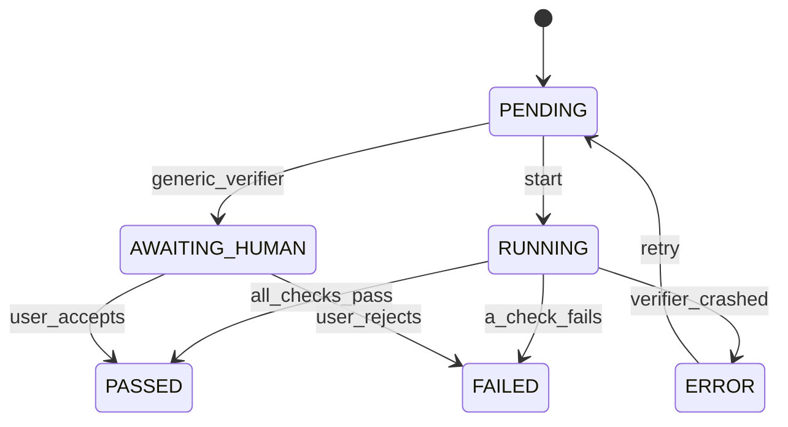
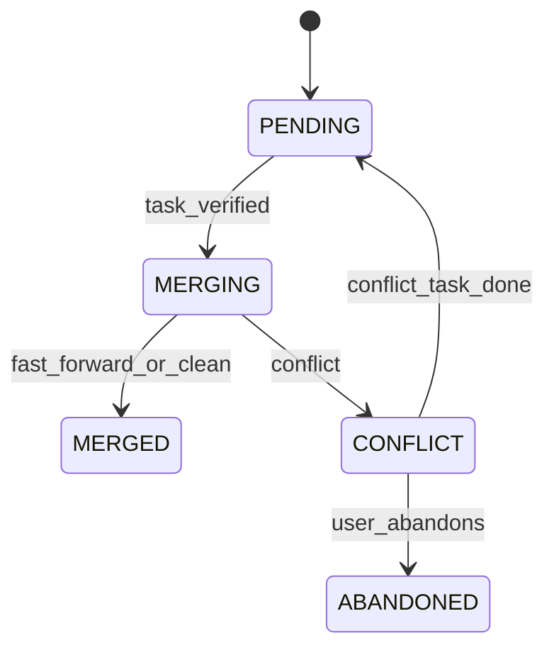

# P13 design gate: verification, review and merge-back

Status: **FROZEN (P13), before any P13 code.** Written 2026-09-27 on the P12/G01 baseline
(`e4197bd`, CI run 36331184385 green). The as-built record and its deviations are §33.
Items are marked as in the earlier gates:

- **[spec]** already specified by the V1 architecture (plan, domain model, state machines, ADRs);
- **[clar]** a clarification of an existing contract the documents leave open, or that the code has
  already settled differently;
- **[new]** a new contract decision.

Every [new] item and every change to a frozen P1–P12 contract is a numbered decision (§31); the
conflicts with frozen documents are listed on their own (§28) with their resolution.

Sources read, in precedence order: the plan (§14, §16, §31.1 **P11, P12, P13**, §31.2, §31.3),
execution-architecture **§1, §4, §7, §8**, state-machines **§2, §3, §4, §6, §7, §13, §14**,
domain-model **§7.2–§7.9, §8**, resource-router **§3, §5, §7**, testing-strategy **§2 (S1, S6),
§3**, the P4 (§3.2, §9), P8 (§7.1, §14, D13), P9 (§24), P10 (§4, §21), P11 (§4, §11, §17, §27,
D-items on worktrees) and P12 (§8, §31) gates; the code: `core/domain/{entities,states,guards,
events}.py`, `core/application/{work,commands,executions,resources,calls,lifecycle,world}.py`,
`core/engine.py`, `core/runtime.py`, `core/calls.py`, `core/routing/router.py`,
`core/planning/{worker,planner}.py`, `core/knowledge/{worker,passes}.py`,
`core/execution/{manager,canonical}.py`, `core/world/{inspection,worker}.py`,
`node/local.py`, `infra/db/{writer,rows}.py`, `infra/artifacts/store.py`,
`harnesses/{base,fake,fake_agent,calls}.py`, the judge (`client.py`, `http.py`, `support.py`,
`conftest.py`, `test_s01_simple_mission.py`, `test_s06_verify_fail_replan.py`) and the G01
changes (`28e0c87`, `339771b`, `b6de1bd`, `e4197bd`). Where a document and the code disagree, the
code says what exists.

The prompt that opened this phase names its scenarios V01–V15 and, in its follow-up, M01–M06.
The judge already uses S-numbers for testing-strategy rows; V and M are new rows (§24).

---

## 1. Objective

P13 makes Archeus able to answer, from durable state, for every task and every mission:

- what was intended (the plan version in force, the task's acceptance criteria, the mission's
  success criteria);
- what actually happened (which execution, on which harness, account and model, left which
  revision of which workspace);
- what evidence proves or disproves it, who or what observed it, at which revision, and whether
  that evidence is still about the state being judged;
- whether an independent reviewer (another model or account, or the user) accepted the result;
- and, for work done in worktrees, that exactly the verified revision was merged into the
  mission branch.

The rule it enforces [spec, P11 §1]: **a process that exits 0 is evidence, never success.**

```
process exit  !=  execution ENDED_OK  !=  task SUCCEEDED  !=  mission COMPLETED
   (P11)            (P11)                  (P13: verified)      (P13: verified + reviewed)
```

## 2. Ownership

| P13 owns | P13 consumes, never changes |
|---|---|
| the Verification and Review machines being *fired* (§6, §7) | the Execution record and its end (P11) |
| every Verification and Review row, their evidence and provenance | the RouteDecision that chose where work ran (P10) |
| task moves out of VERIFYING (`checks_passed`, `checks_failed_*`) | the Policy engine's decisions (P9) |
| the Integration machine on `Task.integration_state` (merge-back into the mission branch) | the plan version and its frozen task contract (P8) |
| the mission branch `archeus/<mission-id>` and the task worktree removal P11 deferred | the repository inspection's `test_commands`/`build_commands` (P4) |
| the verification worker `archeus-verify` | context packages (P5), knowledge (P6), sessions (P12) |
| the `review` own-call purpose and its schema | the own-call pipeline and the router (P6, P10) |
| routes and CLI verbs to read verifications and reviews, to accept or reject what waits on a human, to review as the user, and to abandon a conflicting merge | |

P13 authorises nothing, routes nothing, spawns no execution, changes no policy and no execution
limit, and never edits an Execution row. Its one git write is Core's own (§12): a snapshot commit
and merges on `archeus/*` branches, never the user's branch.

## 3. Non-goals

- Merging the mission branch into the user's working branch, and any push (the user's decision; a
  later, separately policy-checked action — §12.6, D14).
- ResearchVerifier, DocumentVerifier, PresentationVerifier, AutomationVerifier (execution-
  architecture §8). The V1 slice is **CodeVerifier + human acceptance** (plan §31.2); every other
  kind is verified by a human (GenericVerifier) in P13.
- An Attention entity. "Needs you" stays derived (digest `NEEDS_YOU`: APPROVAL_REQUIRED, REVIEWING,
  BLOCKED); P13 surfaces what waits on a human through BLOCKED with an explicit reason (§17).
- A second world model, context engine, freshness model, retention subsystem or policy engine.
- An autonomous model/harness selector (§26: it is P10's router extended with P8 requirements,
  and it is not built here).
- P14 (automation), P15 (pairing), P16 (information architecture), the SPA and the TUI.

## 4. Existing architecture inspected (what P13 starts from)

1. **Machines exist, unfired.** Verification (PENDING → RUNNING → PASSED | FAILED | ERROR;
   PENDING → AWAITING_HUMAN → PASSED | FAILED; ERROR → PENDING `retry`), Review (PENDING →
   IN_REVIEW → ACCEPTED | CHANGES_REQUESTED | REJECTED; `user_reviews`) and Integration (PENDING →
   MERGING → MERGED | CONFLICT; CONFLICT → PENDING | ABANDONED) are declared in `states.py`.
   Only `start`, `all_checks_pass`, `a_check_fails` and the three review verdicts are ever fired,
   all in one transaction by `Work._verify`/`record_review`.
2. **The mission edges and guards are done** (P3/P3.5): `all_tasks_done`, `verified`,
   `awaiting_human_acceptance`, `verification_failed`, `accepted`, and a verification counts only
   for the plan in force. P13 adds no mission edge.
3. **The stubs.** `ScriptedVerifier` (PASSED unless the subject id is in `failing`) and
   `ScriptedReview` (`accept` unless scripted) are injected into the engine, which calls them
   inline on its thread. Every current test and judge Core runs on them.
4. **No evidence exists.** A Verification row holds `subject, verifier, independent, plan_id,
   criterion, state`. No checks, no revision, no execution, no artifact.
5. **No command runner, no merge code, no final commit.** Nothing runs a test command; the node
   has git reads, `worktree add` from HEAD and `worktree remove`; an Execution records `workdir`
   and `branch` but no commit; `Task.integration_state` does not exist.
6. **Worktrees** (P11 as built): a `code_change` task of a git project runs in
   `<ARCHEUS_HOME>/worktrees/<project>/<mission>/<task-key>` on branch
   `archeus/<mission-id>.<task-key>`, created from the project's HEAD; a task's attempts share it;
   P11 never removes one.
7. **Own calls** (P6/P10): `OwnCalls.run(purpose, …)` routes a structured call through the P10
   router, records a RouteDecision (harness, account, model), validates against a schema with one
   retry, and ends the call. `CALL_PURPOSES` has no `review`; the router supports forbidden
   harnesses/accounts, but `call_snapshot` always passes none.
8. **The judge** can script the fake agent (`emit`, `sleep`, `exit`; tool events through the real
   hook) and fixture git repositories; it cannot make the agent change a file. The recorded brain
   has no `review` replies.

## 5. What is verified: the hierarchy [clar]

```
Mission ── plan version (in force) ──┬── success criterion i (automatic | human)
                                     │        └─ Verification (subject mission, criterion i,
                                     │           revision = mission branch head)
                                     └── Task (frozen contract: acceptance[], kind, workspace)
                                              ├─ Execution attempt n  (P11: process, ENDED_OK…)
                                              └─ Verification (subject task, execution_id,
                                                 revision = the commit verified)
                                                    └─ checks[]  → evidence (artifacts)
Review (subject mission, plan version) ── compares result vs intent, requirements, criteria
```

- **An action is not verified by P13.** An action's permission is P9's, judged at dispatch and by
  the hook at every tool call; its effect is part of the task's result.
- **An execution is not verified.** It is an *evidence source*: its end says a process exited;
  its workspace holds what it did. A task is verified against the latest execution whose end
  moved it to VERIFYING (§10).
- **A task's acceptance criteria** are verified by the task's Verification; **a mission's success
  criteria** by one Verification per criterion; **the whole result against the intent** by the
  Review. Verification establishes *necessary* conditions from deterministic evidence; Review
  judges *sufficiency* against the requirements (state-machines §7: "compares result vs intent,
  requirements, constraints and success criteria"). Neither replaces the other: only verified +
  reviewed missions complete (plan §16).

## 6. Verification vocabulary and state machine [spec + clar]

The architecture's names are kept (the prompt's vocabulary maps onto them; no parallel set):

| Prompt term | Archeus | Meaning |
|---|---|---|
| VERIFIED_SUCCESS | Verification **PASSED** | every check that ran passed and at least one *outcome* check ran (§8.3) |
| VERIFIED_FAILURE | Verification **FAILED** | a check observed the work to be wrong, or a human rejected it |
| INCONCLUSIVE (verifier fault) | Verification **ERROR** | the verifier could not decide: a command missing or timed out, the workspace unreadable, the evidence source gone, Core restarted mid-run |
| INCONCLUSIVE (no automatic evidence) | Verification **AWAITING_HUMAN** | nothing deterministic can decide this criterion; a human does (GenericVerifier) |
| SATISFIED / FAILED / UNKNOWN (per criterion) | `criteria[i].result` = `satisfied` / `failed` / `unknown` | the criterion's reading of the checks (§8.4) |



Unchanged. What P13 decides is *who fires what, when, with what evidence*:

- `start` and a verdict are **two transactions** now, with the evidence gathered between them
  outside any transaction (a check may run for minutes). A row in RUNNING is a verification in
  progress; after a Core restart it is `verifier_crashed` (§19).
- **ERROR is never a verdict about the work.** The task stays VERIFYING. ERROR retries once
  (`retry` → PENDING → RUNNING); a second ERROR blocks the mission with the reason (the
  architecture's "Attention item", §17). Resuming the mission permits one more attempt.
- **AWAITING_HUMAN is not a failure and not a pass.** The task stays VERIFYING; the mission is
  blocked "waiting for your acceptance" (§17); only a user device's decision moves the row.

## 7. Review vocabulary and state machine [spec + clar]

Unchanged machine. Review means **acceptance review of a mission's result against its intent**,
performed by the brain on a resource independent of the work when one is free, or by the user.

- **Automated review** is an own call, purpose `review` (new, D8), schema `review.v1` (§14.2).
  `independent` is computed from what ran, never asserted: true when the reviewer's
  (account, model) differs from every execution of the plan in force (§14.3).
- **Human review** is a user device recording its own Review (`user_reviews`); it is always
  `independent = true` and always the latest, so it overrides a model verdict (state-machines §7:
  "recorded as a second Review by `user`"). The mission's existing `accepted` guard reads the latest
  review of the plan in force.
- **REJECTED** stays a result, not a move: the mission waits in REVIEWING for the user
  (unchanged, P3.5).
- **An inconclusive review** (the call failed, timed out, was gated or answered invalid) records
  **no Review row**; the RouteDecision records the outcome. After two failed review calls for one
  plan version the worker stops asking and the mission waits in REVIEWING (a `needs_you` state)
  for the user's review (D9).

Review is **not** P9 approval: it does not authorise an action and does not reuse approvals or
action hashes. Who may review as the user is the route's scope (`approve`, §21), as for every
other human decision surface.

## 8. Evidence model [new, D3–D5]

### 8.1 What counts, and how authoritative

| Evidence | Class | Used for |
|---|---|---|
| a command Core runs itself in the workspace at the recorded revision (the inspection's `test_commands`, `build_commands`): exit code, duration, output | **authoritative** | a check's result |
| git facts Core reads itself at verification time: HEAD commit, tracked-change digest, `merge-base`, diff numstat base..head | **authoritative** | revision binding, "the task changed something", staleness |
| the Execution record: ENDED_OK, exit code, harness/account/model/effort, route decision | **corroborating** | lineage and provenance; never a check result |
| the stream: tool events, usage, reported model | **corroborating** | provenance comparison (§22), the review prompt |
| checkpoint `files_changed`, `decisions` | **corroborating** | the review prompt |
| the agent's reported summary, and anything it claims | **untrusted** | shown to the reviewer labelled "claimed by the agent, not verified"; never read by a verifier |
| a Review verdict | **derived** | mission completion |
| a check or Verification at a revision that is no longer the one being judged | **stale** | ignored by the guards (§11) |
| no check could run | **missing** | ERROR (the verifier broke) or AWAITING_HUMAN (nothing to run) — never PASSED |

### 8.2 Identity, integrity, freshness, provenance, scope

- **Identity.** A check is one entry of `Verification.checks[]`: `{name, kind: command | git,
  argv?, result: pass | fail | error, exit_code?, duration_ms?, output_sha256?, output_bytes?,
  truncated?, detail}`. It is identified by (verification id, index). The Verification is the unit
  of evidence the guards read.
- **Integrity.** A command's output is stored as a content-addressed artifact (`infra/artifacts`,
  sha256, immutable; `store.get` re-hashes on read), with an Artifact row. The guarantee is
  **tamper-evidence against the recorded digest**, not a signature: someone who can write
  `archeus.db` can write anything. Output is bounded: the last 256 KiB are kept, with the full
  size and a `truncated` flag; it is streamed to a file, never held whole in memory.
- **Freshness.** Every Verification of a task or of a mission criterion records `revision`: the
  commit it observed (after the snapshot commit, §12.2), or `null` where there is no repository.
  Staleness is judged against durable state (§11), not against a clock.
- **Provenance.** `execution_id` (task rows), `performed_by` — the verified execution's
  `{harness_id, account_id, account_ref, model, effort, route_decision_id, session_id}` copied
  from the Execution and its RouteDecision at record time — `verifier` (kind),
  `verifier_version`, `workspace` (the path checked), `base_revision`, `plan_id`, `criterion`, the
  acting principal of every transition (row audit columns), and `decided_by`/`note` for a human
  decision.
- **Scope.** A task Verification supports exactly one (task, plan version, execution, revision);
  a mission Verification exactly one (mission, plan version, criterion, revision). Nothing else
  can count it (§20).

### 8.3 Checks a verifier runs

**CodeVerifier** (a task or mission with a git workspace):

| Check | Kind | Result |
|---|---|---|
| `changes` — a `code_change` task changed something: `git diff --numstat <base>..<revision>` non-empty | git | pass / fail ("the task changed nothing") |
| each `test_commands` entry of the repository's latest COMPLETED inspection | command | exit 0 → pass; non-zero → fail; not found, timeout, spawn error → error |
| each `build_commands` entry | command | as above |

An **outcome check** is a command check. `changes` alone never passes a Verification: a diff proves
something was written, not that it is right.

**GenericVerifier** (human): no checks run; the row records the git facts it could read (as
corroborating context) and goes AWAITING_HUMAN.

### 8.4 Aggregation into a verdict

For one Verification:

1. any check `fail` → **FAILED** (`a_check_fails`) — a failure outranks an error or a pass;
2. else any check `error` → **ERROR** (`verifier_crashed`);
3. else at least one outcome check ran and all passed → **PASSED** (`all_checks_pass`);
4. else (no outcome check could run) → **AWAITING_HUMAN** (`generic_verifier`) — the verifier
   cannot decide, so a human does. Missing evidence is never converted to success or failure.

Per criterion (`criteria[]`, one entry per acceptance criterion of the task, or the one mission
criterion): an automatic criterion reads the verdict of the checks — `satisfied` (PASSED),
`failed` (FAILED), `unknown` (ERROR / AWAITING_HUMAN) — because V1's deterministic battery cannot
map criterion *text* to a specific check; the criterion's meaning is the Review's to judge
(requirements_met / requirements_missing, §14). A `human` criterion is `unknown` until decided.
This is stated in the record, not hidden: a task with two automatic criteria and passing tests has
both `satisfied` by the same battery, and the reviewer is told so.

### 8.5 Contradictory evidence

- Authoritative beats corroborating beats untrusted: an agent reporting "done" with failing tests
  is FAILED (V01); a stream reporting failures while Core's run passes is PASSED on Core's run.
- Two authoritative checks disagreeing (tests pass, build fails) is FAILED with both recorded (V11).
- A passing task verification and a failing mission criterion on the merged branch is
  `verification_failed` → REPLANNING (the mission judges the combination).
- Checks run once per Verification; a flaky check is whatever was observed. No silent re-run.

## 9. Lineage [new, D6]

```
Mission ─ Plan version (plan_id, in force) ─ Task (plan_id, frozen acceptance[])
   ─ Execution (task_id, attempt, route_decision_id → harness/account/model, session_id)
      ─ Verification (subject task, plan_id, execution_id, revision, checks → artifacts)
         ─ Integration (Task.integration_state, merged revision → Mission.integration_head)
            ─ Verification (subject mission, criterion i, plan_id, revision = integration head)
               ─ Review (mission, plan_id, route_decision_id | principal, independent)
```

Every link is a stored id or commit, set by Core from durable state at the moment the row is
written — never taken from a request body or from the agent. The questions of the prompt's §7
are answered by reading rows: intent (mission + plan version + task contract), authorisation
(the plan's approval and the execution's `policy_decision_id`, P9), requirement (the task's
`acceptance[]` and `serves[]`, P8), implementation (the execution), evidence (checks and
artifacts), verification time (the row's transitions), world state (the revision).

**No mutable "latest result" fields.** Verification and Review rows are immutable once terminal;
"current" is always *computed* (the latest row of the plan in force, at the current revision). The
two mutable pointers P13 adds are world facts, each moved only by its own event:
`Task.integration_state` (+ `merged_revision`) and `Mission.integration_head`.

## 10. Retries and multiple executions [clar, D7]

- A task is verified against **the execution whose end moved it to VERIFYING** — the task's latest
  ENDED_OK execution of the plan in force. `record` refuses any other execution id (V10).
- `checks_failed_retry` sends the task back to READY (P3.5): the next attempt is a new Execution in
  the same worktree; its end brings a new VERIFYING and a new Verification. Earlier Verifications
  stay as history.
- Attempt 1 ENDED_ERROR, attempt 2 ENDED_OK → the task is verified once, on attempt 2's
  revision (V06). Attempt 1's failure is charged (P11 D9); it is not verification evidence.
- Two ENDED_OK executions of one task cannot both be verified: a verdict moves the task out of
  VERIFYING in the same transaction, and a second record finds the task not VERIFYING (V07).
- A verification FAILED counts against `max_attempts` like an execution failure (P3.5, unchanged:
  `charged_failure` with failure class `verification`).

## 11. Stale evidence [new, D10]

P13 reuses what already defines "current" — commits and durable pointers — rather than a new
freshness model:

- **Task.** The Verification is bound to the commit it checked. Integration merges **that commit,
  by SHA**, never the branch name (§12.4): later edits to the task branch are neither verified
  nor merged. The `task_verified` guard requires the commit being merged to be the revision of
  the task's PASSED Verification of the plan in force.
- **Mission.** `Mission.integration_head` is the mission branch head Core recorded at its last
  merge. The guard snapshot (`persisted_facts`) counts a mission Verification only when its
  `revision` equals `integration_head` (both null for a mission with no repository). If the branch
  head on disk differs from `integration_head` (someone moved it), the worker records the move
  (`mission.updated`, fields `integration_head`) before verifying: every Verification of the old
  head is stale at once and the criteria are verified again at the new head (V04).
- **World and context.** A verification reads no context package; the review prompt is built
  from rows at call time. P4's inspection is the source of the commands; the commands used are
  those of the latest COMPLETED inspection at verification time and are recorded in the checks.
- **In place (no worktree).** A task run in the project root is verified at the root's HEAD and
  tracked-change digest; nothing is committed and nothing is merged. Later user edits there are
  not tracked by a guard — in-place work has no branch to bind to — and the review sees the
  revision it was verified at.

## 12. Integration (merge-back into the mission branch) [spec + new, D11–D14]

Per the user's scope decision: **task branch → mission branch in P13**; the mission branch into
the user's working branch, and any push, are not built (D14).

### 12.1 Branches and worktrees

- Mission branch `archeus/<mission-id>`, in a Core-owned worktree
  `<ARCHEUS_HOME>/worktrees/<project-id>/<mission-id>/_mission` (the node creates and removes it,
  execution-architecture §7). It is created at the first merge, from the first task branch's fork
  point (`git merge-base <task revision> <project HEAD>`), recorded as `Mission.integration_base`.
- **A later task forks from the mission branch** when it exists (a P11 seam change, D12): the
  worktree of task t2 starts at `archeus/<mission-id>`, so a dependent task sees its dependency's
  result and sequential tasks never conflict. Without this, t2 forks from the project's HEAD,
  cannot see t1's change, and their merges conflict whenever they touch the same file.
- A task worktree is removed after its merge (the removal P11 deferred); its branch is kept.
  The mission worktree is kept after COMPLETED (the user inspects and merges from it; §25).

### 12.2 Snapshot

Before verifying a worktree task the worker commits whatever the agent left uncommitted
(`git add -A` + commit on the task's `archeus/*` branch, author "Archeus", message naming the task
and attempt), so the revision verified is a commit and the thing merged is exactly the thing
verified. This is Core's own git write on its own branch (P9 profiles bound agent commits to
`archeus/*`; Core writes nothing else). An in-place task is never committed.

### 12.3 The machine



Unchanged; held on `Task.integration_state` (domain-model §7.3). NULL for an in-place task.

- PENDING is set with `checks_passed` (the task is SUCCEEDED; the merge follows).
- `task_verified` is **guarded** (new guard): the task is SUCCEEDED, its latest PASSED Verification
  of the plan in force names the revision being merged, and the task's plan is in force.
- MERGING → merge performed outside any transaction → MERGED (`merged_revision`, and
  `Mission.integration_head` moves in the same transaction) or CONFLICT (`git merge --abort`; the
  mission branch is left as it was).

### 12.4 The merge

`git -C <mission worktree> merge --no-ff --no-edit <revision SHA>`; a fast-forward-able history
still gets a merge commit so every task is one identifiable merge. Identity: Core's
("Archeus <archeus@localhost>"), set per command (`-c user.name`, `-c user.email`), never the
user's config. Idempotent across a restart: before merging, `git merge-base --is-ancestor
<revision> <mission head>` — already an ancestor means the merge happened and only its record was
lost, so MERGED is recorded with the current head.

### 12.5 Conflict [new, D13 — a documented deviation]

state-machines §13 says CONFLICT blocks the task and creates a follow-up "resolve conflict" task
in the same plan. Neither is possible as built: the task is SUCCEEDED (terminal) when merging
starts, and a plan version is immutable (P8 D1, D12) — a task can only enter a plan through a new
version. So:

- CONFLICT **blocks the mission** (`block`, reason "task t2's result conflicts with the mission
  branch in <files>"), a `needs_you` state, with the conflicting paths recorded on the task.
- The user either **abandons** the merge (`user_abandons` → ABANDONED: that task's work is not in
  the mission branch; mission verification then judges the branch without it, which normally
  fails and replans with the conflict as input), or **resumes** the mission after resolving it
  on the mission branch themselves (the worker re-attempts the merge; a resolved branch merges
  cleanly or is already an ancestor).
- `conflict_task_done` stays declared and unfired (reserved for a follow-up task a later phase may
  create through a replan).
- `all_tasks_done` additionally requires every worktree task of the plan in force to be MERGED or
  ABANDONED (a P3 guard extension, D11), so mission verification always runs on a branch that
  holds every merged task.

### 12.6 Not built

Final integration into the user's working branch and `git_push` (execution-architecture §7:
"separate policy-checked actions performed by Core"). A COMPLETED mission's result is the
`archeus/<mission-id>` branch; the API shows it. Owned by a later phase with its P9 action classes
(D14).

## 13. Acceptance criteria (P8) consumed [clar]

- A task's `acceptance[]` is `{text, check: automatic | human}` (P8 §7.1, frozen with the version).
  - All `human`: GenericVerifier, AWAITING_HUMAN.
  - Any `automatic`, with a git workspace: CodeVerifier; the automatic criteria read its verdict;
    a `human` criterion of the same task is `unknown` and makes a PASSED battery **AWAITING_HUMAN**
    instead (the human criterion must be decided; D5).
  - Any `automatic`, no git workspace (no project, or not a repository): AWAITING_HUMAN — there is
    nothing deterministic to observe.
- A mission's `success_criteria[]` `{text, check, origin}`: one Verification per criterion of the
  plan in force; automatic → CodeVerifier on the mission revision (the mission branch head, or the
  project root in place, or none → AWAITING_HUMAN); human → AWAITING_HUMAN. The existing guards do
  the rest (`verification_failed` first, then `awaiting_human_acceptance`, then `verified`).
- Task kinds `research`, `document`, `presentation` get GenericVerifier (§3).

## 14. The reviewer [new, D8, D9]

### 14.1 When

A mission in REVIEWING with no Review of the plan in force, and fewer than two failed `review`
calls for that plan version, is due. The mission's `_review` in the engine is taken over by the
worker (§18) unless a stub reviewer is injected.

### 14.2 Prompt and schema

`review.v1`: `{verdict: accept | changes_requested | reject, requirements_met: [str],
requirements_missing: [str], risks: [str], regressions: [str], follow_up: [str], summary: str}`,
validated by `shapes.validate` plus a check that `accept` has no `requirements_missing`. The prompt
is built from rows at call time: the objective, the P7 requirements and constraints, the success
criteria, each task's contract and acceptance criteria, each Verification of the plan in force
(verdict, checks with their results, the revision), the mission branch diff stat from
`integration_base`, and each execution's reported summary **labelled as an unverified claim**. No
transcript, no provider-private state.

### 14.3 Independence

The worker asks the router for the call with the resources that executed the plan's tasks
**forbidden** (their accounts — `account_id` or the harness's own `account_ref`); if nothing else
is eligible, it routes again without the restriction and the review runs anyway. `independent` is
then computed from the two RouteDecisions: true iff the reviewer's (account, model) differs from
every execution's. A new `forbidden` argument to `OwnCalls.run` carries the restriction into
`call_snapshot`; the router already implements it (P10 `restriction` step). Both decisions are
recorded, so "no independent resource was free" is visible, not asserted.

### 14.4 The record

`record_review` gains `requirements_met`, `requirements_missing`, `risks`, `regressions`,
`follow_up`, `summary`, `route_decision_id`, `reviewer_resource` `{harness_id, account, model}`,
and `review.requested` carries `independent` and `reviewer_resource`. `changes_requested` →
REPLANNING (unchanged) with `requirements_missing` as a replan input (the planner's `_replan`
gains it and the failing checks, §15).

## 15. Integration with P4–P12

| Phase | P13 uses | P13 changes |
|---|---|---|
| P4 world | latest COMPLETED inspection's `test_commands`/`build_commands` | nothing |
| P5 context | nothing (the review prompt is built from rows) | nothing |
| P6 knowledge | own-call pipeline; the lesson pass already reads the mission's verifications and reviews | nothing (no verification becomes a confirmed fact; a lesson stays a CANDIDATE, P6) |
| P7 intent | the mission's requirements and constraints (review prompt) | nothing |
| P8 plans | frozen `acceptance[]`, `kind`, `workspace_mode`, `serves[]`; `_replan` inputs | `_replan` also passes each failing check's name/detail and the review's `requirements_missing` |
| P9 policy | nothing new: the agent's Write/commit went through the hook; Core's own git writes are on `archeus/*` | nothing |
| P10 routing | the router, for the review call; execution RouteDecisions for provenance | `OwnCalls.run(forbidden=)` into `call_snapshot`; `review` in `CALL_PURPOSES` |
| P11 execution | Execution end, workdir, branch; the worktree | `_workspace` forks a task worktree from the mission branch when it exists; `add_worktree(base=)`; node `run_check`, git helpers |
| P12 sessions | the execution's session id (provenance) | nothing |

## 16. Failure semantics [new]

| Case | Durable result |
|---|---|
| execution failed (ENDED_ERROR/KILLED/LOST) | P11: retry or FAILED; no Verification (nothing to verify) |
| ENDED_OK, evidence contradicts the goal | Verification FAILED; task `checks_failed_retry`/`_final` (V01) |
| ENDED_OK, no outcome evidence can be produced | Verification AWAITING_HUMAN; mission BLOCKED "waiting for your acceptance" (V03) |
| evidence stale | ignored by the guards; re-verified at the current revision (V04) |
| evidence contradictory | FAILED with every check recorded (V11) |
| verifier fails (command missing, timeout) | Verification ERROR; one retry; then mission BLOCKED "verification could not run: <reason>" (V12) |
| verifier / Core crashes mid-verification | RUNNING row → `verifier_crashed` ERROR at boot (`core_restarted`); retried like any ERROR (V08) |
| review rejected | REJECTED; mission waits in REVIEWING for the user |
| review inconclusive (call failed) | no Review row; RouteDecision outcome; two failures → waits for the user |
| required criterion never executed | its task never reached VERIFYING: `all_tasks_done` refuses; nothing is verified |
| world cannot be queried (git fails, workspace gone) | ERROR (verifier fault), never FAILED |
| evidence source unavailable (artifact missing on read) | reading a Verification reports the artifact missing; the verdict row is unchanged (history) |
| merge conflict | integration CONFLICT; mission BLOCKED with the paths (§12.5) |

**Verifier failure is not task failure** (the prompt's §19, state-machines §6): only a check that
*observed the work to be wrong* or a human's rejection is FAILED.

## 17. Human decisions and "needs you"

- A task Verification going AWAITING_HUMAN, or a second ERROR, blocks the mission (`block`,
  EXECUTING → BLOCKED) with the reason; the Verification id is in the event payload. Deciding the
  row (accept → `user_accepts` → PASSED → `checks_passed`; reject → `user_rejects` → FAILED → retry
  or FAILED) **resumes the mission in the same transaction** when nothing else holds it (the
  existing `resume`: unblock + redispatch).
- A mission criterion AWAITING_HUMAN takes the existing `awaiting_human_acceptance` (VERIFYING →
  BLOCKED). Deciding it resumes likewise; the engine's `advance` then takes `verified` (all
  criteria PASSED at the current head) or `verification_failed`.
- Deciding requires a user device with the `approve` scope; the row records `decided_by` (the
  principal) and the note; a decided row cannot be decided again (invalid transition, 409).

## 18. Worker semantics [new, D15]

- **`archeus-verify`**, a `WorldLoop`-hosted worker (the world/knowledge/intent/plan pattern:
  `sweep()` at boot, then `pass_once()`; `pending()` = the number of due items). **Scan-based on
  durable state, not event-driven**: after G01, a continuation is found from rows, so a lost
  wake-up can only delay work, never lose it. The writer's commit notification wakes it.
- **Due items**, in order, one per pass: (1) a VERIFYING task of the plan in force with no open
  AWAITING_HUMAN row and no ERROR row that has used its attempts in this hold; (2) an integration
  PENDING (or a MERGING left by a dead Core); (3) a mission in VERIFYING whose criteria lack a
  terminal or awaiting row at the current `integration_head`; (4) a mission in REVIEWING due a
  review (§14.1). The worker never advances a mission: it writes rows; the engine's `advance`
  judges them (the engine re-steps a mission when its tasks' or its own version moves, P11 D28).
- **One item at a time** (no parallel verification); checks have a timeout (600 s default,
  per-command; tests set it lower).
- **The engine** verifies and reviews inline **only when a stub port is injected** (as it plans only
  with an injected stub brain, P8 D5). The runtime default is the worker; `TempCore` and the
  in-process judge binding keep the stubs unless a test names otherwise (as they keep the fake
  executor, P11).
- **Idle signal.** The worker reports `running` for the whole of every pass and `pending` from
  durable state; the judge's `_idle` includes it (the G01 lesson: idle must mean nothing is in
  flight).

## 19. Restart and recovery [new, D16]

| Restart during | What the next Core finds | What happens |
|---|---|---|
| execution completed, task VERIFYING, no row | a due task | verified on the first pass |
| snapshot commit made, no row | a clean worktree | verified at the committed revision (idempotent) |
| row RUNNING (checks in flight) | a RUNNING row | boot sweep: `verifier_crashed`, reason `core_restarted`; then `retry` (counts as the one retry) |
| checks done, verdict not recorded | a RUNNING row | as above: evidence is re-observed, never replayed from memory |
| AWAITING_HUMAN | the row | unchanged; the mission stays blocked |
| MERGING, merge not performed | MERGING | merge performed |
| MERGING, merge performed, not recorded | MERGING, revision already an ancestor | MERGED recorded (§12.4) |
| mission VERIFYING / REVIEWING | due items | verified / reviewed; a review call left open by the dead Core is ended `failed` by the existing knowledge-worker boot sweep and counts as one failed review call |

Nothing is marked PASSED by recovery; every verdict comes from evidence observed by the Core that
records it.

## 20. Security: binding evidence to lineage [new, D17]

- **Only Core's worker writes verdicts, and only from what it observed.** No route accepts checks,
  a revision, an execution id or a verdict. A user device can only accept/reject a row that is
  AWAITING_HUMAN, record a user review of a REVIEWING mission, or abandon a CONFLICT.
- **The record command re-derives lineage** in its transaction and refuses (422) when: the task is
  not VERIFYING; the execution is not the task's latest ENDED_OK execution of the plan in force;
  the task's plan is not in force (superseded); the row is not RUNNING with the same execution and
  revision it was started with; an evidence artifact is not in the store with the recorded digest.
- **A mission Verification** is refused unless the mission is VERIFYING, the criterion index exists
  in the mission's `success_criteria`, and its revision equals `integration_head`.
- **Replays are no-ops**: a second verdict for the same row is an invalid transition; a second
  decision of a decided row is 409; a verification of a superseded plan never counts (guards read
  the plan in force, unchanged since P3.5).
- **Another mission's or project's evidence cannot count**: evidence lives inside its own
  Verification row, whose subject and plan are fixed at insert (`_FROZEN`).
- **The agent cannot forge success**: nothing it prints is read as a check; its summary reaches the
  reviewer labelled untrusted; a claimed model is compared with the routed one (§22).
- **Core's git writes** are confined to `archeus/*` branches it created (the snapshot and merges),
  with its own identity, never the user's branch, never a push.

## 21. API and CLI [new, D18]

| Route | Scope | Contract |
|---|---|---|
| `GET /v1/missions/{id}/verifications` | observe | every Verification of the mission (task and mission rows), newest last: state, subject, criterion, plan_id, execution_id, revision, checks, criteria, performed_by, verifier, decided_by |
| `GET /v1/verifications/{id}` | observe | one row, plus each check's artifact availability |
| `POST /v1/verifications/{id}/decide` `{decision: accept | reject, note?, idempotency_key?}` | approve | AWAITING_HUMAN → PASSED / FAILED; 409 if not awaiting; 404 unknown |
| `GET /v1/missions/{id}/reviews` | observe | every Review of the mission |
| `POST /v1/missions/{id}/review` `{verdict, note?, requirements_met?, requirements_missing?}` | approve | a user review of a REVIEWING mission (`user_reviews`); 409 otherwise |
| `POST /v1/tasks/{id}/integration/abandon` `{reason}` | control | CONFLICT → ABANDONED; 409 otherwise |

The mission view gains `integration_branch`, `integration_head`, and per task `integration_state`.
CLI: `archeus verifications <mission>`, `archeus decide <verification> accept|reject [--note]`,
`archeus review <mission> accept|changes|reject [--note]`. The routes test that pins the table and
the generated API reference are updated. No UI (P16).

## 22. Provenance of what ran; model/harness claims [new, D19]

Every task Verification copies `performed_by` from the verified Execution and its RouteDecision
(harness, account, model, effort, route decision, session). The stream's reported model (Claude
Code reports it; the fake agent can emit one) is recorded as `provenance.reported_model`, with
`provenance.match` false when it differs from the routed model. A mismatch **is recorded and shown
to the reviewer; it does not fail the task** (a provider falling back to another model is a fact
about provenance, not about whether the code is right) (M06).

## 23. Event semantics [clar]

| Event | Meaning |
|---|---|
| `task.state_changed` → VERIFYING | execution completed (P11) |
| `verification.created` | a verification started (payload: subject, criterion, plan_id, execution_id, revision) |
| `verification.state_changed` | started / verdict / error / awaiting / decided (payload `from, to, reason`) |
| `task.state_changed` → SUCCEEDED / READY / FAILED | task verified / retried / failed |
| `integration.state_changed` (**new**) | a task's merge-back moved (subject task; payload from, to, revision, conflicts) |
| `mission.updated` fields `integration_head` | the mission branch moved (Core's merge, or noticed on disk) |
| `review.requested` | a review started (payload + `independent`, `reviewer_resource`) |
| `review.state_changed` | its verdict |
| `mission.state_changed` → REVIEWING / COMPLETED | mission verified / accepted |

Events are notifications and the audit trail. The worker reads rows; losing an event cannot lose
a verification (§18).

## 24. Acceptance scenarios

**V (verification), P13's judge rows.** Contract-level scenarios are judges on both bindings;
those that need a deterministic hold inside Core, or a forged call the contract cannot express,
are integration tests with the same id.

| ID | Scenario | Expected | Where |
|---|---|---|---|
| V01 | ENDED_OK, the change is wrong (tests still fail) | Verification FAILED (test check fail); task not SUCCEEDED; replans | judge |
| V02 | ENDED_OK, the change is right | PASSED; merged; mission criteria PASSED on the mission branch; reviewed; COMPLETED | judge |
| V03 | a repository with no test or build command | AWAITING_HUMAN; mission BLOCKED "waiting for your acceptance"; accepting completes it | judge |
| V04 | the mission branch moves after the criteria were verified | the old PASSED does not count; re-verified at the new head | integration |
| V05 | two criteria, one satisfied, one failed | mission `verification_failed` → REPLANNING; task-level: a human criterion keeps a passing battery awaiting | judge + integration |
| V06 | attempt 1 exits 1, attempt 2 right | one Verification, of attempt 2's revision; attempt 1 is not evidence | judge |
| V07 | the same verdict recorded twice | one terminal row; the second refused | integration |
| V08 | Core restarts with a Verification RUNNING | `verifier_crashed` at boot; re-verified; one terminal verdict | integration |
| V09 | forged evidence: a verdict/check posted through the API, a verdict for an unrelated row, an artifact digest that does not match | no route; refused; refused | integration |
| V10 | evidence from another task / mission / execution | refused | integration |
| V11 | tests pass, build fails | FAILED, both checks recorded | judge |
| V12 | the test runner is missing / times out | ERROR, retried once, then mission BLOCKED with the reason; the task never FAILED by it | integration |
| V13 | a verification of a superseded plan | cannot satisfy the plan in force | integration |
| V14 | command exits 0, repository wrong | FAILED even though the execution exited 0 | judge (with V01) |
| V15 | repository right | PASSED, and the mission branch holds exactly the verified commit | judge (with V02) |

**M (model/harness provenance), integration tests** (§26): M01 two tasks with different
`min_model_tier` run on different models; M02 the exact harness/model is recorded on the execution
and copied onto its Verification; M03 one model id on two harnesses stays two harnesses; M04 two
models on one harness stay two models; M05 a fallback is a separate RouteDecision governed by the
resource policy (allow/ask/deny), never silent, and re-checks P9; M06 a reported model different
from the routed one is detectable on the Verification.

**Existing rows.** S6's two `phase:P13` functions pass (their bodies adapted to a fixture repository,
D20); S1's strict P13 function passes (an independent review). The skeleton and every other judge
keep passing on their stated verifier.

## 25. Retention [clar]

Verification and Review rows are never deleted (no retention applies to entity rows). Check
output artifacts are kept (the artifact store has no GC). Events are pruned by P2 retention as
today; nothing P13 needs is only in an event. Task worktrees are removed after their merge
(branch kept); the mission worktree is kept, and removed with CANCELLED; a FAILED task's
worktree is kept for inspection. What cannot be reconstructed: a check's output beyond its last
256 KiB.

## 26. Model/harness selection architecture [audit, D21]

### 26.1 Current implementation status

| Capability | Status | Where |
|---|---|---|
| Model, harness, account, session, task kept distinct | **implemented** | `entities.py` Account, Session, Execution, RouteDecision; per-harness `ModelInfo` offers |
| Model / ModelOffer as stored entities | **seam only** (classes exist, never stored or used) | `entities.py` Model, ModelOffer |
| Per-task routing (harness × account candidates, model resolved per candidate) | **implemented** (P10) | `routing/router.py`, `work.dispatch_task` |
| Task requirements used: `capabilities_required`, `min_model_tier`, `estimate` (size) | **implemented** | `resources.task_snapshot` |
| Model chosen by tier (smallest offer meeting it) | **partial** — the tier is the planner's enum guess | `router.py` model step |
| Task `kind` in routing | **missing** (the resource-router doc names it; the code does not read it) | `resources.task_snapshot` |
| Context-window requirement for tasks | **seam only** (the router supports it; tasks pass none) | `router.py`, `resources.py` |
| Effort chosen per task | **seam only** (always None) | `resources.py` |
| Latency, cost, criticality, quality targets | **missing** (no adapter reports cost or latency; P10 D15) | — |
| Different models/harnesses per task in one mission | **partial**: per-task routing is real; production executes only on Claude Code | `runtime.real_executors` |
| Separate identities for planner / executor / reviewer calls | **implemented** for planner (own call, `Plan.route_decision_id`); **P13** adds the reviewer (own call `review`, `Review.route_decision_id`) | `calls.py` |
| Fallback governed by resource policy (allow / ask / deny), P9 re-checked | **implemented** | `router.py` fallback, `resources.request_route`, `work.dispatch_task` |
| Provenance of harness/account/model/effort per execution, session, route decision | **implemented** | `work.new_execution`, `sessions`, `resources.record_route` |
| Learning from verified outcomes per model | **missing** | — |
| Autonomous selection over model × harness × account from task requirements | **missing** as a whole | — |

### 26.2 Abstractions

- **Model**: an id in its harness's own vocabulary (`ModelInfo(id, tier, context_window)` offered by
  an adapter's `capabilities()`); Claude's tier comes from a fixed family table, pi states none.
- **Harness**: an adapter (`discover`, `capabilities`: capabilities, enforcement, models, efforts,
  structured output); not stored.
- **Account**: a registered Account row, or the harness's own account (`account_ref`).
- **Resource** (the router's candidate): a (harness, account) pair; the model is resolved within it.
- **Session**: a provider conversation bound to one harness and account (P12).
- **Task**: requirements, never a resource.

### 26.3 Ownership (the seam, stated)

```
P7  intent: what is wanted, requirements, constraints            (no resource)
P8  plan: per task kind, capabilities_required, min_model_tier,  (requirements, never a choice)
    estimate — the place new requirement fields belong
P9  policy: may this action run, under which enforcement          (a constraint on eligibility)
P10 router: eligible (harness × account × model) for the task,   ← the selector belongs HERE:
    ordered, explained, recorded; fallback modes                    a constrained selection over
                                                                    offers, P8's requirements and
                                                                    P9's enforcement
P11 execution: runs exactly what the RouteDecision chose          (never re-chooses)
P12 sessions: keep harness/model identity; a hand-off re-routes   (a new RouteDecision)
P13 verification: records what actually ran, compares claims,     (provenance, never a choice)
    judges the result; review independence uses the router
P6  learning: verified outcomes as CANDIDATE knowledge about      (future input to P10, gated)
    (task kind, harness, model), never an automatic ranking
```

P13 does not become a routing phase: its only routing use is the review call's `forbidden` set.

### 26.4 Relationships

- **P8 planning** expresses requirements (`capabilities_required`, `min_model_tier`, `estimate`);
  the smallest extension for autonomous selection is more *requirement* fields on the frozen task
  contract (e.g. `min_context_window`, an effort floor, a criticality class), validated by P8,
  read by P10. Not built in P13.
- **P9 policy** constrains eligibility (the router's enforcement step, fed by the P9 decision's per-
  item record); a fallback re-runs `check_dispatch`. A selector never bypasses it.
- **P10 routing** answers "which permitted, available resource can provide what the task requires"
  and is the natural owner of "which capability should perform it", because both are the same
  eligibility filter plus an ordering. Its ordering keys today are affinity, preference, priority,
  tier fit, near-ceiling, id — no cost or latency, because no adapter reports them.
- **P11 execution** runs the routed (harness, account, model, effort); it never chooses.
- **P12 continuity** keeps a session's harness and model (R1); an execution hand-off routes again
  and records a new RouteDecision and a new Execution/Session linked by `handoff_from`.
- **P13 verification** binds a verdict to the execution, copies its routed identity
  (`performed_by`), compares the reported model (§22), and makes the reviewer independent of it.

### 26.5 Fallbacks

A fallback is a separate RouteDecision (`result: fallback`, `fallback_from`), allowed only for a
candidate that passed every eligibility step and failed only on allocation or DEGRADED health, and
only as the resource policy allows (`allow`; `ask` creates a P9-recorded route approval; `deny`
blocks). It cannot weaken a requirement: a candidate that fails `capability`, `model` (tier) or
`enforcement` is never a fallback. A fallback that would change the authorised action is
impossible by construction — the action set is the plan's, re-checked by P9 at every dispatch.

### 26.6 Provenance requirements (what P13 guarantees)

Execution: `harness_id, account_id, model, effort, route_decision_id, session_id, handoff_from`.
Verification: `execution_id`, `performed_by` (copied), `provenance.reported_model/match`.
Review: `route_decision_id`, `reviewer_resource`, `independent`. Each is set by Core from rows.

### 26.7 Future learning

A verified outcome (PASSED/FAILED with its `performed_by` and task kind) is the evidence a future
selector could weigh. It must enter through P6 as CANDIDATE knowledge (confirmed only by the user
or by a rule P6 defines), aggregated over many outcomes, with supersession — one success is not a
preference and one failure is not a prohibition. Not built.

### 26.8 The remaining gap (exactly)

1. Requirement fields beyond tier/capabilities/size on the P8 task contract (context window, effort,
   criticality/quality, latency/cost preference), and the planner emitting them from evidence rather
   than a guess (P8).
2. The router reading task `kind`, a context-window minimum and an effort choice, and cost/latency
   as ordering keys once adapters report them (P10).
3. A stored model catalogue (`Model`/`ModelOffer`) with discovery and staleness (P10).
4. A second real execution adapter (pi or Codex execution; P20 per the plan) so per-task harness
   choice is more than a routing seam in production.
5. The P6 learning path from verified outcomes to CANDIDATE selection knowledge.

None is claimed by P13.

## 27. Mutation targets (P13 suite, `tools/mutate_p13.py`)

Each breaks one safety property; each must be caught.

| # | Mutation | Caught by |
|---|---|---|
| Z01 | an execution exit 0 is taken as success (the worker records PASSED without checks) | V01 |
| Z02 | a failing check does not fail the verdict | V01, V11 |
| Z03 | no outcome check → PASSED instead of AWAITING_HUMAN | V03 |
| Z04 | stale mission verifications count (revision not compared with `integration_head`) | V04 |
| Z05 | the record accepts an execution of another task | V10 |
| Z06 | the record accepts a superseded plan's task | V13 |
| Z07 | one automatic criterion skipped by the mission verification | V05 |
| Z08 | ERROR treated as PASSED | V12 |
| Z09 | a second verdict for a decided row creates a second logical result (as built: §33 item 7) | V07 |
| Z10 | verifier failure becomes task failure (ERROR fires `checks_failed_*`) | V12 |
| Z11 | a REJECTED review completes the mission | review test |
| Z12 | the boot sweep leaves RUNNING rows alone | V08 |
| Z13 | the merge uses the branch name instead of the verified SHA | V15 / stale test |
| Z14 | `all_tasks_done` ignores integration | integration test |
| Z15 | the review is marked independent without comparing resources | S1 P13 / review test |
| Z16 | `performed_by` taken from the stream's claim instead of the execution | M06 |

## 28. Deviations and conflicts with frozen documents

1. **Integration CONFLICT** blocks the mission instead of the task and creates no follow-up task
   (§12.5, D13): the task is terminal and plan versions are immutable.
2. **Final integration into the user's branch and push** are not built (D14, user's scope decision).
3. **The engine's inline verify/review** stay for injected stubs only (D15), as planning did in P8.
4. **Task worktrees fork from the mission branch** when it exists (D12) — a P11 seam change.
5. **S6's P13 functions** are adapted to a fixture repository with failing tests (D20): the frozen
   body asked a verifier to judge "what the agent reported", which the evidence model forbids
   (the agent's report is untrusted); and the budget function's `count('REPLANNING') == 2` is
   corrected to the machine's three entries, recorded by P8 §23.2 and the S6 docstring.
6. **`all_tasks_done`** gains the integration condition (D11), a P3 guard extension.
7. **A second state column** (`Task.integration_state`) needs the writer/lifecycle to take a named
   machine for an entity (D22): Task keeps `_STATE` for its main machine and declares
   `integration_state` as a secondary machine column.
8. **Human-only missions** (no automatic success criterion) still cannot pass `verified` (P3 guard,
   unchanged); P8's validator does not require an automatic criterion. Recorded, not changed.

## 29. Implementation order

1. This gate (commit).
2. Domain: Verification/Review/Task/Mission fields; `review` purpose; `integration.state_changed`;
   secondary machine column (D22); `task_verified` guard; `all_tasks_done` integration condition;
   snapshot counts mission rows only at `integration_head`.
3. Node: `run_check` (bounded output to file), git helpers (head, tracked digest, merge-base,
   is-ancestor, numstat, snapshot commit, mission worktree, merge/abort), `add_worktree(base=)`.
4. Application `verification.py`: begin, record (lineage re-derived), error/retry, await human,
   decide, sweep; integration begin/record/abandon; mission criteria record; review record/user
   review; `_replan` inputs.
5. `core/verification/`: evidence, verifiers (Code, Generic, selection), reviewer (prompt, schema,
   independence), worker.
6. Engine stub-only inline; runtime `archeus-verify`; P11 `_workspace` base; judge bindings
   (in-process pump, HTTP `_idle`, recorded `review` replies, fake agent `Write`).
7. API routes, schemas, CLI; generated API reference.
8. Tests: unit (aggregation, lineage refusals), integration (V04, V05, V07–V10, V12, V13, M01–M06,
   integration/merge, restart), judges (V01–V03, V05, V06, V11, V14, V15, S6, S1).
9. `tools/mutate_p13.py`; P8–P12 suites re-run.
10. Docs as built; full suite after the last change; CI after the last commit.

## 30. Risks

- **Running project test commands** runs the user's code as the user, in a worktree (as Claude
  Code itself does); commands come from P4's marker heuristics, not from the agent, and have a
  timeout. `python -m pytest` needs a Python with pytest on PATH; a missing runner is ERROR, never
  FAILED.
- **Human acceptance volume**: a repository with no detectable tests makes every code task wait for
  a human. That is the honest result of the evidence model; better verifiers are later work.
- **Windows CI time**: fixture-repo judges run real git and a small pytest; kept to a handful, each a
  few seconds, on the D: temp volume.

## 31. Decisions

| # | Decision |
|---|---|
| D1 | The architecture's Verification/Review/Integration machines and names are kept; the prompt's vocabulary maps onto them (§6) |
| D2 | Hierarchy: checks → task Verification → task outcome → integration → mission criterion Verification → Review → COMPLETED; actions and executions are not verified subjects (§5) |
| D3 | Evidence classes (authoritative, corroborating, derived, untrusted, stale, missing); only Core's own observations are check results (§8.1) |
| D4 | Checks and their output artifacts (sha256, bounded 256 KiB tail, streamed) are the evidence; integrity is tamper-evidence, not a signature (§8.2) |
| D5 | Aggregation: fail > error > pass-with-outcome > AWAITING_HUMAN; missing evidence never passes; a human criterion keeps a passing battery awaiting (§8.4, §13) |
| D6 | Lineage ids set by Core from rows; no mutable latest-result field; two world pointers with their own events (§9) |
| D7 | A task is verified against the execution whose end moved it to VERIFYING; one terminal verdict per VERIFYING (§10) |
| D8 | Review is an own call, purpose `review`, schema `review.v1`, routed with the executing accounts forbidden, falling back to non-independent (§14) |
| D9 | An inconclusive review records no Review; two failed calls per plan version, then the user (§7, §14) |
| D10 | Staleness by commit: merge the verified SHA; mission rows count only at `integration_head` (§11) |
| D11 | Integration on `Task.integration_state`; `task_verified` guarded; `all_tasks_done` needs MERGED/ABANDONED for worktree tasks (§12) |
| D12 | A task worktree forks from the mission branch when it exists (§12.1) |
| D13 | CONFLICT blocks the mission; no follow-up task; the user abandons or resolves and resumes (§12.5) |
| D14 | No merge into the user's branch, no push in P13 (§12.6) |
| D15 | Verification, integration and review run on the `archeus-verify` scan worker; the engine runs them inline only with injected stubs (§18) |
| D16 | Recovery: RUNNING rows → `verifier_crashed` at boot; merges idempotent by ancestry (§19) |
| D17 | Evidence binding: no route writes evidence; the record re-derives lineage and refuses mismatches (§20) |
| D18 | Six routes and three CLI verbs (§21) |
| D19 | `performed_by` copied from the execution; a reported-model mismatch is recorded, not a failure (§22) |
| D20 | S6's P13 functions adapted to a failing-tests fixture repository; the REPLANNING count corrected to three (§28.5) |
| D21 | Model/harness selection is P10's (with P8 requirements, P6 learning); P13 records provenance and review independence only (§26) |
| D22 | An entity may carry a secondary machine column; Task declares `integration_state` (§28.7) |

## 32. The prompt's completion questions

- *What was intended?* Mission + plan version in force + task contract + criteria (§9).
- *What actually happened?* The execution (P11) and the revision it left (§8, §12.2).
- *What evidence proves it?* The checks, their artifacts, bound to the revision (§8).
- *Is it fresh and bound?* Commit binding and `integration_head` (§11); lineage re-derived (§20).
- *Who/what verified it?* `verifier`, `verifier_version`, the worker's principal; `decided_by` for a
  human; the review's resource and independence (§7, §14).
- *What remains uncertain?* AWAITING_HUMAN, ERROR, `unknown` criteria, a non-independent review — all
  explicit rows (§6, §16).
- *Does it survive restart?* §19. *Reproducible from durable state?* Every verdict's inputs are rows
  and artifacts (§8, §9). *Forged or stale rejected?* §11, §20.

## 33. As built

**What landed.** The Verification and Review machines fired from `core/application/verification.py`
(start, record, retry, hold, decide, sweep, begin/record/retry/abandon merge,
`note_integration_head`, record/user review); `Task.integration_state` as a secondary machine
column (D22) in the entity base, writer and lifecycle; the `task_verified` guard and
`all_tasks_done`'s integration condition; `core/verification/{evidence,reviewer,worker}.py`
(`archeus-verify`, started by the runtime and stopped with it); the node's bounded check runner
and git helpers; task worktrees forking from the mission branch (D12); the six routes of §21 and
the generated API reference and client; the fake agent writing a file for an allowed `Write`
call. V01–V03, V05, V06, V11, V14, V15, S6's two P13 functions and S1's independent review pass
on both bindings; V04, V07–V10, V12, V13, the merge conflict and abandon, the verified-SHA merge,
the rejecting review and the superseded plan in `tests/v1/integration/test_verification.py`;
M01–M06 in `tests/v1/integration/test_provenance.py`; the pure parts in
`tests/v1/unit/test_verification_units.py`. `tools/mutate_p13.py`: 16/16 killed.

**Deviations from this gate.**

1. **A rejected human criterion replans**, as a failed automatic one does (`verification_failed`),
   instead of blocking again: a decided criterion is decided, and blocking on it would ask the
   same question twice.
2. **Mission rows are recorded while the mission is BLOCKED out of VERIFYING** waiting on a human
   criterion (`mission_open`): the engine may take `awaiting_human_acceptance` between the
   worker's transactions, and the rows are bound by plan and revision, not by the mission's state.
3. **An automatic criterion with nothing deterministic to run is decided by a human first**
   (GenericVerifier), before any check, rather than recorded ERROR and retried: no command means
   no outcome check can exist, which is not a fault that a retry could clear.
4. **The router's `forbidden` set also matches a harness's own `account_ref`**, since an
   unregistered account has no id and could otherwise never be excluded from a review (P10).
5. **A branch moved while its criteria were checked is noted in the verdict's own transaction.**
   §11 had the worker notice a move only before verifying. V04 found the window after: the
   worker records PASSED at the old head, the engine judges it before the worker's next pass, and
   the mission reaches REVIEWING on evidence about a revision no longer there. `record` now takes
   the head the worker read after the commands ran and notes a move with the verdict, so no
   judgement sees one without the other. A move after that transaction is the user's own commit
   after verification, like a push after CI: the mission records the head it verified.
6. **Two CLI verbs, not three**: `archeus verify <mission>` lists verifications and reviews, and
   `archeus decide` takes a verification id (accept/reject) or a mission id
   (accept/changes/reject, the user's review). The three functions of §21 are all there.
7. **Z09 names the second-result path that exists.** PASSED and FAILED are terminal in the
   machine and `record` refuses a row that is not RUNNING, so a decided row cannot take a second
   verdict at all; the mutation that yields a second logical result is a new row for a task that
   already left VERIFYING with its verdict (`_task_lineage`'s state check), caught by V07.
8. **A defect found on the way (the G01 class again).** A parked mission never woke after the
   worker recorded a mission criterion: a verification row moves no task and no execution, and the
   engine's wake-up stamp counted only those. The stamp now includes verification and review
   rows (`runtime.py`).
