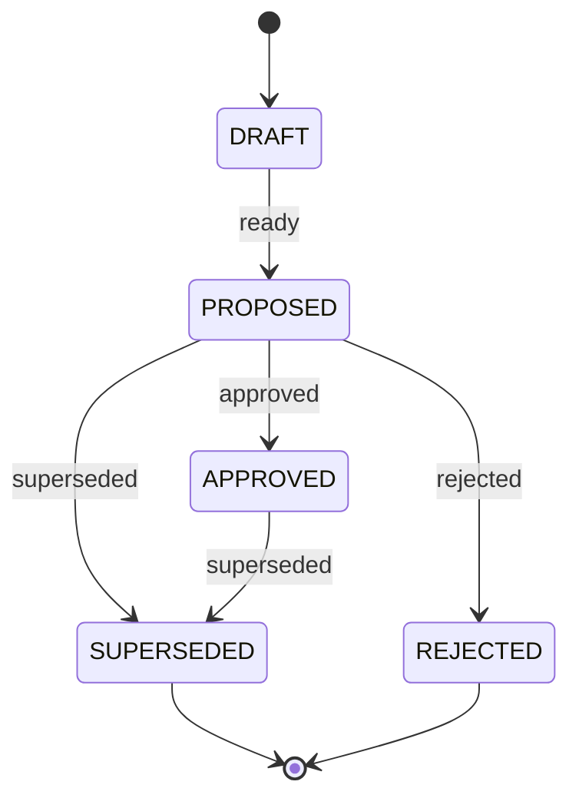

# P8 design gate: plan engine

Status: **IMPLEMENTED (P8).** Written 2026-09-26 against `ec1118d` (P7 closed); the decision
pass accepted D1–D16 with binding clarifications (§22); the as-built record and its deviations
are §25. Every item is marked with where it comes from:

- **[spec]** already specified by the V1 architecture (plan, domain model, state machines, ADRs);
- **[clar]** a clarification of an existing contract that the documents leave open or that the
  code has already settled differently;
- **[new]** a genuinely new contract decision. Every [new] item, and every [clar] item that
  changes a frozen P1–P7 behaviour, is in the decision pass (§22) and needs approval.

Sources read, and precedence: the plan (**§12**, §11, §31.1 **P3.5 as-built, P7 as-built, P8**,
§31.4), **ADR-0006**, **ADR-0021** (still OPEN), **ADR-0022**, domain-model **§3.3, §7.1–§7.3**,
state-machines **§0, §2, §3, §5**, context-and-knowledge §2, execution-architecture §3 and §7,
resource-router §3 and §5, api-and-realtime §2–§3, testing-strategy **§1.1, §2 (S1, S6, SK)**, the
P5, P6 and P7 gates, and the code: `archeus/core/{engine,runtime,calls,ports}.py`,
`application/{work,commands,conversation,calls}.py`, `brain/intent.py`, `missions/intent.py`,
`context/assemble.py`, `domain/{entities,states,events}.py`, `infra/db/writer.py`, migrations
0001–0006, the judge (`client.py`, `http.py`, `support.py`, `conftest.py`, S1, S6). Where a
document and the code disagree, the code states what exists; the frozen judge is the most
specific source.

---

## 1. What P8 is

P7 **understands** the user and ends at a Mission. P8 **plans** that mission: it turns an
understood mission, read against its context package, into one explicit, validated, immutable
**PlanVersion** with a task graph that later phases can authorise (P9), route (P10), execute (P11)
and verify (P13) without re-reading the model's words. It never authorises, routes, executes,
continues sessions, verifies, reviews or automates.

```
mission.state_changed -> REASONING | PLANNING | REPLANNING          (a planning round)
  -> planning worker (outbox consumer, archeus-plan)
     REPLANNING: replan budget judged FIRST, on the plan being replaced   (P3.5, unchanged)
     context: the mission's package if current, else a fresh one       (P5's engine, subject mission)
     archeus_call(purpose planner, plan.v1)                            (P6's path, unchanged:
                                                                        election, RouteDecision
                                                                        first, ADR-0021 re-check,
                                                                        native or prompted, Core
                                                                        validation, one retry)
     Core check = the deterministic plan validator (§11)               (invalid -> retry -> invalid)
     handles resolved to {kind, id}; keys assigned t1..tN by Core
     ONE command:
       result stale?          -> discard, end the call; the newer round plans      (§10)
       blocking issue?        -> no plan; the question is posted                    (§10)
       otherwise              -> PlanVersion DRAFT -> PROPOSED ("ready for policy")
                                 the previous version -> SUPERSEDED
                                 THEN the unchanged P3 plan gate decides the MISSION (§6)
```

The invariant carries over from P7: **the model proposes; Core validates and decides.** Raw
model output never reaches a row: it is schema-checked, handle-checked, graph-checked, resolved,
and re-judged against the rows of the transaction that records it.

## 2. Boundaries

| | |
|---|---|
| **P8 owns** | `core/planning/{planner,validate,worker}.py`, `core/application/planning.py`, the plan machine's `ready` and `superseded` edges, the task contract fields, the planning context rule, plan currency (staleness), migration 0007, one event type, two routes, `health.plan`, the judge's `planner` recordings and `rig.script_harness` |
| **P8 consumes** | P5's `record_context_package` (subject `mission`, unchanged), P6's `archeus_call` and ProviderTerms gate, P7's mission fields (requirements, constraints, desired outcome, origin), P7's conversation cards, P3's `Missions` actions and guards, P3.5's `Work.propose_plan` decision tail |
| **defers** | the Policy pre-evaluation of a plan, `approval_points` and every Approval (P9); the plan machine's `approved`/`rejected` edges being *fired* (P9); `min_model_tier` enforcement and the planner's own `large` tier (P10); the execution prompt built from the task contract (P11); checkpoints as replan input (P12); failing evidence from real verifiers and reviewers (P13); `POST /v1/plans/{id}/edit` (P16, §15) |
| **never** | an Approval, PolicyDecision, RouteDecision other than the planner call's, Execution, Session, Verification or Review; a task moved past PENDING; a world object created from a name the model produced; a mission requirement written by the planner; an edit to a recorded PlanVersion |

## 3. Plan ownership (question 1)

| Concept | Represented by | Status |
|---|---|---|
| **Mission** | the aggregate that owns the plan lineage: `mission.id` is the lineage key; it owns requirements, constraints, desired outcome, success criteria (P7) and lifecycle progression, including approval (state-machines §2) | [spec] |
| **PlanVersion** | one `plans` row. `plans.id` (`plan_…`) is the identity of **one version**; `(mission_id, plan_version)` is its number within the lineage (UNIQUE since 0002); `supersedes_plan_id` points at the version it replaced | [spec] domain-model §7.2; identity rule **D1** |
| **"Plan" (the lineage)** | not a row. "The mission's plan" is its lineage; "the plan in force" is `commands.active_plan` (the highest `plan_version`, unchanged) | [clar] **D1** |
| **Task** | one `tasks` row, owned by exactly one PlanVersion (`tasks.plan_id`); `key` is stable within that version (UNIQUE `(plan_id, key)` since 0002). A replan creates new task rows; tasks are never moved between versions | [spec] domain-model §7.3 |
| **Dependency / graph** | `Task.depends_on` (keys of tasks in the same version). The graph is a DAG (§7). Derived serialisation edges are also in `depends_on`, with their provenance on the plan (`serialised[]`, §7.4) | [spec] + [new] **D8** |
| **Requirements, constraints** | stay on the Mission, origin-tagged (P7). The PlanVersion records the **snapshot it planned against** (`inputs`: each item's text, origin and handle) and `coverage` (requirement handle → task keys). The planner never writes a mission requirement | [clar] **D16** |
| **Assumptions** | `plan.assumptions[]`, each `{text, origin: inferred, about?}` — the planner's gap-filling, always inferred | [spec] domain-model §7.2 ("origin-tagged") |
| **Expected outcomes** | per task `expected_output`; for the mission, its success criteria (a mission without any takes the plan's, marked `inferred` — P3.5, unchanged) | [spec] |
| **Acceptance criteria** | per task `acceptance[]`, each `{text, check: automatic|human}`; mission-level criteria stay `Mission.success_criteria` | [spec] plan §12 ("verification per task") + [new] **D7** |
| Risks, rollback | `plan.risks[]`, `plan.rollback` — informational, recorded as proposed | [spec] domain-model §7.2 |
| Cost band | `plan.estimated_cost`, **computed by Core** (§11.4) | [spec] plan §12 + [new] thresholds **D9** |
| Approval points | `plan.approval_points` stays empty in P8; filled by P9's pre-evaluation | [spec] plan §12, deferred |

**D1 — PlanVersion identity [clar].** The request names `plan_id` and `plan_version_id`. The
existing schema already answers both: a `plans` row *is* a PlanVersion, its `id` identifies that
exact version, and every downstream row already points at a version, not a lineage
(`tasks.plan_id`, `verifications.plan_id`, `reviews.plan_id`). Adding a separate lineage row
would duplicate what the Mission is and rewrite three P3.5 foreign keys for no behaviour. **Later
execution identifies the exact plan** through `Execution → Task → plan_id`, and P9's approvals
bind `plan_version` in `action_hash` (domain-model §9.3); P8 adds `plan.digest` (§5) so P9 may
also bind the content.

## 4. Plan lifecycle (question 2)

Five distinct steps, owned by different phases:

| Step | What it means | Owner | Where it shows |
|---|---|---|---|
| mission understanding | the intent is read, unambiguous, unchallenged | P7 | mission `UNDERSTANDING → CONTEXT_GATHERING` (`understood`) |
| plan creation | a structurally valid plan is recorded | **P8** | a PlanVersion reaches PROPOSED |
| plan revision | a newer version replaces the one in force | **P8** | the new version PROPOSED, the old SUPERSEDED |
| plan readiness | the version is structurally complete and ready for policy | **P8** | PlanVersion **PROPOSED** |
| plan approval / execution readiness | the plan may be executed | P3 gate today, **P9** for real | mission `APPROVED` / `APPROVAL_REQUIRED`; PlanVersion `APPROVED` only from P9 |

**D2 — declare the plan machine [clar; changes a P3.5 checkpoint].** The P1 state set
(`STATE_SETS['plan']`: DRAFT, PROPOSED, APPROVED, SUPERSEDED, REJECTED — domain-model §7.2) has
had no edges; the P3.5 checkpoint (1) kept every plan DRAFT and let the mission carry approval
and supersession. P8 declares the edges, reusing exactly those five states and inventing none:



- `ready` is **guarded** (guard `ready`, in `states._GUARDED`): the validator's verdict on this version is `ready` and
  its digest matches its content (§11). DRAFT is transient: a version is inserted DRAFT and takes
  `ready` in the same transaction, so a DRAFT row is never visible (§10 explains why a plan that
  is not ready is never recorded).
- `superseded` is taken by the previous version **in the same transaction** that makes the next
  one PROPOSED.
- `approved` and `rejected` are declared, as P1 declared the Approval machine before P9, and are
  **fired only by P9**. P8 never fires them (M02, §21.3). Until P9, a mission the P3 stub gate
  approves has a PROPOSED plan: honest, because no real policy has approved anything.
- The mission still owns lifecycle progression (P3.5 checkpoint (1) stands in that respect): no
  plan move changes the mission, and no mission move is derived from a plan state.
- `plan.state_changed` is registered (the writer requires `<machine>.state_changed`, state-machines
  §0).
- Migration 0007 backfills existing rows (V1 is unreleased; development databases only): per
  mission, the highest `plan_version` becomes PROPOSED and every lower one SUPERSEDED.

## 5. Plan versioning (question 3)

| | Rule | Status |
|---|---|---|
| identity | `plans.id` = one version (D1) | [spec] |
| number | `plan_version` = 1 for the first, previous + 1 for each next **recorded** version | [spec] P3.5 |
| parent | `supersedes_plan_id` = the version in force when this one was recorded (None for v1) | [spec] domain-model §7.2 |
| supersession | the parent takes `superseded` in the same transaction the child takes `ready` | [spec] + D2 |
| why a new version | exactly one of: a planning round in REASONING (first plan), PLANNING (after `request_changes`), REPLANNING (after a failure, a failed verification, a review asking for changes, or a user's `replan`), or a planning input changing while the mission waits in one of those states (§14) | [clar] |
| the old version | kept forever, SUPERSEDED, with its tasks; verifications and reviews stay attached to the version they ran under (P3.5) | [spec] |
| immutability | a recorded version is never edited: every field except `state` is frozen, and a task's contract fields are frozen (`state` and `failure_class` still move) — enforced at P2 (**D12**) | [clar] **D12** |
| content identity | `plan.digest` = sha256 of the canonical JSON of the version's content (summary, inputs, coverage, assumptions, criteria, every task's contract fields and `depends_on`, `serialised`), computed at insert; the `ready` guard re-checks it | [new] **D12** |
| idempotency | one version per planning round: `(mission_id, round_seq)` UNIQUE (§13) | [new] **D10** |
| exact version for execution | `Execution → Task.plan_id`; `dispatch_task` already refuses a task of a superseded version (P3.5) | [spec] |

## 6. The authorisation boundary

**D4 — record-and-decide stays atomic; P8 code never decides [clar].** Today `Work.propose_plan`
records a plan and, in the **same transaction**, takes the mission's plan decision through the P3
guards (`plan_auto_approved`, else `plan_needs_approval`), which consult the **Policy port** (the
stub until P9) — "so a plan is never left undecided" (P3.5). P8 keeps that shape:

- P8's apply command records the PlanVersion (DRAFT → PROPOSED, parent SUPERSEDED) and then calls
  the **unchanged** decision tail in `work.py`. The decision, the Policy port and the guards stay
  in P3/P3.5 code; `core/planning/` and `application/planning.py` contain no policy call, no
  plan-decision trigger and no reference to the Policy port (E-boundary tests, §17).
- A DENY is refused before anything is written, exactly as P3.5 specifies (no plan, no task,
  mission unchanged); the worker ends its call (outcome `ok`, detail naming the denial) and writes
  nothing else. Persisting that denial is P9's (P3.5 checkpoint (5)).
- **Why not split creation from decision.** A split would leave a PROPOSED plan undecided in
  REPLANNING, where `replan_budget_exhausted` — judged on "the plan in force" — would then judge
  the *new* plan and refuse one replan too early (the exact bug P3.5 fixed as checkpoint (3)).
  Fixing that needs a P3 guard-input change, plus a window that the HTTP binding observes only by
  luck. The split buys nothing P9 cannot add: P9 replaces the Policy port and gains the plan
  `approved` edge without touching P8.

## 7. Task graph (question 4)

### 7.1 Task contract (**D7**, [new] fields on the existing Task entity, body only)

| Field | Meaning | Consumer |
|---|---|---|
| `key` | `t1…tN`, **assigned by Core** in the plan's topological order (ties: the model's order); the model names tasks by its own labels, which never reach a row | P11 (the judge scripts `t1`, `t3`, `t6`) |
| `title`, `objective`, `expected_output`, `boundaries[]` | the four-part dispatch contract (objective, expected output, allowed action classes = `action_classes`, boundaries) | P11 |
| `kind` | existing TASK_KINDS | P10, P13 |
| `depends_on[]` | keys in the same version | P11 (`ready_tasks`, unchanged) |
| `action_classes[]` | existing closed list | P9 |
| `capabilities_required[]` | closed list `code_edit, shell, web, long_context, vision` (resource-router §3) | P10 |
| `min_model_tier` | `small | mid | large`, proposed by the planner, validated only as an enum | P10 |
| `workspace_mode` | `in_place | worktree` (default `worktree` for `code_change`) | P11 |
| `touches[]` | path globs, relative to a referenced repository | P8 serialisation, P11 worktrees |
| `inputs[]` | `{from_task: key}` or `{ref: {kind,id}}`, each with `what` | P11 |
| `refs[]` | canonical world objects the task concerns, `{kind, id}` (§9) | P10, P11, P13 |
| `serves[]` | the mission requirement handles it covers (`r1…`) | coverage (§8) |
| `acceptance[]` | `{text, check: automatic|human}`; **at least one** for every non-`human` task; a `human` task's are all `human` | P13 |
| `estimate` | integer 1–5, relative weight | progress, cost band |
| `max_attempts` | existing, default 2 | P11 |

The same validator (§11) judges the planner's output **and** `Work.propose_plan`'s input, so the
P3.5 stub plans meet the same structure: `SKELETON_PLAN` and the test plans gain `acceptance`
(their keys stay as written — Core assigns `t…` keys only when it resolves a model answer).

### 7.2 Ordering, parallelism, blocking

- **DAG only.** A cycle is invalid output; the validator reports the cycle (`t2 → t4 → t2`), not
  just "cyclic". Self-dependency, a dependency on an unknown label and duplicate labels are
  invalid too.
- **Ordering** is the dependency order only; the key order is a topological order, so "planned
  before it" (the P3.5 rule in `propose_plan`) holds by construction.
- **Parallelism** is the absence of a path: tasks with no path between them may run together.
  The plan view exposes the derived `waves` (topological levels); nothing stores them.
- **Blocking conditions** at execution time are P11's (`ready_tasks` reads `depends_on`, a
  `human` task waits for a person). P8 records no runtime blocking state.
- **Unreachable tasks:** in a DAG every task is reachable from a root, so a task can only never
  start by depending on one that cannot succeed by construction, which the acyclicity and
  acceptance rules refuse.

### 7.3 Graph rejection

Invalid output is retried once by `archeus_call` and then ends `invalid`; nothing is recorded
but the call's outcome and the mission's `planning_blocked` (§10). A graph the stub path proposes
is refused with `ValueError` (400) as today.

### 7.4 `touches` serialisation (**D8**, [spec] plan §12 + [new] rule)

Two tasks with no path between them whose `touches` may overlap are serialised: Core adds the
later key to depend on the earlier one and records `serialised: [{task, after, because}]` on the
plan. Overlap is decided conservatively (ponytail: literal-prefix and `fnmatch` both ways; a false
overlap costs parallelism, never correctness). Tasks with no `touches` are never serialised by
this rule.

## 8. Requirements (question 7)

- The planner receives the mission's requirements and constraints as **handles** (`r1…`, `c1…`),
  each labelled explicit or inferred, never merged.
- **D16 [new]:** every **explicit** requirement must be served by at least one task (`serves`),
  or be the subject of a blocking question; otherwise the answer is invalid (retried). Inferred
  requirements may be left unserved; `coverage` records what is served either way.
- Anything the planner adds that the mission did not state goes to `plan.assumptions` (origin
  inferred). **Nothing is written to `Mission.requirements` or `constraints`**, and no origin is
  ever changed (M06). Confirming an assumption is the user's, through the conversation (P7's
  continue_work), which updates the mission and starts a new round.
- Constraints are shown to the planner as boundaries it must respect; a task's `boundaries` may
  cite them (`c1`). Whether free text contradicts free text is not decidable deterministically,
  so the planner must report a clash as a `question` or a `conflict` (§10); what Core checks
  deterministically is in §11.

## 9. World references (question 8)

P7's closed-world rule, reused ([spec] p7-design-gate §3, D10):

- The model names objects **only by handles** the prompt gives the package's items: `p` project,
  `y` repository, `k` knowledge item (architecture, decision, standard, preference), `m` mission
  (for `refs` only), plus `r`/`c` for the mission's own requirements and constraints.
- An unknown handle, or one of the wrong kind for its field (a `touches` scope must be a
  repository; a conflict must be a deciding knowledge item), is invalid output.
- Something the plan needs that is not in the package goes into `missing[]` as `{name, kind,
  required}` with no reference. A `required` missing object blocks the plan (§10); nothing is
  created from the name (M05).
- Stored as `{kind, id}` in `task.refs`, `task.inputs[].ref` and `plan.refs`; handles never
  reach a row.

## 10. Ambiguity and missing information (question 9)

**D3 — only ready plans become versions [new].** A planning result that is not ready is a
**planning outcome**, not a PlanVersion. Recording "blocked" or "incomplete" versions would
consume `plan_version` numbers, and both `replan_budget_exhausted` (`plan_version - 1 >=
max_replans`) and "the plan in force" (the highest version) read those numbers: a blocked draft
would spend a replan and could become the plan the guards judge. So:

| Situation | Detected by | P8 does |
|---|---|---|
| a **structural** defect (cycle, unknown handle, missing acceptance, uncovered explicit requirement) | the validator, as the call's `check` | invalid output → retry once → call ends `invalid`; no plan; mission waits with `planning_blocked: {kind: call, outcome: invalid}` |
| an **ambiguous** requirement | the planner's `questions[]` with `blocking: true` | **clarification** (below) |
| a **required world object missing** | `missing[]` with `required: true` | **clarification** naming it; never created |
| **required information unavailable** | a blocking question | **clarification** |
| an assumption or requirement **conflicting with CONFIRMED knowledge** | `conflicts[]` naming a deciding item (P7's rule, including note-derived DECISION candidates, labelled not confirmed) | **challenge** (below) |
| a **non-blocking** gap | `questions[]` with `blocking: false`, `assumptions[]` | a **plan with explicit assumptions** (inferred), plus the non-blocking questions shown on the plan |
| **the mission changed since understanding** (`mission.updated` after the package) | currency check (§11.3) before the call and again when applying | re-record the package through P5 before calling; a result made against a stale package is **discarded** (the call ends `failed`, reason `stale: …`) and the round the change started plans instead |
| the call is gated / unavailable / failed | `archeus_call` outcome | **refuse to plan**: no plan, `planning_blocked: {kind: call, outcome}`; re-attempted on the next trigger (§14) |
| a task's action class is DENIED | P3.5 plan gate | refuse, write nothing (§6) |

**Clarification and challenge, delivered** ([spec] P7's cards; [new] where they land, **D6**):
Core posts an Archeus message in the primary conversation with a `clarification` or `challenge`
card whose `ref` is the mission, listing the questions / missing objects / conflicts; the user
answers by replying, which P7 reads (the question in view) as `continue_work` of that mission →
`mission.updated`. The mission records `planning_blocked: {kind, questions, missing, conflicts,
route_decision_id, context_package_id, round_seq}` (new body field) and it is cleared when a
version is recorded.

- **In REASONING (first plan)**, the blocked round takes the existing edge `REASONING → BLOCKED:
  challenge_raised` (state-machines §2) with `planning_blocked` set — the mission-level challenge
  the P7 gate deferred to P8 (p7 §6). Leaving BLOCKED is the existing `resume` →
  `redispatch_before_plan` → UNDERSTANDING → a **fresh** context package → REASONING → a new
  round. **Resume is explicit in P8** (the card says "answer, then resume"): Archeus resuming on
  the user's behalf is autonomy, which is P9's.
- **In PLANNING or REPLANNING** there is no edge to BLOCKED. The mission **waits in place** with
  `planning_blocked` set (recorded by `mission.updated`), and the next input change starts a new
  round. Adding `challenge_raised` from those states is rejected: a BLOCKED mission resumes
  through `redispatch_before_plan` → REASONING, whose `propose_plan` never judges the replan
  budget, so a challenged replan would escape `max_replans`.

Confidence is recorded and never decides (P6 D4, P7 D11).

## 11. Plan quality and validation (question 10)

`core/planning/validate.py` — pure functions of the answer (or a stub plan) and the facts the
prompt was built from; no I/O, no model.

### 11.1 Structural (invalid output; retried)

graph: labels unique, every `depends_on` known, no self-dependency, **acyclic** (cycle named),
at least one task, at most 50 · tasks: known `kind`, known `action_classes`, known
`capabilities_required`, `min_model_tier` enum, `estimate` 1–5, `acceptance` rule (§7.1) ·
references: every handle known and of the
right kind (§9) · coverage: every explicit requirement served or asked about (D16) · duplicates:
two tasks with identical `(title, objective)` are refused.

### 11.2 Deterministic contradiction checks (invalid output)

A mission-level criterion with `check: automatic` and no non-`human` task. *(As built, §25.1:
the two other checks this section proposed are not separate rules — a reference outside the
mission's project is already an unknown handle, since the mission's package holds only its own
project, and overlapping parallel `touches` are serialised by §7.4 rather than refused.)*

### 11.3 Currency (staleness) — `plan_currency(conn, plan_or_package)` [new] **D11**

A package (and a plan made from it) is **stale** when, after its `as_of_seq`: the mission had a
`mission.updated`; a knowledge item it cites left the state it was cited in (superseded,
retracted, forgotten); or the mission's project had `project.changed` or
`architecture.state_changed`. Pure over the event log and the cited rows. Used: before the call
(stale → record a fresh package), when applying (stale → discard), and by the plan views
(`current: false, why`) for P9, which must refuse approving a stale version (recorded here as a
P9 input, not implemented).

### 11.4 Cost band (**D9**, [spec] plan §12 + [new] thresholds)

`score = Σ tier_weight(min_model_tier) × estimate` with `small 1, mid 2, large 4`; band `low` ≤ 6,
`medium` ≤ 20, else `high`. The model's own estimate is not read. This is the only P8 number the
P3 auto-approve ceiling (`AUTO_APPROVE_CEILING = 'medium'`) reads, so it is in the decision pass.

A model-generated plan becomes a row only after §11.1–§11.2 pass on the answer and §11.3 passes in
the recording transaction; the model's word alone never does (M09).

## 12. Readiness (question 11)

| Term in the request | P8 meaning |
|---|---|
| **draft** | DRAFT: a version being recorded, inside one transaction; never visible |
| **incomplete** | not a version: a planning result that failed §11 — invalid output, never recorded |
| **blocked** | not a version: a blocking result (§10), recorded on the mission as `planning_blocked` |
| **ready for policy** | PlanVersion **PROPOSED**: §11 passed, digest recorded, `ready` taken |
| **approved** | PlanVersion **APPROVED**: **P9 only**. The mission's `APPROVED` state under the P3 stub gate is not a plan authorisation |

P8 decides structural readiness. It never decides that the user has authorised execution.

## 13. Idempotency (question 13, **D10** [new])

- A **planning round** is identified by the seq of the event that started it (a
  `mission.state_changed` into a planning state, or a `mission.updated` / `provider_terms.decided`
  that restarts a waiting mission). The version records `round_seq`.
- `UNIQUE (mission_id, round_seq)` (migration 0007, a promoted column; NULL for stub-path plans,
  which SQLite's UNIQUE allows) stops a redelivered event or a race from recording a second
  version, as `intents.message_id` does for P7.
- The worker skips a round when: the mission is no longer in the state the round started in; a
  version with that `round_seq` exists; or a newer round exists for the mission (the newer event
  will plan).
- A Core that dies mid-call leaves a RouteDecision without an outcome; the knowledge worker's boot
  sweep ends it `failed` (P6, unchanged) and redelivery plans the round again — at most one extra
  call, never a duplicate version.

## 14. Replanning (question 12)

| Trigger | Entry | P8 in P8 |
|---|---|---|
| requirements or constraints change while planning / waiting | `mission.updated` (P7 continue_work) in REASONING, PLANNING, REPLANNING | new round |
| the user asks for changes to a proposed plan | `request_changes` → PLANNING (P3) | new round; the reason is a planner input |
| world state changes (a cited item moved, the repository changed) | currency (§11.3) | stale shown on the plan; in a planning state a new round |
| a task becomes impossible (fails its attempts) | `task_failed_retryable` → REPLANNING (P3.5) | new round; previous version, task states and failure classes are inputs |
| execution reports failure | P11 through the same edge | contract only |
| verification or review shows the plan did not achieve the outcome | `verification_failed`, `changes_requested` → REPLANNING (P3.5/P13) | new round; failing verifications and the review's `requirements_missing` of the version in force are inputs |
| the user declares failure and asks for another plan | `FAILED → REPLANNING: replan` | new round |

- REPLANNING judges the **replan budget first**, before the model is asked (P3.5, unchanged;
  moved from the engine into the worker).
- A mission in APPROVAL_REQUIRED, APPROVED or later whose inputs change is **not** replanned by
  P8: its plan shows `current: false`, and moving it back to planning is `request_changes` (a
  user verb) or the P11/P13 edges. P8 adds no mission edge.
- Replan inputs are the previous version, its task states and failure classes, its failing
  verifications and latest review, and the triggering transition's reason. Checkpoints (plan
  §12) join in P12.

## 15. Human and model planning (question 5)

- **Deterministic planning without a model** exists only as the stub `Brain` port the P3.5 tests
  inject (`FixedPlanBrain`, `ScriptedBrain`) — kept, synchronous, in the engine, because the P3.5
  skeleton and engine-loop tests drive `engine.run()` through it (D5). No production path plans without the model, and
  no "simple mission" template is invented: a one-task plan is still the planner's to propose
  and Core's to validate.
- **The model path** is `OwnCalls.run(purpose='planner', …)` — P6's `archeus_call`, unchanged
  ([spec] ADR-0022; `planner` is already in `CALL_PURPOSES`): election over installed `headless`
  harnesses (the user's own-call choice, else Claude Code, else the first), RouteDecision
  committed first, the ADR-0021 gate re-checked immediately before the spawn, the harness's own
  account and model vocabulary, native or prompted structured output, Core validation with one
  retry. No direct Claude or pi path. The planner's `large` tier (plan §12) cannot be expressed
  before the router; it is recorded as a P10 requirement, not enforced.
- **Human-authored plans** (`POST /v1/plans/{id}/edit`, api-and-realtime §2) are **deferred to
  P16** ([clar] **D15**): an edited plan is a new version through the same validator, but the
  editing surface is the SPA's, and no P8 scenario needs it. The user revises a plan in P8 through
  the conversation or `request_changes`.
- **`plan.v1`** (in `core/planning/planner.py`, beside its checks — the P7 deviation 10
  precedent, not `core/brain/schemas/`): `summary`, `tasks[]` (label + §7.1 fields), `assumptions[]`,
  `questions[]` (`question`, `blocking`, `about?`), `missing[]`, `conflicts[]` (`ref`, `why`),
  `success_criteria[]`, `risks[]`, `rollback`, `refs[]`, `confidence`.

**D5 — planning runs in a worker [new].** Plan §31.1 P3.5 says the engine "will split into
`planning.planner`, …" when those phases arrive. The planner is an **outbox consumer**
(`archeus-plan` thread, `health.plan {state, pending}`), mirroring P6/P7: an own call may take
minutes (`DEFAULT_TIMEOUT_S = 600`), and in the engine thread it would stall every other mission.
The engine does nothing in REASONING / PLANNING / REPLANNING unless a stub `Brain` is injected.
The runtime's default becomes the planner (**the judge and the production Core stop using
`FixedPlanBrain`**): with the real adapters and ADR-0021 unanswered, a production mission waits
in REASONING with `planning_blocked: {kind: call, outcome: gated}` — the same honest behaviour P7
gave intent. Runtime tests that relied on the stub default pass `brain=FixedPlanBrain(...)`
explicitly.

## 16. Context (question 6)

- P8 builds **no context of its own**. It plans from the mission's package recorded by
  `context_ready` (P5), and records a **fresh mission package through the same
  `record_context_package`** when that one is stale (§11.3) — typical for REPLANNING, where the
  package is from the first pass. [clar]
- **What the planner is shown**, and nothing else: the mission itself (title, objective,
  desired outcome, requirements and constraints with origins, success criteria) — read from the
  mission row, because P5's mission subject carries only title, objective and criteria; the
  package's L1 project and repositories, L2 CONFIRMED decisions / architecture / standards /
  preferences and related missions, and the history the budget admits; for a replan, the §14
  inputs. The package's budget and ordering decide what is shown — never "all context".
- The PlanVersion records `context_package_id`, and its RouteDecision cites the same package
  (P6 provenance).

## 17. Phase boundaries (question 17)

Import and architecture tests (`tests/v1/unit/test_planning_units.py`, AST plus a fresh
interpreter, as P7's U07/U08):

| # | Constraint |
|---|---|
| E1 | `archeus/core/planning/*` and `core/application/planning.py` import nothing from `archeus.harnesses` (the call adapter is injected as `OwnCalls`), `archeus.core.engine`, `archeus.core.runtime`, `archeus.api`, and no future `policy`, `routing`, `execution`, `node`, `verification`, `automation` package |
| E2 | the planning code never names the Policy port or calls `.evaluate(`, `.route(`, `.start(`, `.stop(`, `.verify(`, `.review(` |
| E3 | the planning code never names the triggers `approved`, `rejected`, `plan_auto_approved`, `plan_needs_approval`, `dispatch`, `deps_satisfied`, `routed`, `accepted`, nor `Work.dispatch_task`, `ready_tasks`, `record_spawn`, `record_exit`, `record_task_verification`, `verify_mission`, `record_review` |
| E4 | importing `archeus.core.planning.worker` in a fresh interpreter loads no `subprocess`, `archeus.harnesses.calls`, `claude_sessions.llmcall` |
| E5 | integration: after a planning round with the engine stopped — one PlanVersion PROPOSED, every task PENDING, zero Executions, Sessions, Verifications, Reviews, and no RouteDecision other than `purpose: planner` |
| E6 | integration: across the whole P8 suite no plan row is ever APPROVED or REJECTED |
| E7 | no route under `/v1/plans` or `/v1/missions/{id}/plan` accepts POST (no execution control) |

## 18. Events (question 14)

| Event | Status |
|---|---|
| `plan.created` — payload grows `supersedes_plan_id`, `round_seq`, `digest`, `route_decision_id`, `context_package_id`, `tasks` (count) | [spec] exists |
| `task.created` — unchanged | [spec] exists |
| **`plan.state_changed`** — required by the writer once the plan machine exists | [new] **D2**, the only new type |
| `mission.state_changed` (`challenge_raised`), `mission.updated` (`planning_blocked`), `message.created` (the card), `context_package.created`, `route.decided`, `archeus_call.ended` | [spec] exist, reused |

No `plan.validated`, `plan.blocked`, `planning.requested`: each would restate a row or an event
already written in the same transaction.

## 19. API and commands (question 15)

| Surface | | Status |
|---|---|---|
| `GET /v1/missions/{id}/plan` → the plan in force with its tasks, `waves`, `current`/`why`, and `versions[]` (id, plan_version, state, supersedes) | observe | [spec] api-and-realtime §2 |
| `GET /v1/plans/{id}` → that exact version, tasks, currency | observe | [spec] |
| `GET /v1/missions/{id}` gains `plan_id`, `plan_version` (derived from `active_plan`, never stored twice) and `planning_blocked` | — | [clar] S6 reads `plan_version` |
| `/v1/health` gains `plan: {state, pending}` | — | [clar] as P7's `intent` |
| `/{id}/tasks` | — | not added: the plan view carries the tasks |
| `POST /v1/plans/{id}/edit` | — | deferred to P16 (**D15**) |

Commands: `Planning.apply` (record version + tasks, supersede, hand to the decision tail, end the
call — one transaction), `Planning.hold` (record `planning_blocked`, post the card, take
`challenge_raised` in REASONING, end the call). `Work.propose_plan` gains the validator, the plan
machine moves and the provenance fields; its DENY refusal, budget-first and decision tail are
unchanged. No new `CoreClient` operation.

## 20. Persistence (question 16)

Migration **0007_planning.sql**: `ALTER TABLE plans ADD COLUMN round_seq INTEGER`,
`ADD COLUMN supersedes_plan_id TEXT REFERENCES plans (id)`, `CREATE UNIQUE INDEX
plans_by_round ON plans (mission_id, round_seq)`, and the D2 state backfill. Everything else is
body fields (Plan: `inputs`, `coverage`, `assumptions`, `questions`, `risks`, `rollback`, `refs`,
`serialised`, `digest`, `route_decision_id`, `context_package_id`; Task: §7.1; Mission:
`planning_blocked`). SQLite, the single writer, one transaction per command, events in the same
transaction, `expected_version` where a caller supplies one. **D12 [clar, P2]:** an entity may
declare `_FROZEN` fields — `Tx.update` and `Tx.transition(fields=…)` refuse them (Plan: every
field; Task: its contract fields). Generic like `_STATE`: persistence learns a list of names, not
a machine's meaning, so the P2/P3 boundary test still holds.

## 21. Acceptance

### 21.1 Judge (testing-strategy §2)

- **S6 (D13 [clar, changes the frozen judge]):** `test_a_failed_verification_produces_a_new_plan_version`
  cannot pass in P8 — its failure comes from a verifier judging "done (it is not)", and the P3.5
  stub verifier passes everything; it also expects to *observe* REPLANNING with `plan_version == 2`,
  a state D4 never leaves visible. Its tag moves to `phase:P13` (still within the row's P8–P13
  range). A **new** P8 function takes the replan path the fake harness can drive:
  `rig.script_harness('t1', [{'exit': 1}])` → the task fails its attempts → REPLANNING → wait
  until `get_mission(...)['plan_version'] == 2` → the mission passed through REPLANNING, v1 is
  SUPERSEDED (observed through `plan.state_changed` events).
- `rig.script_harness` gets its body in both bindings (it mutates the engine's `scenarios` map,
  which `TempCore` shares in-process); its "(P9)" message changes.
- The judge's Core runs the planner worker on the recorded brain; `recordings.json` gains a
  `planner` list with one recording per scenario that plans (SK, S1, S6, S15, G1), each a
  one-task `t1` plan unless the scenario needs more. A unit test validates every recording
  against §11 ("plans for all judge scenarios validate", plan §31.1 P8).
- Expected to stay green unchanged: SK, S1 (both passing functions), S9, S13, S15, SP3, G2, K1–K3.
  Implementing `script_harness` may make another strict-xfail function pass early (G1, G5, G6,
  S2, S4, S5 use it); any that does is reported, not silently unmarked.

### 21.2 P8 scenarios (`tests/v1/integration/test_planning.py` I01–I26, `test_planning_http.py` H01–H04, units U01–U06)

| # | Scenario | Asserts |
|---|---|---|
| I01 | simple mission → plan | one PROPOSED v1, one task `t1` with objective / expected output / acceptance; mission PLANNING → decided by the P3 gate |
| I02 | multi-step → dependency graph | keys in topological order, `depends_on` as proposed, `waves` derived |
| I03 | parallel tasks | two independent tasks share a wave; overlapping `touches` are serialised with `serialised[]` provenance (D8) |
| I04 | cycle rejected | cyclic answer → retried → second cyclic → call `invalid`, no plan, `planning_blocked`; the problem names the cycle |
| I05 | missing requirement | an explicit requirement no task serves → invalid output → retry |
| I06 | ambiguous requirement | a blocking question → no version; REASONING → BLOCKED (`challenge_raised`), clarification card with `ref` = mission |
| I07 | missing world reference | `missing[required]` → clarification; no project/repository row created |
| I08 | unknown handle | invalid output; nothing created from it |
| I09 | stale context before the call | `mission.updated` after the package → a fresh package is recorded and cited |
| I10 | stale result when applying | the mission changed during the call → result discarded (call `failed`, `stale:`), the newer round records the plan |
| I11 | explicit vs inferred | mission requirements unchanged after planning; planner additions only in `assumptions` (inferred); coverage recorded |
| I12 | assumptions | non-blocking gaps → a PROPOSED plan with inferred assumptions and non-blocking questions |
| I13 | conflict with CONFIRMED knowledge | challenge card; no version |
| I14 | plan version creation | `plan_version`, `supersedes_plan_id`, `digest`, `round_seq`, `context_package_id`, `route_decision_id` recorded; `plan.created` payload |
| I15 | plan revision | `request_changes` → PLANNING → v2 PROPOSED, v1 SUPERSEDED in one transaction; the reason reached the prompt |
| I16 | replan after task failure | budget judged on v1 first; v2 inputs include v1's failed task and failure class |
| I17 | replan budget | the third replan request → BLOCKED before any call (no RouteDecision) |
| I18 | idempotent planning | a redelivered round, a concurrent duplicate and a replayed consumer produce one version (UNIQUE `round_seq`) |
| I19 | invalid model output | malformed JSON and schema violations → retried once → `invalid` |
| I20 | model retry | invalid then valid → one version, `attempts: 2` on the call |
| I21 | native structured output | a `native` FakeCaller |
| I22 | prompted structured output | a `prompted` FakeCaller, same plan |
| I23 | multi-harness | two headless fakes, the preference picks one; a non-headless harness never elected; RouteDecision records the rejected candidates |
| I24 | provider-terms gate | a real adapter without the ADR-0021 answer is never called; `gated`, mission waits; `provider_terms.decided` restarts the round |
| I25 | no execution before P9–P11 | E5 and E6 |
| I26 | exact version preserved | after a replan, v1's tasks, digest and content are byte-identical; an update to a frozen field is refused at P2 (D12); `dispatch_task` of a v1 task refused |
| H01–H04 | routes | the two GETs (in force, history, exact version, currency), the mission view's new fields, `health.plan`, no POST under the plan routes |
| U01–U06 | units | validator table (every §11 rule, positive and negative), cost bands, glob overlap, key assignment, currency rules, E1–E4 |

Deterministic plan validation is U01 plus I04/I05/I08; the scripted brain and recordings keep
all of it off real providers.

### 21.3 Mutation suite (`tools/mutate_p8.py`, each must be killed)

| # | Mutation | Killed by |
|---|---|---|
| M01 | the worker dispatches a task / starts an execution after recording | I25 (E5), E3 |
| M02 | P8 fires plan `approved` (or the mission's `plan_auto_approved`) itself | E6, E3 |
| M03 | the planner calls a router (`route()`) or elects without `archeus_call` | E2, I23 |
| M04 | the cycle check removed | I04, U01 |
| M05 | an unknown / missing world object is created or resolved by name | I07, I08 |
| M06 | an inferred requirement written into `Mission.requirements` as explicit | I11 |
| M07 | the stale check skipped before the call or when applying | I09, I10 |
| M08 | `round_seq` uniqueness / the round skip removed | I18 |
| M09 | the validator not passed as the call's `check` (model output accepted as is) | I19, I04 |
| M10 | an unknown dependency label accepted | U01, I04 |
| M11 | the acceptance rule removed | U01, I05-family |
| M12 | `_FROZEN` enforcement removed, a plan field updated after creation | I26, U01 |
| M13 | the previous version not superseded | I14, I15 |
| M14 | the replan budget judged after the call (or on the new version) | I16, I17 |
| M15 | the provider-terms gate bypassed for the planner | I24 |
| M16 | a blocking question ignored (plan recorded anyway) | I06 |
| M17 | a conflict not challenged | I13 |
| M18 | `touches` serialisation removed | I03 |
| M19 | the cost band read from the model instead of computed | U01 cost table |
| M20 | the digest not re-checked by the `ready` guard | I26 |

## 22. Decision pass

**Outcome: D1–D16 accepted**, with these binding clarifications from the decision pass:

- **D2:** PROPOSED means structurally valid, validated and ready for the policy stage. It does
  not mean approved, authorised, user-approved or executable; P9 owns authorisation.
- **D4:** recording a plan and the mission's decision stay one writer transaction; the P3
  replan-budget protection is preserved.
- **D5:** planning uses the existing `archeus_call` / provider-terms architecture; ADR-0021 is
  not bypassed and there is no P8 provider path.
- **D6:** the asymmetry stands — REASONING → BLOCKED where the lifecycle allows it, no new
  BLOCKED edge from PLANNING/REPLANNING, explicit resume.
- **D8:** a Core-added dependency is always distinguishable from a planner-produced one and
  carries its reason; the persisted graph is authoritative for execution.
- **D9:** the band is Core's, frozen at low ≤ 6, medium ≤ 20 (`validate.BAND_CEILINGS`); the
  model's task estimates are inputs, never the band.
- **D13:** verification/review-dependent behaviour stays P13-gated; the S6 fact about two vs
  three REPLANNING entries is recorded, and neither that test nor the machine is altered.
- **D16:** every explicit requirement is covered by a task or asked about; planner additions stay
  inferred assumptions and never reach the mission's requirements.
- **The invariant:** the model proposes; Core validates and determines every derived property —
  graph validity, world references, requirement coverage, acceptance criteria, the cost band and
  serialisation.

**Requires your approval** (contract-affecting) — as proposed:

| # | Decision | Kind | Recommendation |
|---|---|---|---|
| D1 | A `plans` row is one immutable PlanVersion; the Mission is the lineage; no new Plan/PlanVersion split | clar | accept |
| D2 | Declare the plan machine over the five P1 states (`ready`, `superseded` fired by P8; `approved`, `rejected` declared for P9); `plan.state_changed`; backfill in 0007. Partly reverses P3.5 checkpoint (1) | clar, changes P3.5 | accept |
| D3 | Only ready plans become versions; incomplete = invalid output, blocked = `Mission.planning_blocked` | new | accept |
| D4 | Record-and-decide stays one transaction; the decision stays P3's (Policy port); P8 never decides. Split rejected (§6) | clar | accept |
| D5 | Planning is an outbox worker (`archeus-plan`, `health.plan`); the engine plans only through an injected stub Brain; the runtime and judge default to the planner, so a production mission waits `gated` until ADR-0021 is answered | new | accept |
| D6 | Blocked first planning takes `REASONING → BLOCKED: challenge_raised`; PLANNING/REPLANNING wait in place; no new mission edge; resume is explicit | new | accept |
| D7 | The task contract fields (§7.1); Core assigns `t1…tN`; at least one acceptance criterion per non-human task; one validator for model and stub plans (`SKELETON_PLAN` gains acceptance) | new | accept |
| D8 | Overlapping `touches` between parallel tasks are serialised by a Core-added dependency, recorded in `serialised[]` | new rule for a [spec] requirement | accept |
| D9 | Cost band computed by Core: `Σ tier × estimate`, low ≤ 6, medium ≤ 20, else high | new thresholds | accept, or give thresholds |
| D10 | Planning round = triggering event seq; `UNIQUE (mission_id, round_seq)` | new | accept |
| D11 | Currency rules (§11.3); stale package re-recorded before the call; stale result discarded; P9 must refuse approving a stale version | new | accept |
| D12 | `_FROZEN` entity fields enforced by `Tx.update`/`transition(fields)`; `plan.digest` | clar (P2) + new | accept |
| D13 | S6: retag the verification-driven function to P13; add a P8 function driven by task failure; implement `rig.script_harness`; judge Core on `planner` recordings; mission view gains `plan_id`/`plan_version`/`planning_blocked` | clar, changes the frozen judge | accept |
| D14 | "Supersession of approvals" (plan §31.1 P8 tests) moves to P9: there is no `approvals` table before P9; P9 supersedes on `plan.state_changed → SUPERSEDED` | clar, changes the plan | accept |
| D15 | Two GET routes and the mission/health fields only; `POST /v1/plans/{id}/edit` deferred to P16 | clar | accept |
| D16 | Every explicit requirement served or asked about; planner additions only as inferred assumptions; mission requirements never written by P8 | new | accept |

**Follows from the documents** (recorded, not asked): the planner is `archeus_call` purpose
`planner` (ADR-0022, `CALL_PURPOSES`); schema beside its checks (P7 deviation 10); handles and the
closed world (P7 D10); confidence never decides (P6 D4); budget judged before the call (P3.5
checkpoint (3)); DENY writes nothing (P3.5); `approval_points` empty until P9 (plan §12 assigns
them to policy pre-evaluation); the planner's `large` tier recorded, enforced in P10.

## 23. Conflicts with frozen P1–P7 invariants

1. **S6's P8-tagged function is unsatisfiable in P8** (D13): it needs a failing verifier (P13) and
   an observable undecided REPLANNING (excluded by D4, and flaky over HTTP under any design).
2. **S6's second function asserts two REPLANNING entries for a budget of 2**; the frozen mission
   machine enters REPLANNING three times (two replans, then the refused third, which goes
   REPLANNING → BLOCKED). It stays `phase:P13` and is not P8's to change — reported for P13.
3. **P3.5 checkpoint (1)** ("Plan has no declared edges and stays DRAFT") — D2 declares edges;
   the mission keeps owning progression.
4. **Plan §31.1 P8 "supersession of approvals"** — no approvals table exists (D14).
5. **Plan §12 "policy pre-evaluation … marks approval points"** sits under planning; it is P9's
   (the plan's own §13 and the request's phase rule).
6. **The walking skeleton's production behaviour changes** (D5): without the ADR-0021 answer a
   mission now waits at REASONING instead of completing on the stub plan.
7. **`rig.script_harness` says it arrives in P9**; S6 needs it in P8 (D13).
8. **P7 §6 / deviation 9** said REASONING's `challenge_raised` is not taken in P7; P8 takes it (D6) —
   consistent with P7 deferring it, listed for traceability.
9. **ADR-0006** names `core/brain/schemas/`; `plan.v1` lives beside its checks, as P7 did.
10. **P2 learns `_FROZEN`** (D12) — generic, but a writer change.

No P4, P5 or P6 contract changes. P7 changes: none in code (its cards and continue_work are
reused as they are).

## 24. Implementation plan (after approval)

**Files.** New: `archeus/core/planning/{__init__,planner,validate,worker}.py`,
`archeus/core/application/planning.py`, `archeus/infra/db/migrations/0007_planning.sql`,
`tests/v1/integration/{test_planning,test_planning_http}.py`,
`tests/v1/unit/test_planning_units.py`, `tools/mutate_p8.py`. Changed: `domain/{states,entities,
events}.py` (plan machine, Task/Plan/Mission fields, `_FROZEN`, `plan.state_changed`),
`infra/db/{writer,rows}.py` (`_FROZEN`, promoted columns), `application/work.py` (validator,
plan moves, provenance; decision tail untouched), `application/queries.py` (plan views, mission
fields), `engine.py` (plans only with an injected stub Brain; `SKELETON_PLAN` acceptance),
`runtime.py` (`archeus-plan`, `health.plan`, Ports default), `api/{routes,schemas,server}.py`,
`pyproject.toml` (package list), generated `api-reference.md` and `clients/app/src/api/generated.ts`,
the judge (`client.py`, `http.py`, `support.py`, `conftest.py`, S6, `recordings.json`), the P3.5
tests that inject plans (acceptance fields), docs updated in place (plan §12 and §31.1, domain-model
§7.2–7.3, state-machines §2–§3 plus the plan diagram, api-and-realtime §2–§3, testing-strategy §2).

**Order.**
1. Domain: plan machine + diagram (`test_state_tables`), entity fields, `_FROZEN`, event type.
2. Migration 0007 with backfill; writer `_FROZEN`; rows.
3. `planning/validate.py` + U01–U05 (pure; mutation-verified before anything uses it).
4. `Work.propose_plan` on the validator and the plan machine; P3.5 tests updated; full `tests/v1`.
5. `planning/planner.py` (`plan.v1`, prompt, handles, check, resolve) + `application/planning.py`
   (`apply`, `hold`) + I-tests on direct calls.
6. `planning/worker.py`, runtime thread, `health.plan`, engine hand-off; I-tests through the worker.
7. Routes, schemas, queries, generated docs/client; H-tests.
8. Judge: recordings, `script_harness`, S6 retag + new function, both bindings; traceability.
9. Boundary tests E1–E7; mutation suite M01–M20; full suite, ruff, mkdocs `--strict`, SPA `tsc`,
   wheel contents.
10. Docs in place; this gate's status → IMPLEMENTED with the as-built deviations.

**Commit boundary.** One commit for P8 (`archeus: implement v1 plan engine`), plus a separate
commit for any test-race fix found on the way (as in P7). Branch `archeus-v1-rearchitecture`
only; `main` untouched; PR #6 stays draft, auto-merge off.

## 25. As built

Implemented in the order of §24. Files: `archeus/core/planning/{__init__,validate,planner,
worker}.py`, `archeus/core/application/planning.py`, migration `0007_planning.sql`, and the
changes §24 lists; tests `tests/v1/unit/test_planning_units.py` (U01–U06, E1–E4, the
recordings), `tests/v1/integration/test_planning.py` (I01–I26, E5, E6 as an autouse check on
every test), `tests/v1/integration/test_planning_http.py` (H01–H04, E7); the mutation suite is
`tools/mutate_p8.py` (M01–M20, with M06 and M07 split into two each: 22 mutants).

### 25.1 Deviations from this gate

1. **§11.2 has one rule, not three** (see the note there): a reference outside the project is an
   unknown handle, and overlapping parallel `touches` are serialised, not refused.
2. **`rig.script_harness` made two strict-xfail functions pass early**, as §21.1 warned. Both
   pass for reasons that are not their phase's, so their markers came off (strict xfail requires
   it) and each is documented in its file: G1's *restart mid-execution reconciles and continues*
   asserts only P3.5's kill-and-retry reconciliation — a new strict `phase:P11` function, *a
   restart mid-execution adopts the live process* (one `execution.started`), keeps the row
   pending until P11, the P7 D3 precedent; S2's *a hand-off never moves the mission out of
   EXECUTING* is a negative assertion that holds while no hand-off exists, and S2's first
   function still keeps its row pending until P12.
3. **The judge's `planner` recordings are two, not one per scenario:** a specific one for S1
   (two tasks, serving its explicit requirement) and one without `when` that answers every other
   mission with a one-task plan. Every recording passes Core's validator (a unit test).
4. **The test harness chooses a planner explicitly.** `TempCore` without `ports`, and the
   `CoreProcess` child, run the P3.5 stub brain (the service tests measure the service, not
   planning); `InProcessClient(brain=...)` does the same for a test about something else (N24).
   The judge's bindings pass the recorded brain, so every judge scenario plans through
   `archeus_call`. Production (`Ports()`) plans through `archeus_call`.
5. **`shapes.validate` accepts null for a nullable named type** (`{'ref': ..., 'nullable':
   True}`), which `MissionPlan.plan` needs; the TypeScript generator already emitted `| null`.
6. **`Missions.challenge`** is a new P3 action (REASONING → BLOCKED through `_fire`, with
   `planning_blocked`), the one path the planning commands use to move a mission.
7. **The planning commands are three:** `apply`, `hold` and `note` (a call that ended without an
   answer), where §19 named two.
8. **Setting and clearing `planning_blocked`** are `mission.updated` events naming only that
   field; currency ignores them (only the mission's planning inputs make a package stale).

### 25.2 Remaining concerns (for later phases)

- P9 must refuse to approve a stale version (`current: false`) and should bind `plan.digest`
  into `action_hash` besides `plan_version`; P9 also fires plan `approved`/`rejected` and
  supersedes approvals on `plan.state_changed → SUPERSEDED` (D14).
- S6's second function asserts two REPLANNING entries; the machine enters three (recorded, P13).
- Planning is one consumer thread: missions plan one at a time, as intent reads one message
  at a time (P7).
- `touches` overlap is conservative (`validate.overlap`): a false overlap costs parallelism,
  never correctness.

**DESIGN_GATE = IMPLEMENTED.**
