# Archeus V1 — State Machines

Status: **DECIDED**. Entities are defined in [domain-model.md](domain-model.md).

## 0. How state machines are implemented

- **One table.** `archeus/core/domain/states.py` declares every machine as a flat tuple of
  `(machine, from_state, to_state, trigger, guard_name)`. Diagrams in this document are
  documentation of that table; `tests/v1/unit/test_state_tables.py` parses the Mermaid blocks
  below and fails if a diagram edge is missing from the table or vice versa (the repo's
  "one declaration, everything derived" rule).
- **One mutator.** `transition(entity, to, *, actor, reason, cause)` validates the edge, runs the
  guard, bumps `version`, writes the row and appends the event in one transaction. Nothing else
  assigns `state`. Two layers: the **persistence primitive** (`Tx.transition`, P2) checks
  `expected_version` and the edge against the table, assigns the state, bumps `version` and
  appends `<machine>.state_changed` with its required reason, atomically, and refuses a guarded
  edge without a matching transition proof; the **application layer** (P3) owns guards, action semantics, policy interaction and
  lifecycle orchestration, and reaches the database only through the primitive.
- **Guards are pure functions** of the entity plus a read-only snapshot. They never call a
  model or a process. A guard that needs a side effect is a bug; the side effect belongs in an
  outbox consumer reacting to the event. They live in `archeus/core/domain/guards.py` (`GUARDS`
  holds exactly the guarded edges of the table). The application layer gathers the snapshot —
  including any Policy port decisions — inside the writer transaction that commits the move.
  Guards **fail closed**: an unknown fact (no active plan, no success criteria, no cost band)
  refuses.
- **The P2/P3 boundary.** P3 turns a passed guard into a `states.TransitionProof` — entity id,
  version, from, to, trigger, and the table's guard name for that trigger — and the P2
  primitive checks every field against the row it is changing and the P1 table. That is all
  persistence knows: `archeus/infra/` imports no guard, no application module and no machine's
  meaning (a test scans it). So a guard can be neither skipped nor judged on a stale row, and
  guard definitions and mission behaviour stay out of P2. The primitive also takes `fields`,
  other fields of the entity written in the same row write (never the state).
- **Legality is not authority.** P3 answers whether a trigger is legal from the current state.
  Whether a principal may *ask* for it is authorisation — route scopes (P3.5) and policy (P9) —
  and no P3 rule refuses or privileges an actor kind. The one policy call P3 makes is the Policy
  port evaluating a plan's action classes, with the acting principal in its context so P9 can
  decide on it. The two actor rules in guards are domain meaning, not permission: `unrecoverable`
  treats a user device's request as a declaration, and `approve` is defined (§5) by who decides.
- **Two refusals, never one.** A trigger with no edge from the current state is an *invalid
  transition* (`422 invalid_transition`, naming machine/from/to and the trigger); an edge whose
  guard refuses is a *failed guard* (`422 guard_failed`, naming the guard and its reason). Both
  write nothing. A stale `expected_version` is `409 version_conflict`, checked before the guard.
- **Actions name triggers.** A caller asks for a trigger (`pause`, `verified`, …), not a
  destination; `(machine, from, trigger)` has one destination (a unit test keeps it so). A
  trigger into `[*]` removes the row and is not a state change (`code_expired`).
- **Terminal states are terminal.** Retrying a FAILED execution creates a new Execution row;
  replanning a mission creates a new Plan version. History is never rewritten.
- **Human intervention** is modelled as triggers with `actor.kind == user_device` — the same
  edges an automation or the brain would use, so every path is audited the same way.
- Naming: states are UPPER_SNAKE; triggers are lower_snake verbs.

Policy decisions use exactly four values everywhere: `ALLOW`, `ASK`, `ALLOW_WITHIN_BOUNDARY`,
`DENY`.

---

## 1. Idea

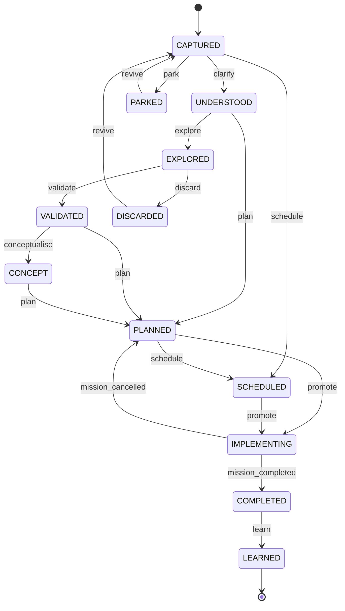

- `promote` creates a Mission (origin = idea) and links it; the idea's state then follows its
  mission (`mission_completed` / `mission_cancelled` are event-driven triggers).
- Stages may be skipped (spec §6): the diagram's shortcuts are the allowed skips; anything else
  is rejected. A reminder goes CAPTURED → SCHEDULED directly.
- `explore` runs research executions under the idea (they are tasks of a lightweight
  "exploration" mission with `kind=research`, which keeps routing/policy uniform).
- LEARNED is an **Idea** state only. Missions do not have a LEARNED state (see §2).
- *As built (P7):* an idea is captured from a message (`idea.created`); made into a mission it
  takes the diagram's shortcuts only — `clarify`, `plan`, `promote` from CAPTURED — and follows
  its mission through `mission_completed` / `mission_cancelled`, consumed from the outbox.

---

## 2. Mission

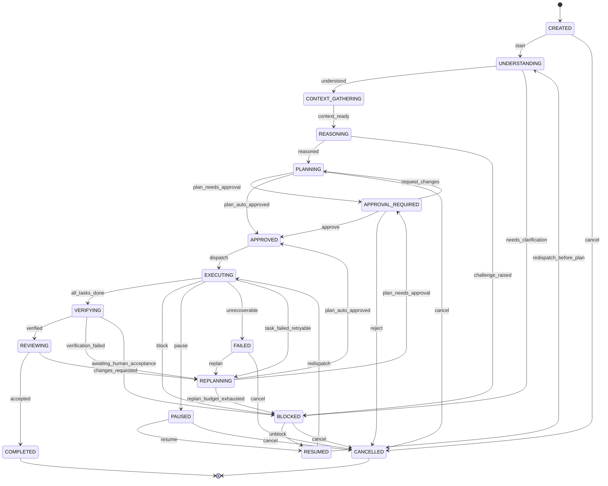

| Guard / rule | Definition |
|---|---|
| `plan_auto_approved` | the policy engine evaluates every task's `action_classes` under the mission's scope chain and all are ALLOW or ALLOW_WITHIN_BOUNDARY, **and** the plan's estimated cost band is under the mission's auto-approve ceiling, **and** the plan in force is newer than `mission.decided_plan_version` |
| `all_tasks_done` | every non-`human` task is SUCCEEDED or SKIPPED |
| `verified` | every mission-level success criterion with `check: automatic` has a PASSED verification (at least one such criterion exists), and no `check: human` criterion is still open — an open one is `awaiting_human_acceptance`, which must not be skipped |
| `awaiting_human_acceptance` | a criterion with `check: human` (GenericVerifier) is open; an Attention item is created. Mission shows `blocked_reason = "waiting for your acceptance"`, which the UI renders as *needs you*, not as failure |
| `replan_budget_exhausted` | `plan_version - 1 >= mission.max_replans` (default 2), judged on the plan **in force** — the one being replaced — before a new plan is proposed. `max_replans` is the number of replans allowed after the initial plan: 0 refuses the first replan, 2 allows two and refuses the third |
| `task_failed_retryable` | a task FAILED after `max_attempts` and the failure class is not policy/credential/human |
| `unrecoverable` | policy DENY on a required action, missing capability with no resource, or user-declared failure |
| `verification_failed` | an automatic criterion has a FAILED verification of the plan in force (guarded since the P3.5 adversarial review: fired by name with nothing failed it was a free replan) |
| `redispatch` | `mission.held_from` is EXECUTING or VERIFYING — an approved plan is in force. Held from anywhere else the mission starts over with `redispatch_before_plan` (guarded since the P3.5 adversarial review: `unblock` + `redispatch` by name reached EXECUTING with no plan) |
| `accepted` | the latest Review of the plan in force is ACCEPTED. A human overrides a verdict by recording their own review, never by firing the edge (guarded since the P3.5 adversarial review: REVIEWING completed with no review at all) |
| `plan_needs_approval` | a guarded edge since P3.5: the plan in force is newer than `mission.decided_plan_version`, no action class is DENY (a denial is not a question for a human), and there is something to ask — an ASK, or a cost band not known to be under the ceiling. With nothing to ask it refuses, so the two plan decisions never both pass |
| plan freshness | taking `plan_auto_approved` or `plan_needs_approval` records the judged `plan_version` in `mission.decided_plan_version`; neither guard passes for that plan again. So REPLANNING, or PLANNING after `request_changes`, cannot re-decide the plan it is replacing — `advance` or a trigger fired by name alike — until a newer plan is proposed |
| `pause` | cooperative: tasks move to PAUSED as their executions reach the next tool boundary; mission shows PAUSED immediately and "pausing N executions…" until they settle |

`plan_auto_approved`, `plan_needs_approval`, `all_tasks_done` and `replan_budget_exhausted` refuse when the mission has
no active plan (with tasks); `unrecoverable` from a user device is the user's declaration, from
any other principal it needs a DENY or a missing capability.

**Orchestration** (`Missions` in `archeus/core/application/commands.py`) is deterministic and
changes state only through the triggers above. The `advance` order is domain behaviour, declared
once as `commands.DECISIONS`; a test keeps this table equal to it. Every response says whether
anything `changed`.

| Action | Rule |
|---|---|
| `advance` | at a decision point, take the first exit the facts allow, in this order — PLANNING: `plan_auto_approved`, `plan_needs_approval`; REPLANNING: `replan_budget_exhausted`, `plan_auto_approved`, `plan_needs_approval`; EXECUTING: `unrecoverable`, `task_failed_retryable`, `all_tasks_done`; VERIFYING: `verification_failed` (an automatic criterion FAILED), `awaiting_human_acceptance`, `verified`. Anywhere else, or when no exit is allowed yet, nothing changes. It is the engine's step, not a declaration (`unrecoverable` is judged without the actor). The response lists every exit considered and why. |
| `resume` | PAUSED → `resume`, BLOCKED → `unblock`, then out of RESUMED in the same transaction: `redispatch` if the mission was held from EXECUTING or VERIFYING (an approved plan in force), `redispatch_before_plan` otherwise — read from `Mission.held_from`, recorded with the move into the hold and cleared on the way out of RESUMED. It is current state, not history, so event retention cannot change the answer; a hold with no record is refused, never guessed. |
| `cancel` | the edge into CANCELLED from the current state (`cancel`, or `reject` in APPROVAL_REQUIRED). EXECUTING has none: pause first. |
| `request_changes` | APPROVAL_REQUIRED → PLANNING, or a review verdict overridden: REVIEWING → REPLANNING. |
| `accept` | REVIEWING → COMPLETED, guarded by `accepted` (an accepting review of the plan in force). REVIEWING is reachable only through `verified`, so nothing completes unverified or unreviewed. |
| `pause`, `fire` | `pause`; any trigger by name (what the engine and later phases call). |

Which principal may take which action is policy (P9), not the state machine.

**The walking skeleton (P3.5, as built)** drives these actions from `archeus/core/engine.py`, one
writer command per step: `start`, `understood`, `context_ready` (stub steps until the intent and
context engines exist) → a proposed plan recorded with `reasoned` and its decision
(`plan_auto_approved`, else `plan_needs_approval`) in one transaction — from REPLANNING the
budget is judged first, on the plan being replaced → `dispatch` → per task `deps_satisfied`,
`dispatch`, `routed`, then the execution and the task's checks → `advance` out of EXECUTING → the
mission criteria recorded with `advance` out of VERIFYING → the review recorded with `accept` or
`request_changes`. The engine itself changes no edge and adds no guard: the four guards P3.5
added (`plan_needs_approval`, `verification_failed`, `redispatch`, `accepted`) are P3 table
changes in `states.py` and `guards.py`.

- **One path for a mission move.** Every mission transition goes through `Missions._fire`:
  table legality → guard on the persisted facts → `TransitionProof` → `Tx.transition`, recording
  `held_from` and `decided_plan_version` on the way (a scan in `test_skeleton.py` keeps it the
  only caller). Policy authorization of who may fire a trigger stays P9's and is not in P3.
- **ASK vs DENY.** ASK → APPROVAL_REQUIRED, a human `approve`. DENY → the command is refused
  (`PolicyDenied`, `423 policy_denied`) before anything is written: no plan, task or execution
  row, no approval request, the mission's state and version unchanged. No approval overrides a
  DENY: one that appears after approval is refused at dispatch, and in EXECUTING the existing
  `unrecoverable` edge ends the mission.
- **Plan** has no declared edges: it stays DRAFT and is the versioned strategy attached to the
  mission; the mission owns lifecycle progression (approval and supersession are its states).
- **Review REJECTED** is a review result, not a mission move: the mission stays in REVIEWING until
  an explicit `request_changes`, or a human's own accepting review (`work.record_review`), which
  `accept` then requires. A rejection never completes.
- **`advance` holds no legality of its own.** Every exit it may take is a guarded edge; it only
  chooses the order (`test_advance_holds_no_legality_of_its_own`).
- **Only the plan in force runs.** `dispatch_task` refuses a task of a superseded plan, so a
  READY task left behind by an earlier plan can never start after a replan.

**P7, as built.** The UNDERSTANDING stub is gone: `Missions.understand` takes `understood`
with the reason naming where the understanding came from (the message and its intent, the idea,
or the explicit title and objective). A mission exists only once its intent is understood and
unchallenged, so `needs_clarification` and `challenge_raised` are not taken in P7 — a
clarification or challenge happens before any mission (p7-design-gate §6).

**Session rotation never changes mission state.** An execution handing off (Execution §4) keeps
its task RUNNING and its mission EXECUTING.

**Learning is not a state.** After COMPLETED, an outbox consumer runs the learning pass
(lessons, preferences, architecture updates) and sets `mission.learned_at`. A failed or skipped
learning pass never reopens a mission. This resolves the spec's `COMPLETED → LEARNED`.

---

## 3. Task

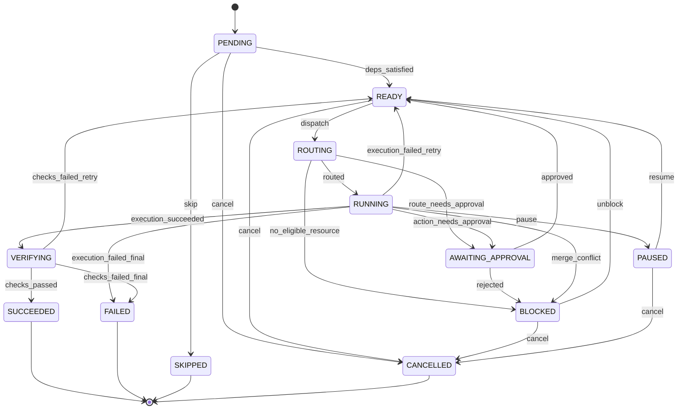

- `approved` returns the task to READY; the resumed execution receives the one-shot allow bound
  to the approved action hash (execution-architecture §5).
- `execution_failed_retry`: attempt < `max_attempts`. A retry re-enters ROUTING, which may pick
  a different resource (affinity is kept unless the failure was resource-attributable).
- **The three-strikes rule (migration kit):** if the same failure signature (normalised error
  class + task kind) is seen three times across a mission, the task goes FAILED with
  `reason = rule_bug` and Attention gets a "this looks like a process problem" item instead of a
  fourth retry.
- `human` tasks skip ROUTING: READY → AWAITING_APPROVAL (the Attention item *is* the task).

---

## 4. Execution

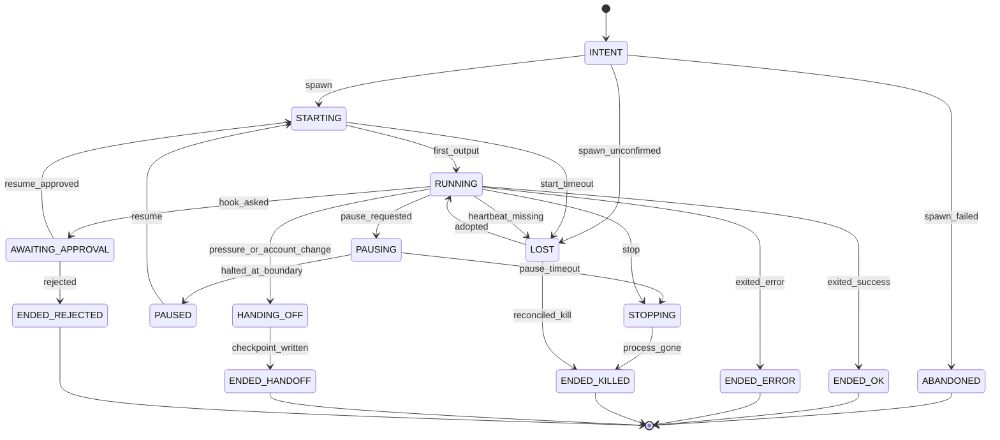

- **INTENT is committed before spawn.** The row (with the planned argv, workdir and account)
  exists before any process does; the outbox consumer writes the **spawning marker**, spawns,
  and records `{pid, create_time}` in the execution's `pid.json`, the on-disk registry
  (`<ARCHEUS_HOME>/run/processes.jsonl`) and the DB (process I/O contract:
  execution-architecture §3.1). Boot reconciliation of an INTENT row: no spawning marker →
  `spawn_failed` → ABANDONED (nothing was started); marker present but no `pid.json` →
  `spawn_unconfirmed` → LOST (a process may exist; it is never spawned again under the same
  attempt); marker and `pid.json` present → adopted like a RUNNING execution.
- **Pause is cooperative** (Windows has no SIGSTOP; a headless agent cannot be frozen and
  thawed safely). `pause_requested` sets a flag the PreToolUse hook reads; at the next tool call
  the hook returns halt (`continue:false`). The adapter's `pause()` then records the provider
  session ref. `resume` starts a new process with `--resume` (same account). `pause_timeout`
  (default 120 s with no tool boundary) escalates to STOPPING and a checkpoint is derived.
- **ASK mid-execution:** hook denies the action with a reason and halts → `hook_asked` → an
  Approval row bound to the action hash. `resume_approved` resumes the provider session with a
  one-shot allow token for that hash.
- **HANDING_OFF → ENDED_HANDOFF** ends this execution; the Execution Manager creates the next
  Execution (attempt unchanged, `handoff_from` set) for the same task, fed by the checkpoint.
- **LOST** is decided by Core, never self-reported: no process-registry liveness *and* no output
  for `lost_after` (default 90 s), or node OFFLINE past grace. Reconciliation at boot either
  `adopted` (pid + create_time match a live process that is still writing its stream) or
  `reconciled_kill`.
- ENDED_OK does not mean the task succeeded — the task goes to VERIFYING.
- **As built in P3.5**, reconciliation does not adopt: an execution no running Core is watching
  has its process killed (pid + creation time) and ends ABANDONED (never spawned) or
  LOST → ENDED_KILLED (`spawn_unconfirmed` / `start_timeout` / `heartbeat_missing`, then
  `reconciled_kill`), and its task retries with a new execution. Adoption (`LOST → RUNNING`) is
  the execution manager's (P11).

---

## 5. Approval

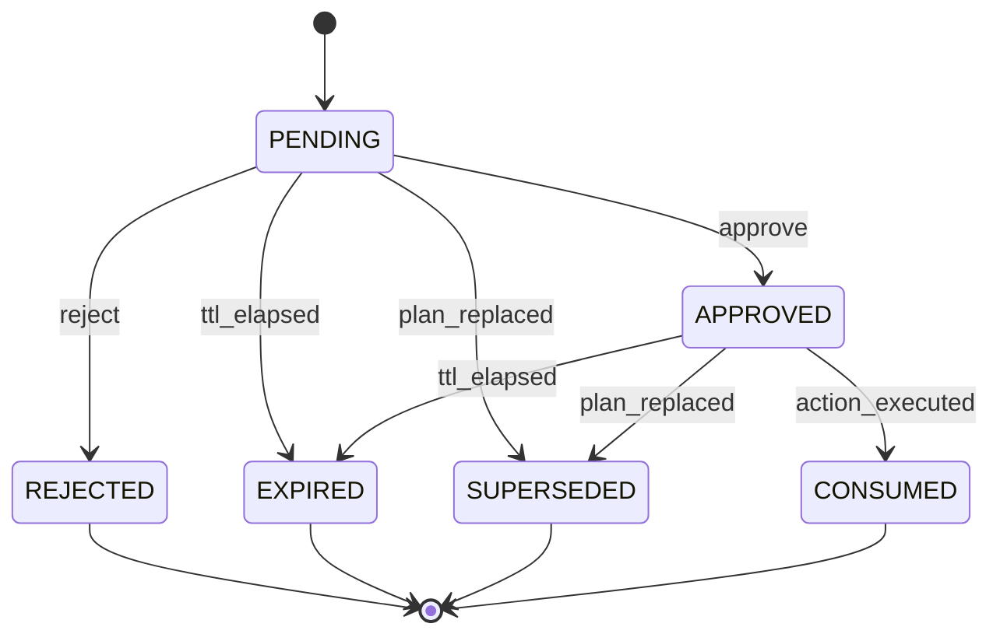

- Guard on `approve`: actor is a `user_device` principal with scope `approve`; if `step_up`, the
  command carries a valid step-up proof; the command's `action_hash` equals the row's.
- `action_executed`: the policy engine, asked about an action whose hash matches an APPROVED
  approval, returns ALLOW once and consumes it. A second identical action needs a new approval
  (single-use; replay-safe).
- `plan_replaced`: a replan supersedes every approval tied to the old `plan_version`.
- Deciding commands are idempotent by `idempotency_key`: a repeated approve returns the existing
  decision.

---

## 6. Verification

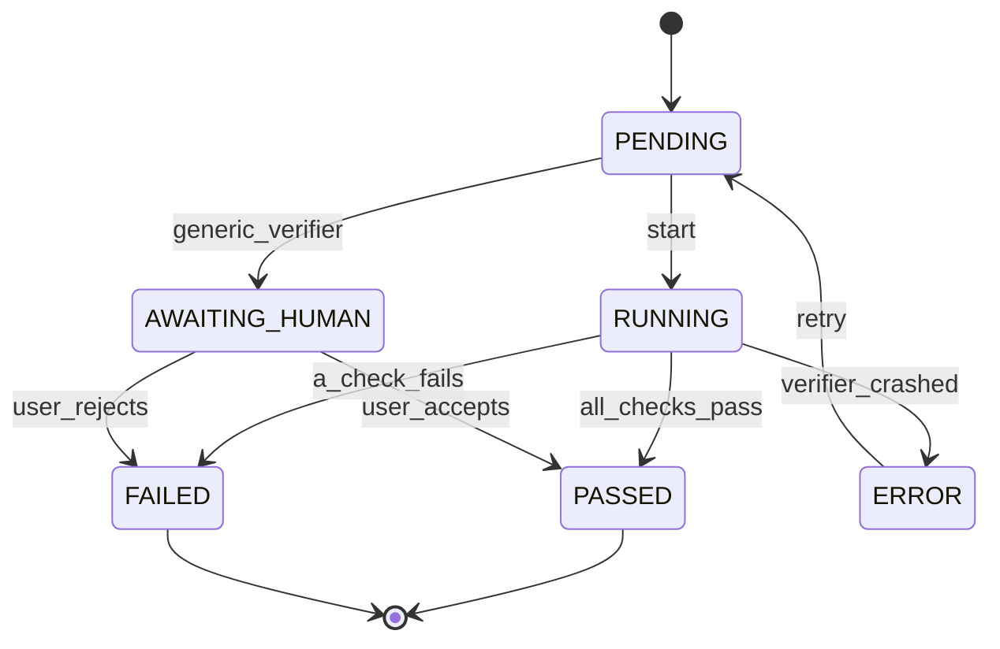

ERROR (the verifier itself broke: missing test runner, timeout) is not FAILED (the work is
wrong). ERROR retries once, then becomes an Attention item; it never silently passes.

---

## 7. Review

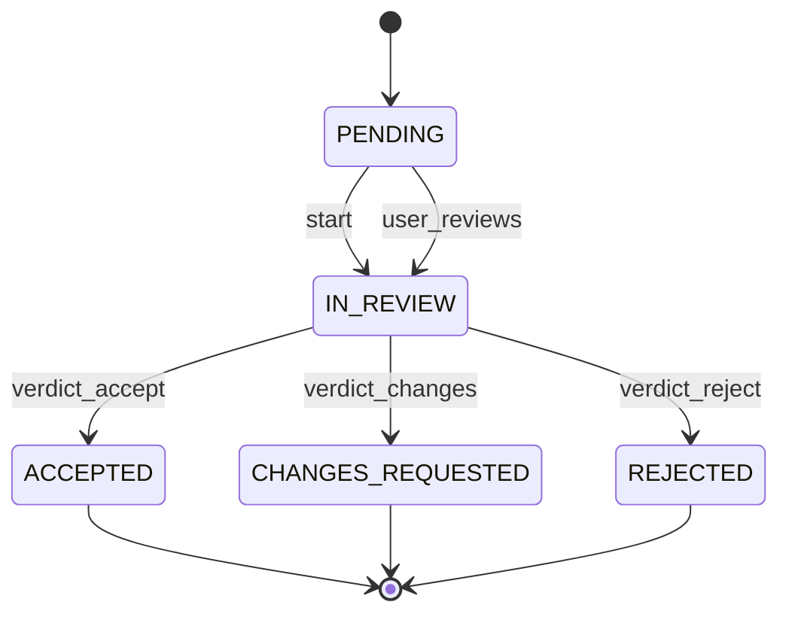

Review compares result vs intent, requirements, constraints and success criteria. The router
prefers a model/account different from the one that executed the work; when none is free the
review runs anyway with `independent = false`, and the mission's inspector shows it. The user
can always override a verdict (it is recorded as a second Review by `user`).

---

## 8. Automation and AutomationRun

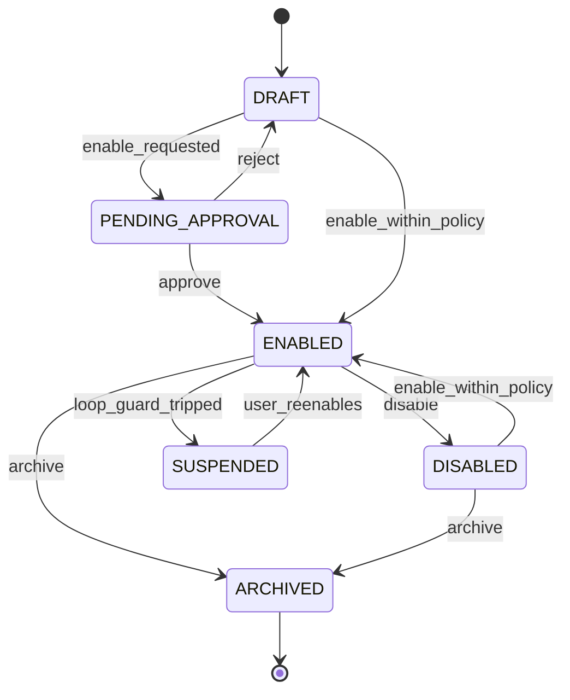

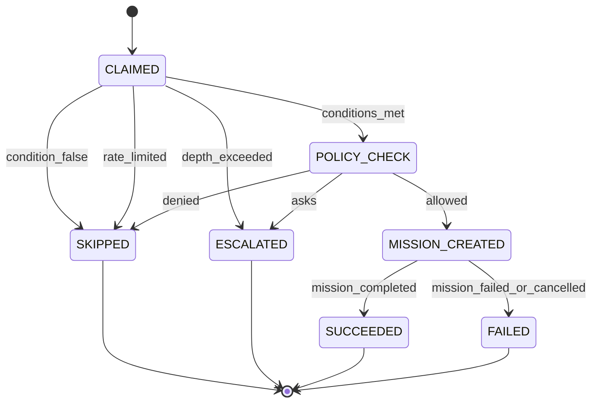

- Enabling an automation whose template exercises any ASK/DENY action class needs approval
  (`enable_requested`); purely ALLOW templates enable directly.
- `depth_exceeded`: the triggering event's `cause_chain` contains ≥ `max_depth` automation runs
  → **escalate, never silently drop** (Munder Difflin's hop cap dropped messages; its docs said
  it escalated; we take the documented behaviour).
- `loop_guard_tripped`: the same automation escalated 3 times in 1 hour, or its rate limit was
  hit 3 windows in a row → SUSPENDED with an Attention item.
- Claiming uses the single writer: select-due + insert run + advance `next_run_at` happen in one
  transaction, so a schedule cannot fire twice (Vicoa's claim-and-advance, without needing
  `SKIP LOCKED` because only one writer exists).

---

## 9. Account health (resource availability + circuit breaker)

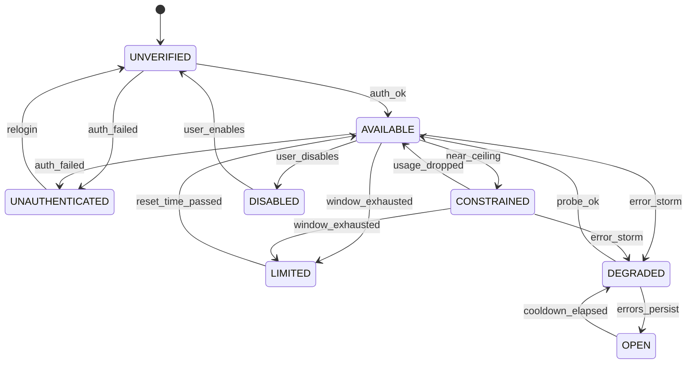

- `near_ceiling`: observed utilisation ≥ `ceiling(account, task) − 5`, i.e.
  `allocation_pct − reserve_pct − brain_reserve_pct − 5` (router §4).
- `window_exhausted`: provider says so (`quota.is_limit_error` / `is_window_limit` on a failure,
  or usage ≥ 100%). `limited_until = resets_at`.
- DEGRADED/OPEN is a circuit breaker adapted from Munder Difflin's `breaker.ts`: move **at most
  one level per beat** (beat = 60 s), de-escalate on a successful probe. OPEN accounts are never
  routed to; DEGRADED accounts only receive work when no AVAILABLE candidate exists and policy
  permits fallback.
- The machine lives on Account; Harness has a simpler AVAILABLE/MISSING/MISCONFIGURED state set
  by discovery.

---

## 10. Repository inspection and architecture consistency

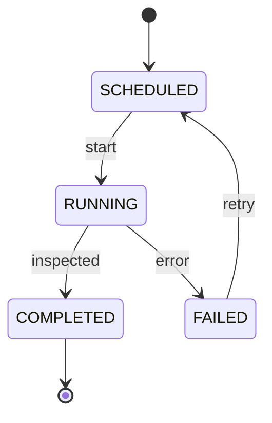

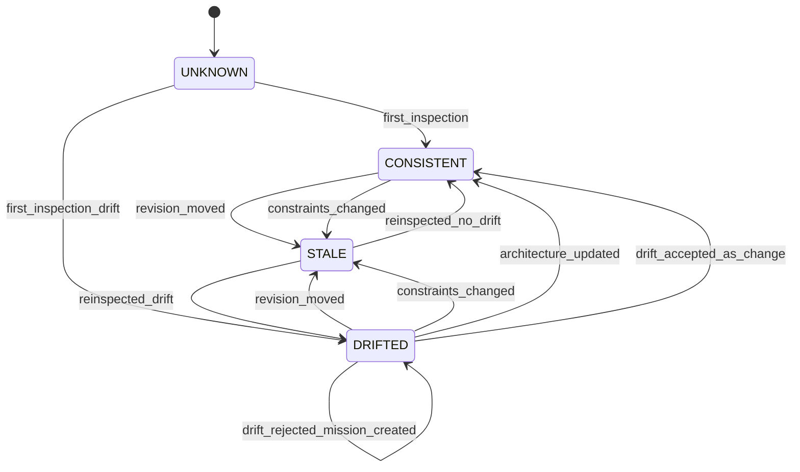

The second machine is `Repository.architecture_state`. `revision_moved`: HEAD SHA differs from
the last inspection's `revision` (checked cheaply from `.git/HEAD`, as `statusline` already
does). `constraints_changed`: a constraint was declared for the repository's project, so the
current assessment was made against a different set. `reinspected_drift`: the new inspection's
module graph or dependency set violates a CONFIRMED ARCHITECTURE/DECISION item
(context-and-knowledge §6). A drifted repository is left by a fix (`revision_moved`, then a
clean re-inspection) as well as by the drift proposal, which lands in Attention with three
actions: update the architecture knowledge, accept as intended change, or create a mission to
fix the code (P6; not fired before).

The four assessment edges (`first_inspection`, `first_inspection_drift`,
`reinspected_no_drift`, `reinspected_drift`) are guarded (p4-design-gate §5): each is taken
only on a COMPLETED inspection of this repository (whose revision is the one recorded), and only
when its findings say what the edge says — so no path can record drift that the findings do not
show, or its absence when they do.

---

## 11. KnowledgeItem

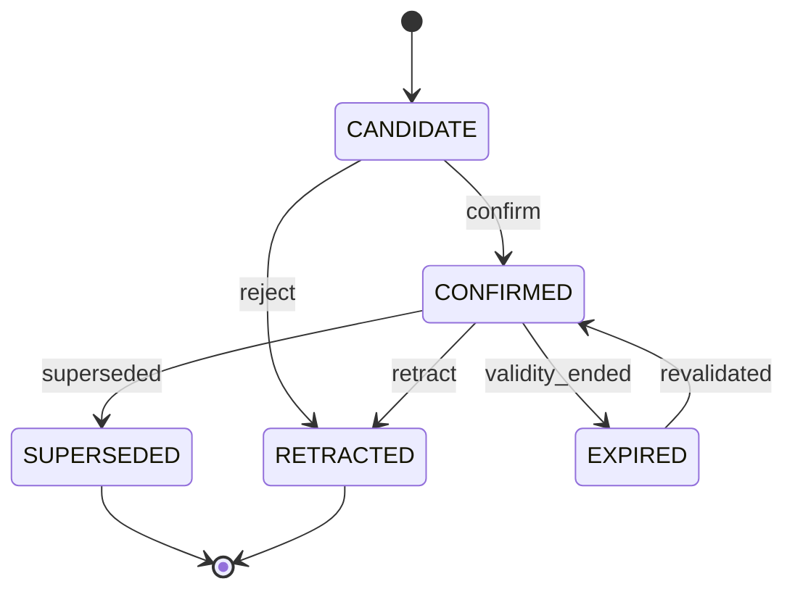

- `confirm`: explicit user action, or automatic when `origin = explicit`, or when
  `confidence ≥ autoconfirm_threshold` and the type is FACT/ENTITY from an EXTRACTED source
  (today's `memory_lessons_autoapprove` generalised). PREFERENCE and STANDARD never
  auto-confirm from inferred sources.
- `superseded`: a newer CONFIRMED item with `supersedes_id = this` → sets `valid_until`,
  `superseded_by_id`. Superseded items are excluded from context by default and shown as history.
- Staleness is a flag (`stale = now > stale_after` or anchor revision moved), not a state; stale
  items are down-ranked and labelled in context packages rather than dropped.

---

## 12. Device and ExecutionNode

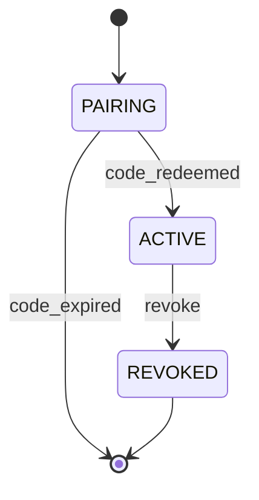

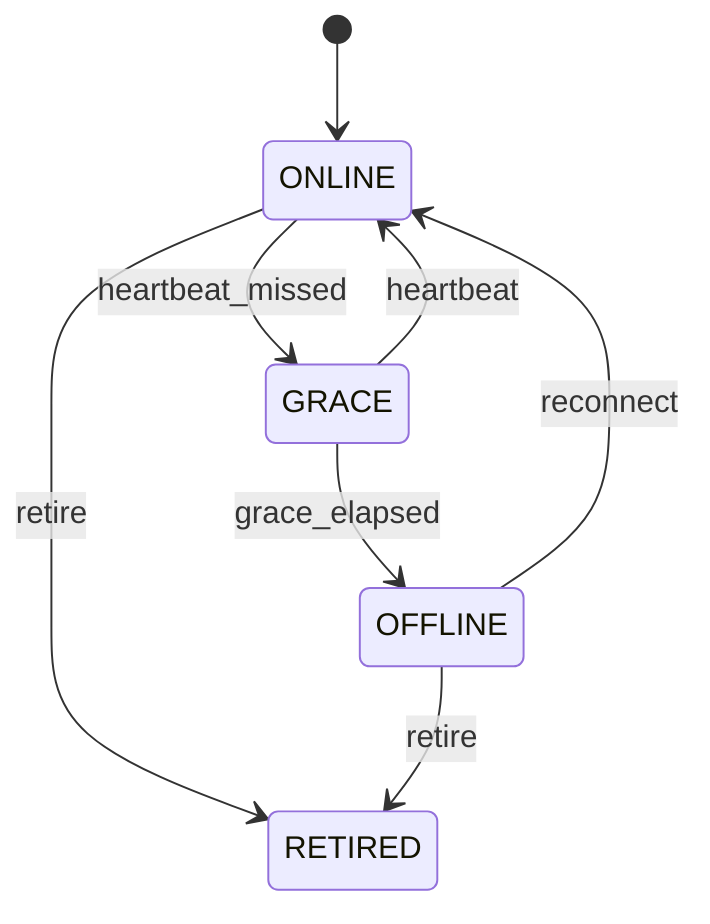

Revocation closes the device's live SSE streams in the same request. Host sleep: the local node
goes GRACE when the OS suspends (missed heartbeats); on grace elapsed its RUNNING executions
become LOST and are reconciled on wake.

---

## 13. Integration (merge-back of worktree results)

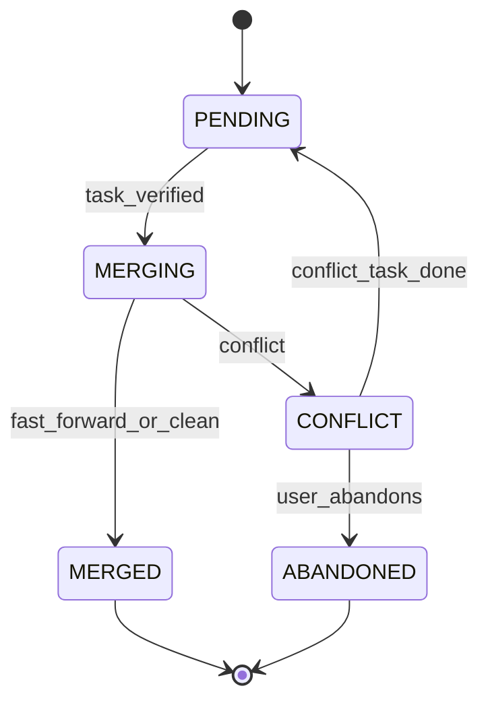

The machine is held on `Task.integration_state` (domain-model §7.3), not on an entity of its
own. Only Core merges (executions have no rights to the main branch). CONFLICT sets the owning task
BLOCKED and creates a follow-up `code_change` task "resolve conflict" in the same plan.
`git_commit` on the main branch and `git_push` are separate action classes evaluated by policy
at MERGING time.

---

## 14. Event handling (consumer cursors)

Each outbox consumer (spawner, notifier, automation matcher, learning pass, inspector scheduler,
SSE fan-out) owns a row in `consumer_cursors(name, last_seq)`. A consumer processes events in
`seq` order, performs its side effect idempotently (keyed by `(consumer, event_seq)` in
`consumer_effects`), then advances its cursor. A crash re-delivers from the cursor; the effects
table makes re-delivery harmless. This is Munder Difflin's `cursor.json` plus Vicoa's
wake-and-requery, on one SQLite file.
