# Archeus V1 — State Machines

Status: **DECIDED**. Entities are defined in [domain-model.md](domain-model.md).

## 0. How state machines are implemented

- **One table.** `archeus/core/domain/states.py` declares every machine as a flat tuple of
  `(machine, from_state, to_state, trigger, guard_name)`. Diagrams in this document are
  documentation of that table; `tests/v1/unit/test_state_tables.py` parses the Mermaid blocks
  below and fails if a diagram edge is missing from the table or vice versa (the repo's
  "one declaration, everything derived" rule).
- **One mutator.** `transition(entity, to, *, actor, reason, cause)` validates the edge, runs the
  guard, bumps `version`, writes the row and appends the event in one transaction. Nothing else
  assigns `state`.
- **Guards are pure functions** of the entity plus a read-only snapshot. They never call a
  model or a process. A guard that needs a side effect is a bug; the side effect belongs in an
  outbox consumer reacting to the event.
- **Terminal states are terminal.** Retrying a FAILED execution creates a new Execution row;
  replanning a mission creates a new Plan version. History is never rewritten.
- **Human intervention** is modelled as triggers with `actor.kind == user_device` — the same
  edges an automation or the brain would use, so every path is audited the same way.
- Naming: states are UPPER_SNAKE; triggers are lower_snake verbs.

Policy decisions use exactly four values everywhere: `ALLOW`, `ASK`, `ALLOW_WITHIN_BOUNDARY`,
`DENY`.

---

## 1. Idea

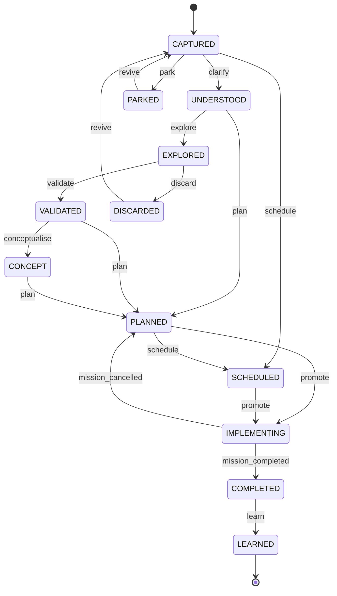

- `promote` creates a Mission (origin = idea) and links it; the idea's state then follows its
  mission (`mission_completed` / `mission_cancelled` are event-driven triggers).
- Stages may be skipped (spec §6): the diagram's shortcuts are the allowed skips; anything else
  is rejected. A reminder goes CAPTURED → SCHEDULED directly.
- `explore` runs research executions under the idea (they are tasks of a lightweight
  "exploration" mission with `kind=research`, which keeps routing/policy uniform).
- LEARNED is an **Idea** state only. Missions do not have a LEARNED state (see §2).

---

## 2. Mission

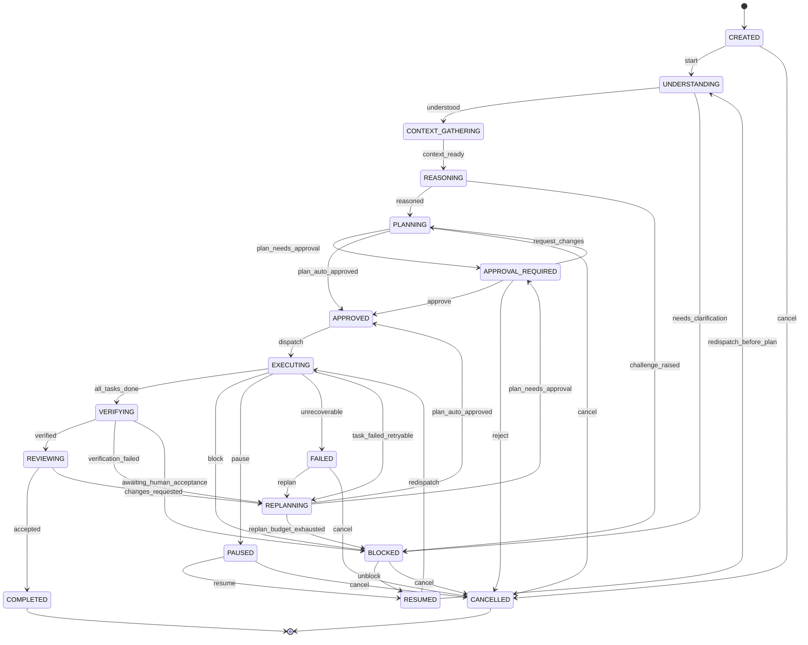

| Guard / rule | Definition |
|---|---|
| `plan_auto_approved` | the policy engine evaluates every task's `action_classes` under the mission's scope chain and all are ALLOW or ALLOW_WITHIN_BOUNDARY, **and** the plan's estimated cost band is under the mission's auto-approve ceiling |
| `all_tasks_done` | every non-`human` task is SUCCEEDED or SKIPPED |
| `verified` | every mission-level success criterion with `check: automatic` has a PASSED verification |
| `awaiting_human_acceptance` | a criterion with `check: human` (GenericVerifier) is open; an Attention item is created. Mission shows `blocked_reason = "waiting for your acceptance"`, which the UI renders as *needs you*, not as failure |
| `replan_budget_exhausted` | `plan_version - 1 >= mission.max_replans` (default 2) |
| `task_failed_retryable` | a task FAILED after `max_attempts` and the failure class is not policy/credential/human |
| `unrecoverable` | policy DENY on a required action, missing capability with no resource, or user-declared failure |
| `pause` | cooperative: tasks move to PAUSED as their executions reach the next tool boundary; mission shows PAUSED immediately and "pausing N executions…" until they settle |

**Session rotation never changes mission state.** An execution handing off (Execution §4) keeps
its task RUNNING and its mission EXECUTING.

**Learning is not a state.** After COMPLETED, an outbox consumer runs the learning pass
(lessons, preferences, architecture updates) and sets `mission.learned_at`. A failed or skipped
learning pass never reopens a mission. This resolves the spec's `COMPLETED → LEARNED`.

---

## 3. Task

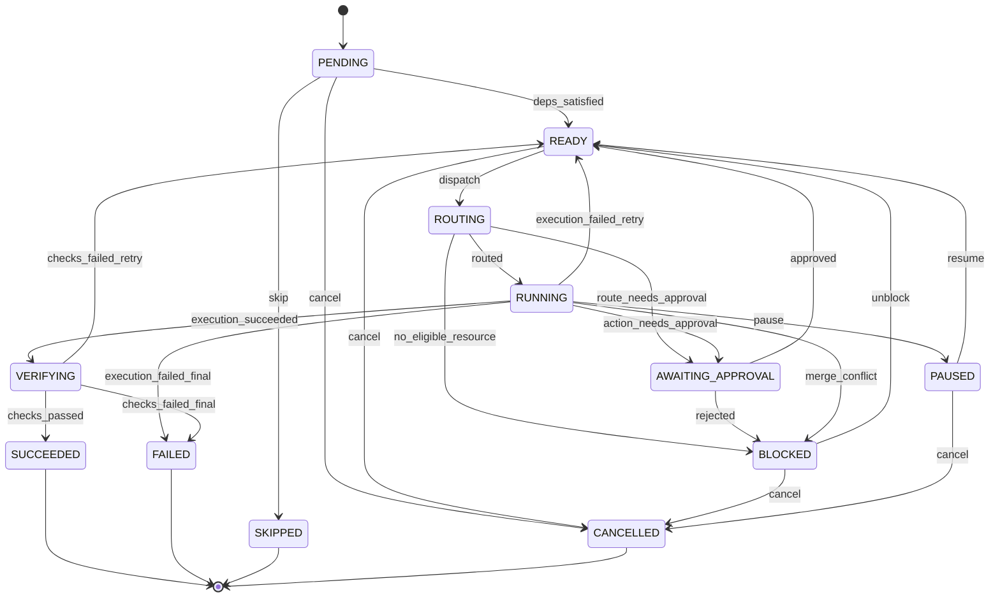

- `approved` returns the task to READY; the resumed execution receives the one-shot allow bound
  to the approved action hash (execution-architecture §5).
- `execution_failed_retry`: attempt < `max_attempts`. A retry re-enters ROUTING, which may pick
  a different resource (affinity is kept unless the failure was resource-attributable).
- **The three-strikes rule (migration kit):** if the same failure signature (normalised error
  class + task kind) is seen three times across a mission, the task goes FAILED with
  `reason = rule_bug` and Attention gets a "this looks like a process problem" item instead of a
  fourth retry.
- `human` tasks skip ROUTING: READY → AWAITING_APPROVAL (the Attention item *is* the task).

---

## 4. Execution

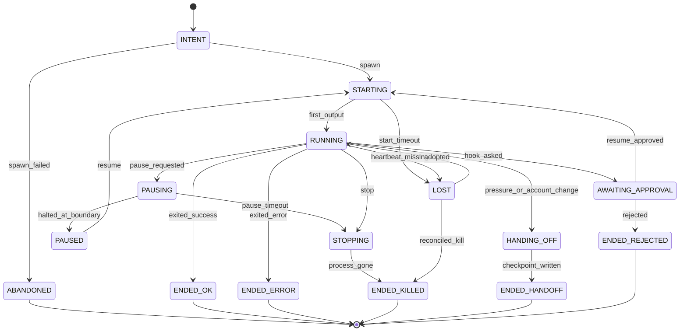

- **INTENT is committed before spawn.** The row (with the planned argv, workdir and account)
  exists before any process does; the outbox consumer spawns and records `{pid, create_time}` in
  both the DB and the on-disk process registry (`~/.archeus/run/processes.jsonl`). A crash
  between commit and spawn leaves an INTENT row that boot reconciliation moves to ABANDONED.
- **Pause is cooperative** (Windows has no SIGSTOP; a headless agent cannot be frozen and
  thawed safely). `pause_requested` sets a flag the PreToolUse hook reads; at the next tool call
  the hook returns halt (`continue:false`). The adapter's `pause()` then records the provider
  session ref. `resume` starts a new process with `--resume` (same account). `pause_timeout`
  (default 120 s with no tool boundary) escalates to STOPPING and a checkpoint is derived.
- **ASK mid-execution:** hook denies the action with a reason and halts → `hook_asked` → an
  Approval row bound to the action hash. `resume_approved` resumes the provider session with a
  one-shot allow token for that hash.
- **HANDING_OFF → ENDED_HANDOFF** ends this execution; the Execution Manager creates the next
  Execution (attempt unchanged, `handoff_from` set) for the same task, fed by the checkpoint.
- **LOST** is decided by Core, never self-reported: no process-registry liveness *and* no output
  for `lost_after` (default 90 s), or node OFFLINE past grace. Reconciliation at boot either
  `adopted` (pid + create_time match a live process that is still writing its stream) or
  `reconciled_kill`.
- ENDED_OK does not mean the task succeeded — the task goes to VERIFYING.

---

## 5. Approval

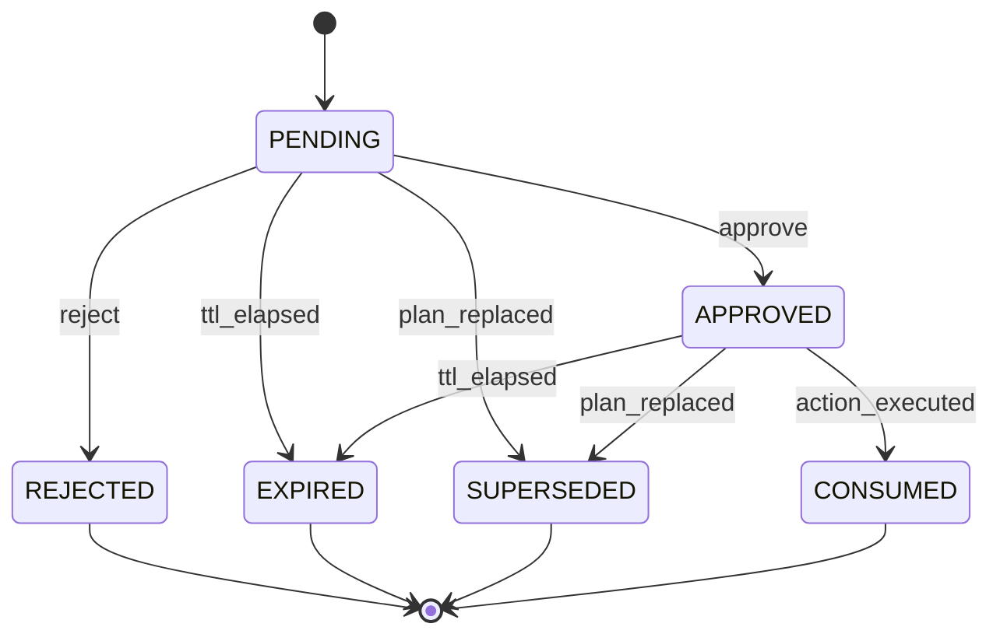

- Guard on `approve`: actor is a `user_device` principal with scope `approve`; if `step_up`, the
  command carries a valid step-up proof; the command's `action_hash` equals the row's.
- `action_executed`: the policy engine, asked about an action whose hash matches an APPROVED
  approval, returns ALLOW once and consumes it. A second identical action needs a new approval
  (single-use; replay-safe).
- `plan_replaced`: a replan supersedes every approval tied to the old `plan_version`.
- Deciding commands are idempotent by `idempotency_key`: a repeated approve returns the existing
  decision.

---

## 6. Verification

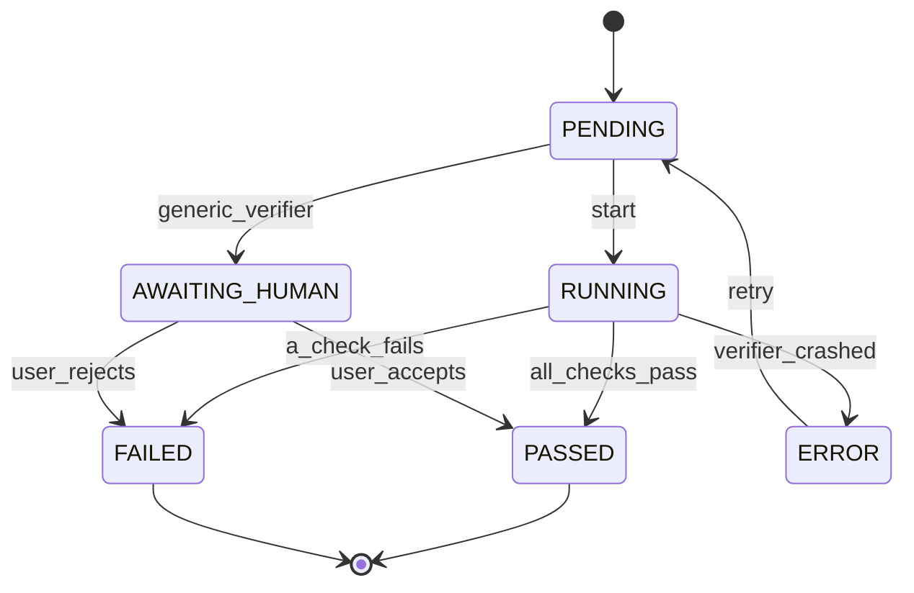

ERROR (the verifier itself broke: missing test runner, timeout) is not FAILED (the work is
wrong). ERROR retries once, then becomes an Attention item; it never silently passes.

---

## 7. Review

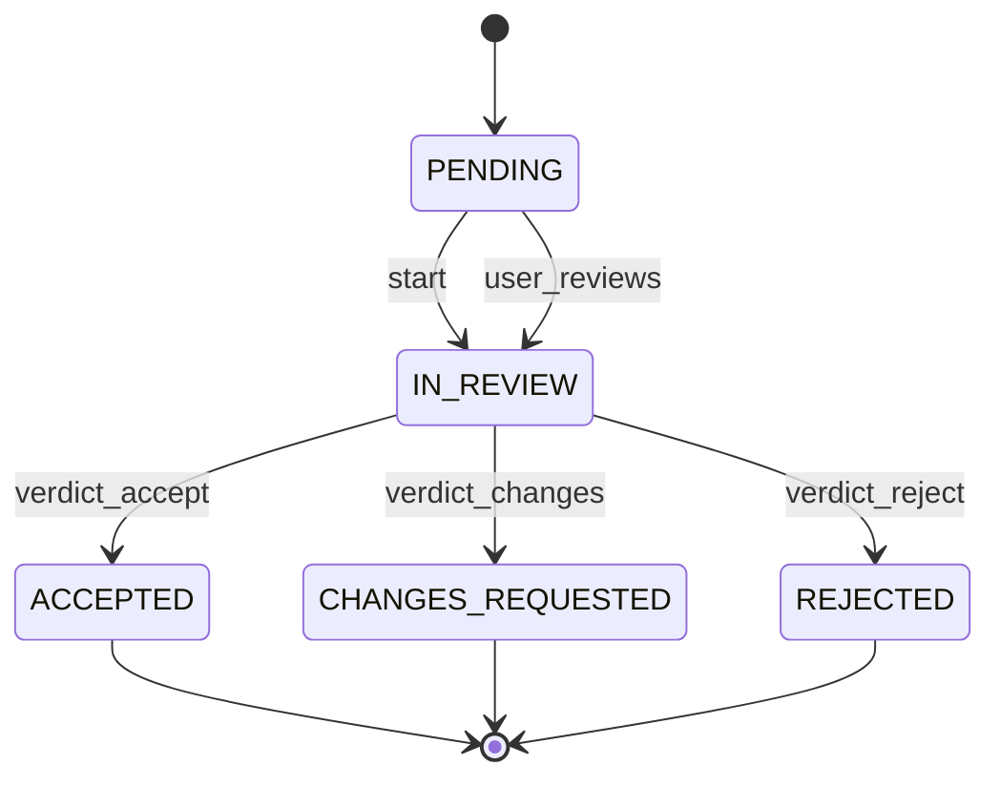

Review compares result vs intent, requirements, constraints and success criteria. The router
prefers a model/account different from the one that executed the work; when none is free the
review runs anyway with `independent = false`, and the mission's inspector shows it. The user
can always override a verdict (it is recorded as a second Review by `user`).

---

## 8. Automation and AutomationRun

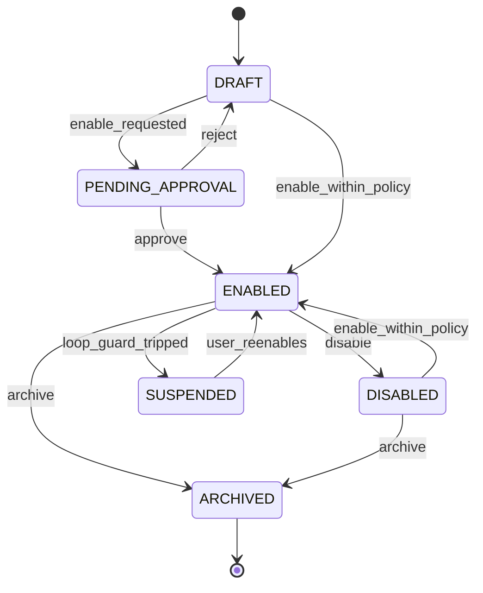

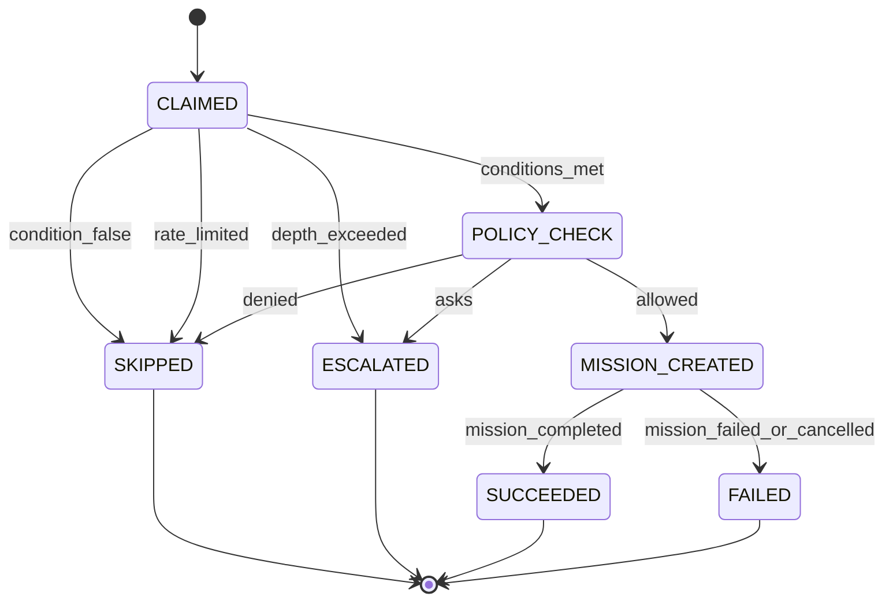

- Enabling an automation whose template exercises any ASK/DENY action class needs approval
  (`enable_requested`); purely ALLOW templates enable directly.
- `depth_exceeded`: the triggering event's `cause_chain` contains ≥ `max_depth` automation runs
  → **escalate, never silently drop** (Munder Difflin's hop cap dropped messages; its docs said
  it escalated; we take the documented behaviour).
- `loop_guard_tripped`: the same automation escalated 3 times in 1 hour, or its rate limit was
  hit 3 windows in a row → SUSPENDED with an Attention item.
- Claiming uses the single writer: select-due + insert run + advance `next_run_at` happen in one
  transaction, so a schedule cannot fire twice (Vicoa's claim-and-advance, without needing
  `SKIP LOCKED` because only one writer exists).

---

## 9. Account health (resource availability + circuit breaker)

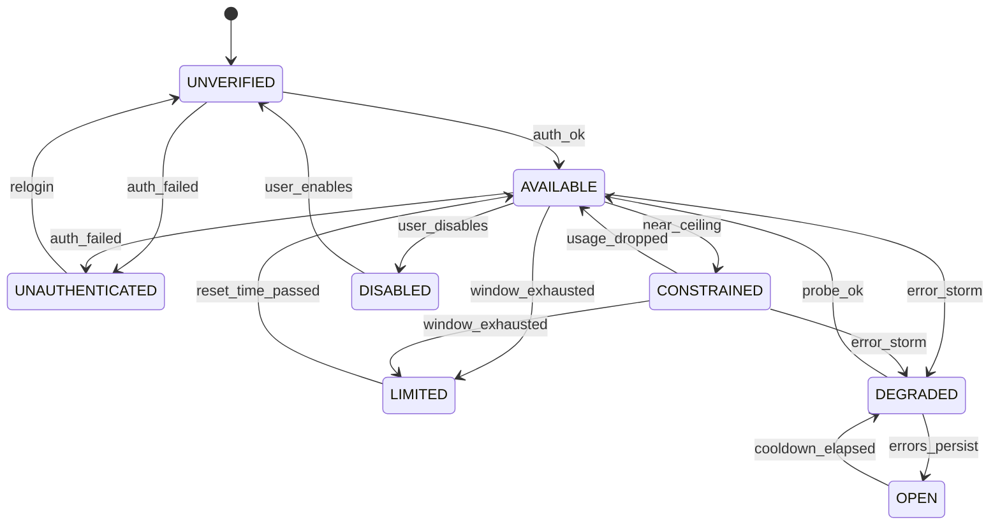

- `near_ceiling`: observed utilisation ≥ `allocation_pct − reserve_pct − 5` (router §4).
- `window_exhausted`: provider says so (`quota.is_limit_error` / `is_window_limit` on a failure,
  or usage ≥ 100%). `limited_until = resets_at`.
- DEGRADED/OPEN is a circuit breaker adapted from Munder Difflin's `breaker.ts`: move **at most
  one level per beat** (beat = 60 s), de-escalate on a successful probe. OPEN accounts are never
  routed to; DEGRADED accounts only receive work when no AVAILABLE candidate exists and policy
  permits fallback.
- The machine lives on Account; Harness has a simpler AVAILABLE/MISSING/MISCONFIGURED state set
  by discovery.

---

## 10. Repository inspection and architecture consistency

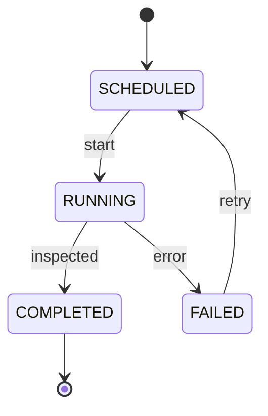

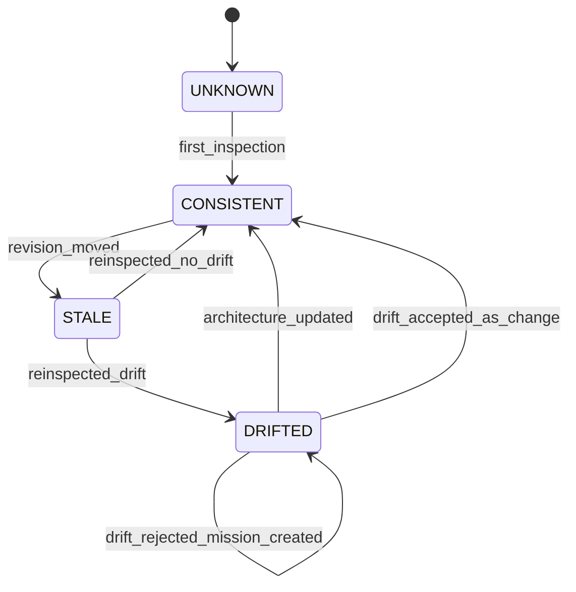

The second machine is `Repository.architecture_state`. `revision_moved`: HEAD SHA differs from
the last inspection's `revision` (checked cheaply from `.git/HEAD`, as `statusline` already
does). `reinspected_drift`: the new inspection's module graph or dependency set violates a
CONFIRMED ARCHITECTURE/DECISION item (context-and-knowledge §6). The drift proposal lands in
Attention with three actions: update the architecture knowledge, accept as intended change, or
create a mission to fix the code.

---

## 11. KnowledgeItem

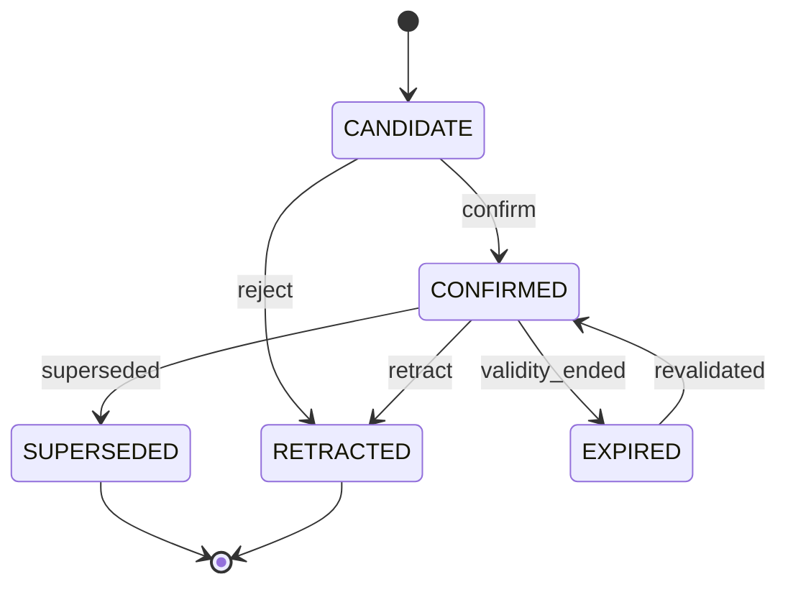

- `confirm`: explicit user action, or automatic when `origin = explicit`, or when
  `confidence ≥ autoconfirm_threshold` and the type is FACT/ENTITY from an EXTRACTED source
  (today's `memory_lessons_autoapprove` generalised). PREFERENCE and STANDARD never
  auto-confirm from inferred sources.
- `superseded`: a newer CONFIRMED item with `supersedes_id = this` → sets `valid_until`,
  `superseded_by_id`. Superseded items are excluded from context by default and shown as history.
- Staleness is a flag (`stale = now > stale_after` or anchor revision moved), not a state; stale
  items are down-ranked and labelled in context packages rather than dropped.

---

## 12. Device and ExecutionNode

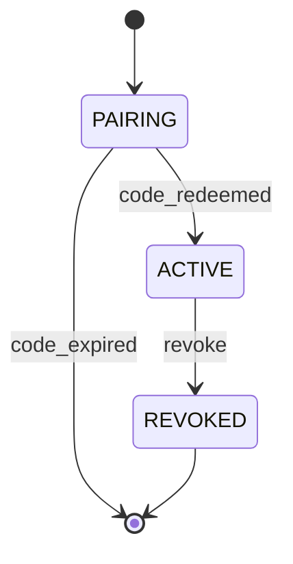

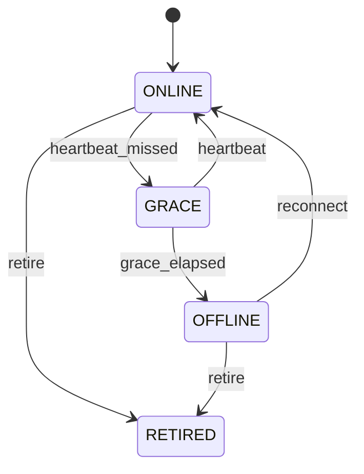

Revocation closes the device's live SSE streams in the same request. Host sleep: the local node
goes GRACE when the OS suspends (missed heartbeats); on grace elapsed its RUNNING executions
become LOST and are reconciled on wake.

---

## 13. Integration (merge-back of worktree results)

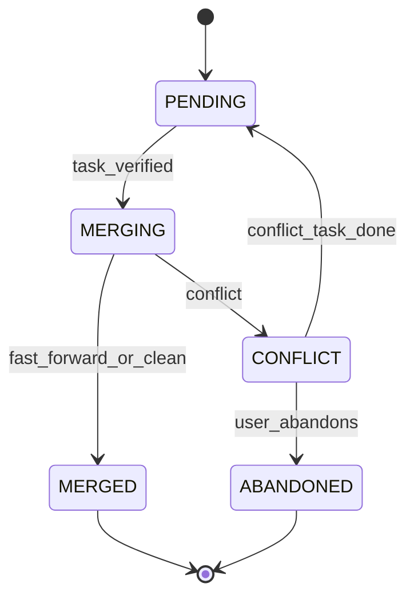

Only Core merges (executions have no rights to the main branch). CONFLICT sets the owning task
BLOCKED and creates a follow-up `code_change` task "resolve conflict" in the same plan.
`git_commit` on the main branch and `git_push` are separate action classes evaluated by policy
at MERGING time.

---

## 14. Event handling (consumer cursors)

Each outbox consumer (spawner, notifier, automation matcher, learning pass, inspector scheduler,
SSE fan-out) owns a row in `consumer_cursors(name, last_seq)`. A consumer processes events in
`seq` order, performs its side effect idempotently (keyed by `(consumer, event_seq)` in
`consumer_effects`), then advances its cursor. A crash re-delivers from the cursor; the effects
table makes re-delivery harmless. This is Munder Difflin's `cursor.json` plus Vicoa's
wake-and-requery, on one SQLite file.
