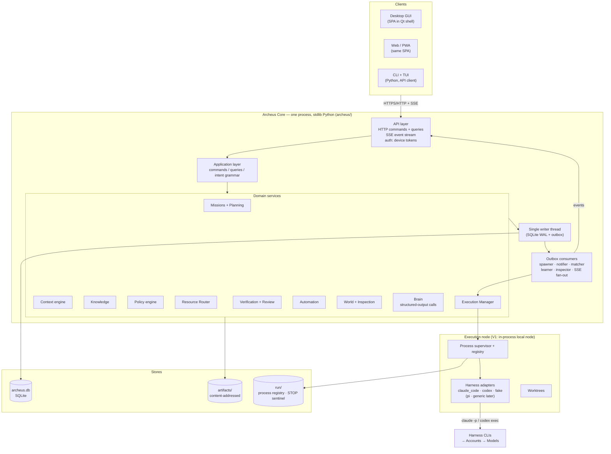

# Archeus V1 — Target Architecture

Status: **DECIDED** unless marked. Decisions are recorded as ADRs in
[decisions/](decisions/). Entities: [domain-model.md](domain-model.md).

## 1. Shape in one picture



## 2. Architectural principles (binding)

1. **Modular monolith control plane** (ADR-0001). One long-lived Core process owns the database,
   scheduling, routing and policy. Domain modules talk through in-process function calls behind
   explicit interfaces (`archeus/core/<area>/api.py`), so any of them could be extracted later,
   but nothing is split in V1.
2. **Stdlib only at runtime** (ADR-0003): `sqlite3`, `http.server`, `threading`, `subprocess`,
   `json`, `hashlib`, `secrets`, `ssl` (only for optional outbound calls), `ctypes` (DPAPI on
   Windows). Optional extras: `gui` (PyQt6 shell, existing), `push` (Web Push, DEFERRED).
3. **Single writer** (ADR-0002). Exactly one thread holds the SQLite write connection. Every
   state change is a *command* executed on that thread; the command writes rows and events in
   one transaction. Readers use separate `query_only` connections. Only the Core process writes
   the DB; hooks, the CLI and clients go through HTTP.
4. **Side effects after commit.** Spawning processes, calling models, sending notifications and
   touching git happen in outbox consumers reacting to committed events — never inside a
   command. A crash therefore never leaves "process running but DB says not started"; the
   INTENT row + reconciliation covers the one remaining window (state-machines §4).
5. **Provider neutrality.** Everything provider-specific lives in `archeus/harnesses/*`.
   Domain code sees the adapter contract only ([execution-architecture.md §3](execution-architecture.md)).
6. **Policy by capability removal** (ADR-0007). An execution only has the credentials and
   sandbox its policy allows. Hooks are a second line, not the first.
7. **One declaration per concept.** State tables, action classes, event types, routes, design
   tokens, navigation: each is one flat table in one file, and docs/tests/clients derive from it.
   This is the lesson the current repo paid for repeatedly (NAV/TABS/ACTIONS, PALETTES,
   cluster spec).
8. **Clients hold no business logic.** A client sends commands, runs queries and listens to the
   event stream. Parity between GUI, mobile and TUI follows from sharing the API, not from tests
   comparing surfaces (which the current repo needs because logic is duplicated).

## 3. Package layout

A **new top-level import package `archeus/`** lives beside `claude_sessions/` (strangler fig,
ADR-0001). It also ends the hazard where the current distribution and its predecessor install
the same `claude_sessions` import package (uninstalling one deletes the other).

```text
archeus/
├── core/
│   ├── domain/            entities.py  values.py  states.py (all machines, one table)
│   │                      events.py (event type registry)  actions.py (action classes)
│   │                      ids.py (ULID)
│   ├── application/       commands.py  queries.py  grammar.py (control verbs)
│   │                      handlers/ (one module per area; the only callers of the writer)
│   ├── missions/          intent.py  mission_service.py  progress.py
│   ├── planning/          planner.py (brain prompts + validation)  dag.py
│   ├── context/           assemble.py  levels.py  budget.py  explain.py
│   ├── knowledge/         items.py  relations.py  promote.py  forget.py  ingest.py
│   ├── world/             projects.py  inspection.py  drift.py  digest.py (since-you-left)
│   ├── policy/            engine.py  rules.py  approvals.py  profiles.py
│   ├── routing/           router.py  allocation.py  explain.py  usage.py
│   ├── execution/         manager.py  checkpoint.py  handoff.py  integration.py (merge-back)
│   ├── verification/      verifiers/{code,research,document,generic}.py  review.py
│   ├── automation/        matcher.py  scheduler.py  guard.py
│   └── brain/             calls.py (structured-output runner)  schemas/ (JSON schemas)
├── infra/
│   ├── db/                connection.py  writer.py  migrations/NNNN_*.sql  backup.py
│   ├── eventlog/          outbox.py  consumers.py  retention.py
│   ├── artifacts/         store.py (sha256 addressing)
│   ├── search/            bm25.py (adapter over the existing recall scorer)
│   ├── llm/               runner.py (spawn headless harness call, cancel, capture)
│   ├── notify/            desktop.py (wraps notify.py)  ntfy.py
│   └── secrets/           dpapi.py  posix.py
├── harnesses/
│   ├── base.py            the adapter contract (Protocol + dataclasses)
│   ├── fake.py            scripted harness for tests and the walking skeleton
│   ├── claude_code/       adapter.py  hooks/ (policy hook, pressure hook)  stream.py
│   ├── codex/             adapter.py
│   ├── pi/                adapter.py            (DEFERRED)
│   └── generic_cli/       adapter.py            (DEFERRED)
├── node/
│   ├── local.py           in-process node implementing the node contract
│   ├── supervisor.py      spawn, pid+create_time registry, kill, adopt
│   ├── worktrees.py       node-computed worktree paths
│   ├── estop.py           `archeus estop` (works without Core)
│   └── remote.py          (DEFERRED) outbound SSE client for remote nodes
├── api/
│   ├── server.py          ThreadingHTTPServer, request pools, TLS-less (TLS via tunnel)
│   ├── routes.py          ONE route table: (method, path, handler, scope, idempotent)
│   ├── sse.py             stream pool, heartbeats, Last-Event-ID replay
│   ├── auth.py            device tokens, pairing, host/origin allowlist, CSP
│   └── static/            built SPA (generated at release, not in git)
├── cli/
│   ├── main.py            `archeus core|status|approve|pause|route why|estop|pair`
│   └── tui/               (P17) full TUI on the API, reusing term.py/render.py
└── legacy/
    └── importers.py       read-only importers from claude_sessions stores
clients/
└── app/                   TypeScript + React SPA (Vite). Builds into archeus/api/static/
tests/v1/
├── unit/  integration/  contract/  e2e/  judge/ (acceptance scenarios, written first)
```

Reuse of `claude_sessions` code happens by **import from the new package into a thin seam**
(`archeus/infra/...` or an adapter), never by copying. The P0.5 seam work extracts the few
functions whose current form reaches into UI modules (see [migration-plan.md §3](migration-plan.md)).

## 4. Process model and lifecycle

| Process | Started by | Lifetime | Notes |
|---|---|---|---|
| **Archeus Core** (`archeus core`) | desktop shell, autostart entry, or CLI | long-lived; survives GUI close | single-instance lock `~/.archeus/run/core.lock`; writes `~/.archeus/run/core.json` `{pid, port, started_at}` (0600) for local discovery |
| Desktop shell (`archeus gui`) | user | while window open | Qt shell (existing `gui_qt.py` lineage) that attaches to Core via `core.json`, starting Core if absent; pairs itself as the local desktop device automatically |
| Harness processes | Execution Manager via node supervisor | per execution | detached so a Core restart does not kill work; adopted or killed at boot |
| Brain calls | `infra/llm/runner` | seconds–minutes | headless, `HEADLESS_MARK`-tagged, output schema enforced |
| `archeus estop` | user, any time | seconds | reads `run/processes.jsonl`, writes `run/STOP`, kills by pid+create_time; needs no Core |

**Autostart** (Windows: Startup-folder shortcut or `schtasks /sc onlogon`; macOS: LaunchAgent;
Linux: systemd user unit) is opt-in in onboarding because Scenario 11 (mobile control while
away) requires Core to be running. **Sleep/hibernate:** Core notices a clock jump > 2× the
heartbeat interval; the local node goes GRACE → executions become LOST → reconciled on wake
(adopt if still alive, else checkpoint-derived restart per policy).

## 5. Data architecture

| Store | Technology | Contents | Truth for |
|---|---|---|---|
| `~/.archeus/archeus.db` | SQLite WAL, `PRAGMA user_version` migrations | all entities of domain-model.md, `events`, `consumer_cursors`, `consumer_effects`, `idempotency_keys` | current state, history, knowledge |
| `~/.archeus/artifacts/` | files, sha256-addressed | transcripts copies, reports, diffs, checkpoints, imported notes, verifier logs | large content |
| `~/.archeus/run/` | files | `core.json`, `core.lock`, `processes.jsonl`, `STOP` | liveness + e-stop without Core |
| Harness homes (`~/.claude*`, `CODEX_HOME`) | owned by the harness | provider transcripts, credentials | never written by Core except hook/settings installation through the existing atomic read-modify-write helpers |
| Legacy stores (`~/.claude/archeus.json`, `<project>/.archeus/memory/graph.json`, …) | JSON | today's app state | owned by legacy until cutover (ADR-0019); V1 imports read-only snapshots |

Why SQLite and not a graph DB or Postgres: single user, single machine, embedded, stdlib,
transactional outbox is trivial with one writer, and recursive CTEs cover the graph traversals V1
needs (2–3 hop neighbourhoods). Graph DB and vector store are DEFERRED behind the
`infra/search` and `core/knowledge` interfaces (ADR-0012/0013).

Schema rules: every table has `id`, `version`, `created_at`, `updated_at`; JSON columns are
validated by the command handler (not the DB); indices on `(workspace_id, project_id, state)`
for list queries; `events(seq)` is the realtime cursor.

Backups: before every migration and daily, `sqlite3.Connection.backup()` to
`~/.archeus/backups/archeus-YYYYMMDD.db`, keep 7.

## 6. The operating loop mapped to modules

| Loop stage | Module | Key output |
|---|---|---|
| OBSERVE | `world.inspection`, `automation.matcher`, node reports, harness usage | events |
| UNDERSTAND | `missions.intent` (grammar first, brain second) | Intent |
| REASON / SUGGEST | `brain.calls` with a context package | mission draft, challenges, clarifying questions |
| PLAN | `planning.planner` | Plan (DAG, approval points, verification) |
| ASK / APPROVE | `policy.engine` + `policy.approvals` | PolicyDecision, Approval |
| ACT | `routing.router` → `execution.manager` → node → adapter | RouteDecision, Execution |
| VERIFY | `verification.verifiers.*` | Verification |
| REVIEW | `verification.review` | Review |
| UPDATE STATE | handlers (mission progress, project `status_line`, architecture state) | events |
| LEARN | `knowledge.promote` (outbox consumer after COMPLETED / feedback) | KnowledgeItem candidates |
| CONTINUE | `execution.handoff`, `automation.scheduler`, digest | next execution / mission |

## 7. Quality attributes and how they are met

| Attribute | Mechanism |
|---|---|
| Trustworthy current state | single writer; events in-transaction; LOST decided by Core not agents; progress computed from DAG not reported |
| Explainability | PolicyDecision, RouteDecision, context package `reasons[]`, all persisted and rendered by a *Why* tab |
| Survives session rotation | mission state in DB; Core-derived checkpoints; sessions are rows, not identity |
| Safety | capability removal, fail-closed hook for Archeus executions, approvals bound to action hashes, e-stop without Core |
| Responsiveness | SSE wake-and-requery; queries hit indexed SQLite; brain calls never block control verbs |
| Cost awareness | usage ledger + snapshots; brain reserve; effort/model tier per task by blast radius; stable prompt prefixes for cache hits (claudedevs cost guidance) |
| Offline/local-first | everything runs on the user's machine; remote access is an overlay |

## 8. What is explicitly not in V1

Remote execution nodes (contract specified, implementation DEFERRED), multi-user workspaces,
graph DB, vector search, Web Push, WebAuthn step-up, Archeus-as-MCP-server, pi/generic-CLI
adapters, 3D spatial view (2D graph ships), IDE features. Each has an entry in
[ARCHEUS_V1_REARCHITECTURE_PLAN.md §33](ARCHEUS_V1_REARCHITECTURE_PLAN.md).
