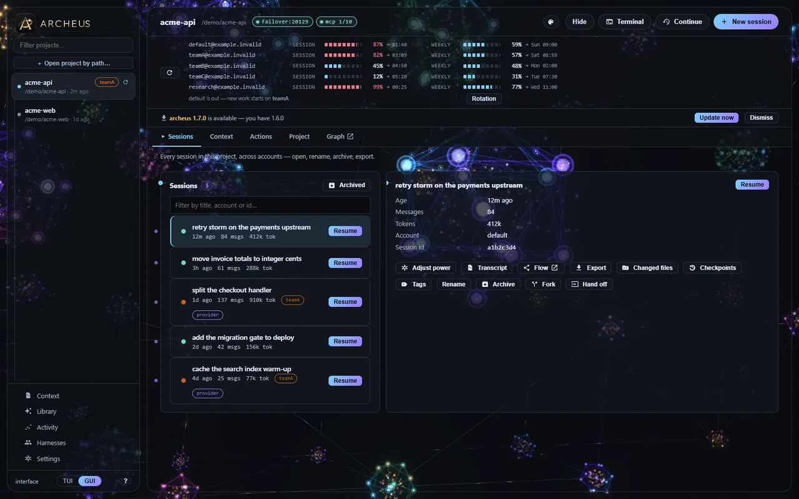

# archeus documentation

**The memory and workspace layer for AI coding agents.** This is the manual: everything
archeus does, how to configure it, and what each part costs you per turn. Claude Code is
the agent it drives today.

[Getting started](getting-started.md){ .md-button .md-button--primary }
[Quickstart](quickstart.md){ .md-button }

New here? [Getting started](getting-started.md) explains what archeus is and which of its
three surfaces you want. In a hurry? [Quickstart](quickstart.md) is install to first
session in five minutes.

!!! info "Which archeus is this?"

    The Python memory and workspace layer for AI coding agents — `pipx install archeus`,
    source at [github.com/babarmuhammad/archeus](https://github.com/babarmuhammad/archeus),
    published on [PyPI](https://pypi.org/project/archeus/). The word itself is
    Paracelsus' name for the vital force that organises living matter, which is why a
    search for it also finds dictionaries and alchemy. It is **not** *Arceus*, Nintendo's
    Pokemon, which is spelled with the vowels the other way round. archeus is not
    affiliated with, endorsed by, or supported by Anthropic.

## Install & first run

| | |
|---|---|
| [Getting started](getting-started.md) | what it is, the three surfaces, where to go next |
| [Installation](installation.md) | pipx, pip, a checkout, the desktop window, Windows shortcuts |
| [Quickstart](quickstart.md) | the five-minute path from nothing to a first session |

## The interfaces

| | |
|---|---|
| [Command line](cli.md) | every command — `workspace status`, `recall`, `review`, `sync-accounts`, `statusline` |
| [Terminal UI](tui.md) | every screen, the loops, and the complete key map |
| [Desktop app](desktop.md) | the same workspace as a local app — 32 palettes, 8 skins, 4 worlds |
| [Claude Code plugin](plugin.md) | three slash commands and eight skills inside the session |

## Working with projects

| | |
|---|---|
| [Configuration](configuration.md) | every file archeus reads and writes, and where |
| [Projects](projects.md) | health checks, auto-fixes, and whether generated context still matches the repo |
| [Sessions](sessions.md) | browse, search, tag, fork, resume, archive, export |
| [Project memory](memory.md) | the memory graph and its three token-budgeted injection surfaces |
| [Architecture graph](architecture.md) | the interactive dependency view, repo down to single files |
| [Usage & cost](usage.md) | what a turn costs across every surface, and how to cut it |
| [Troubleshooting](troubleshooting.md) | when something does not work |

## Reference

| | |
|---|---|
| [API reference](api.md) | the local HTTP API the desktop app is built on, generated from the route tables |
| [Download](https://claudectl.space/download) | every way to get it, what a release contains, versioning |
| [Multiple accounts](accounts.md) · [Context hand-off](context-handoff.md) | more than one Claude account, and moving a session between them |
| [MCP servers](mcp.md) · [Agents & skills](agents.md) · [Hooks](hooks.md) | Claude Code integration |
| [Plan → Execute](plan-execute.md) · [Status line & failover](statusline.md) | model routing and what runs per turn |
| [Files, layout & encoding](reference.md) | CLAUDE.md generation and how project paths are encoded |
| [Project dashboard](dashboard.md) | release version, downloads, stars, test count, commit activity |

## Terminal or desktop, same engine

{ width="836" height="477" loading=lazy }

{ width="1280" height="800" loading=lazy }

Looking for the product pitch, the feature tour or the comparison instead?
That is on [claudectl.space](https://claudectl.space/) — along with the
[blog](https://claudectl.space/blog), which is where the longer write-ups live:
why Claude Code forgets a project between sessions, what belongs in CLAUDE.md,
cutting the per-turn token cost, and running more than one account.

The policies covering both sites live there too, in one copy rather than two:
[privacy](https://claudectl.space/legal/privacy),
[terms](https://claudectl.space/legal/terms),
[cookies](https://claudectl.space/legal/cookies) — there are none — and
[refunds](https://claudectl.space/legal/refunds). Neither site collects anything
from you; the privacy page says what the web hosts log anyway, and why.
