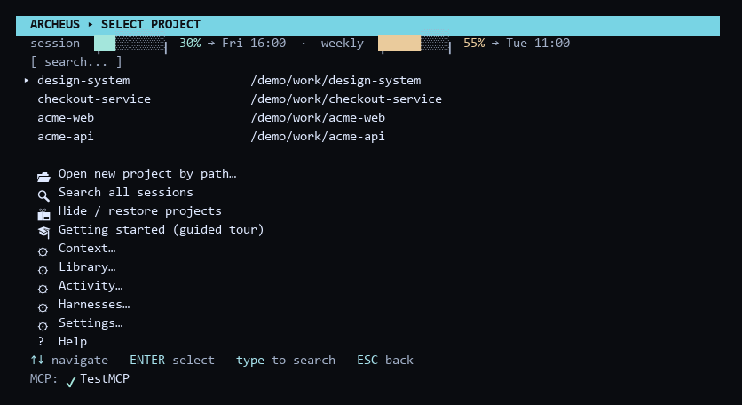
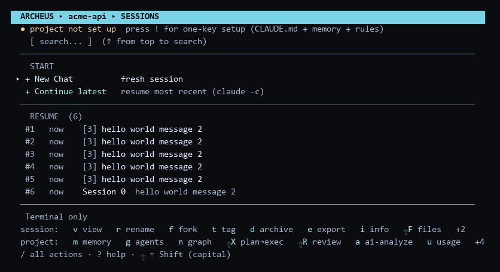

# Terminal UI

`archeus`. Keyboard-first, one screen per job. Everything here has an equivalent in the
[desktop app](desktop.md), and the headless jobs have a [command](cli.md).

## Main screen

On launch, archeus shows all projects Claude Code has ever opened, sorted by most recently
used.



- Quick-resume items appear at the top (★ = most recent session, ☆ = older sessions). These are the 5 most recently used sessions across all projects; selecting one resumes that exact session without navigating into the project's list.
- All other projects follow, sorted by recency — type to filter live
- The MCP status footer shows connected MCP servers once the background check completes
- Bottom menu: three rows that act on the list you are looking at — **📂 Open new
  project by path**, **🔍 Search all sessions**, **📦 Hide / restore projects** — then five
  sections, then **? Help**

The five sections are the same five the [desktop app](desktop.md) puts in its sidebar, in
the same order, and each one opens a submenu:

| Section | What is in it |
|---|---|
| **⚙ Context** | Global CLAUDE.md / MCP Analysis · MCP servers |
| **⚙ Library** | Agents · Skills · Hooks |
| **⚙ Activity** | Usage stats · Logs |
| **⚙ Accounts** | Accounts (switch, run two at once) |
| **⚙ Settings** | Settings · Updates (Claude Code + plugins) |

It used to be fourteen flat rows under the project list, which read as a wall and buried
the three that operate on the list itself. A section holding one row opens it directly
rather than showing a menu of one.

## Built-in screens

**🔍 Search all sessions** — indexes session names, AI titles, and previews across every
project (cached — instant after the first scan). Type to filter, ENTER resumes the selected
session directly, no matter which project it belongs to.

**⚙ Usage stats** — per-project table of sessions, messages, tokens (in / out / cache) and
estimated API-equivalent cost, parsed from local transcripts. ENTER drills into per-session
rows. Costs are estimates at published API rates — useful as a value/consumption gauge if
you're on a subscription plan. First scan shows progress and can be stopped with ESC
(partial results); later opens are instant thanks to a persistent cache.

**📦 Hide / restore projects** — takes a project out of the project list and out of the GUI
sidebar, for the folders you never want to launch from again. ENTER toggles the row under
the cursor. It is a view flag, not an archive: nothing on disk moves, the project's
sessions stay resumable, and restoring is one keypress. The main screen says how many rows
are being filtered; in the GUI a project page has a **Hide** button and the sidebar grows a
**Show N hidden projects** button while any are hidden.

**⚙ Logs** — what archeus itself did, and what failed. Its own headless Claude calls,
background jobs, the auto-memory scheduler, the failover proxy and any state file it had to
quarantine, newest first. Type `/` to search the stream, `e` to open the raw file. Before
this screen existed those failures went nowhere: a background job that crashed left no
trace, and a Claude call that failed because the account was out of quota was reported as
"No output from Claude". See [Logs](#logs) below.

**⚙ Global CLAUDE.md / MCP Analysis** — lists all connected MCP servers; select one to run
Claude with a prompt that calls the MCP's `tools/list` endpoint and formats the result as
markdown, written into `~/.claude/CLAUDE.md` inside a per-server sentinel block (cleanly
re-updatable). You can also open the global CLAUDE.md directly in your editor from this
menu. See [Global CLAUDE.md](configuration.md#global-claudemd).

## Notifications

A desktop notification — Windows toast, macOS notification centre, `notify-send` on Linux —
when a background job that ran longer than 20 seconds finishes, and when the detached
memory worker is done. That worker is the reason this exists: it runs headless, outlives
the screen that started it, and had no way to tell anyone it had finished. Quick jobs never
notify. **⚙ Settings → Notifications** turns it off.

## Logs

archeus does a lot of work you are not watching: the auto-memory scheduler, a detached
scan worker, background jobs in the GUI, the failover proxy, and its own headless `claude -p`
calls for every generate-this-for-me feature. All of those failures used to go nowhere — the
logger only wrote a file when `ARCHEUS_DEBUG` was set, which is off for everyone.

**⚙ Logs** (TUI) and the **Logs** page (GUI) read one append-only file:

```
~/.claude/archeus-events.jsonl
```

One line per event — `error`, `warn` or `info` — with the source, the message, and the
detail (a stack trace, or exactly what `claude` printed on stderr). It is capped at 256 KB
and drops its oldest half when it gets there, so it never needs attention. Nothing on a
per-turn path writes to it: every writer is an archeus-owned process, never a hook.

For verbose tracing of a specific problem, set `ARCHEUS_DEBUG=1` and read
`%TEMP%\archeus.log` — that one is DEBUG-level and unbounded, and is meant to be turned
on for one run and off again.

## Rate limits and a second account

When archeus wants to make one of its own Claude calls and the account's session or weekly
window is **already full**, it no longer launches the call anyway. It stops, and offers any
other configured account that still has headroom:

```
SESSION LIMIT FULL (RESETS 15:00) — RUN UNDER ANOTHER ACCOUNT?
  work      12% used
  personal  40% used
  Run under the current account anyway
  Cancel
```

The GUI asks the same question through the job approval modal. Unattended work — the
scheduler, the detached worker, a scheduled loop — never prompts: it records the reason in
the Logs and skips, rather than quietly spending an account you did not offer.

**⚙ Settings → `headless_quota`** controls it:

| Value | Behaviour |
|---|---|
| `prompt` *(default)* | offer another account; unattended work skips and says why |
| `auto` | switch to the account with the most headroom, no question asked |
| `off` | launch anyway — the old behaviour |

The check reads the usage data the plan-usage poller already fetched, so it costs no
network call and adds no latency. If that poller has not run yet, the call goes ahead as
before: an unknown limit is never treated as a full one.

## Loops

Two kinds, because Claude Code only offers one.

### In a session

`/loop` re-runs a prompt inside a session — polling a deploy, babysitting a PR, working
through a maintenance pass. Its tasks are **session-scoped**: they fire only while that
session is open and idle, expire after seven days, and a fresh conversation clears them.
archeus **starts** one by opening a session whose first typed message is
`/loop [interval] [prompt]` (with the project's usual account, agents, skills and system
prompt), **watches** it through that session's own transcript — each iteration is a turn —
and **ends** it by closing the session, because from outside the session there is no other
lever. Interval and prompt are both optional and each combination means something
different: both is a fixed schedule, prompt alone lets Claude choose the delay each time,
neither runs your `loop.md`.

### In the background

For work that should carry on with archeus closed and no session open, archeus
registers an entry in your **OS scheduler** — Task Scheduler on Windows, cron elsewhere —
that runs headless `claude -p` on the interval, in the project, under the account you pick.
This is archeus doing locally what Claude Code's own comparison table calls a Desktop
scheduled task.

Because it runs unattended, it carries its guardrails in the runner rather than the UI:

- **A permission mode you choose.** `claude -p` starts in Manual mode, so an unattended run
  does nothing unless it is told what it may do — `auto` (a classifier reviews each action),
  `acceptEdits` (writes files; shell and network still gated) or `dontAsk` (reports, never
  changes). The board shows which one each loop is running under.
- **A 7-day expiry**, the same bound Claude Code puts on its own scheduled tasks, enforced
  by the scheduled run itself: past it, the task removes itself. **Renew** pushes it out.
- **Your per-call budget cap** (`Settings → Budget cap`) on every run, and the cost of the
  last run on every row.
- **Nothing silent.** A failed run raises a desktop notification; the board keeps a log of
  the last twenty runs with their cost and one-line outcome.

Each run is a **fresh session** — resuming one forever would grow its context and its cost
without bound. What makes it a loop rather than a repeated one-shot is a rolling record:
after every run archeus rewrites a `ARCHEUS:LOOP` block in the project's `CLAUDE.md`
with the last five outcomes, so the next run starts knowing what the previous ones did. It
is rewritten, never appended, so it cannot grow.

**Stop** removes the scheduler entry, which is exact: it cannot fire again.

### `loop.md`

The prompt a bare `/loop` runs, and what a background loop runs when you leave the prompt
empty: `<project>/.claude/loop.md` wins over `<account>/loop.md`. Both are edited on the
same page, with **Build with AI** to draft one (you approve the text before it is written).
Edits apply from the next iteration.

## Key bindings

### Main screen (project list)

| Key | Action |
|-----|--------|
| ↑ / ↓ | Navigate |
| ENTER | Select project / resume / open menu item |
| Type text | Filter projects live |
| ESC | Clear filter, then exit |

### Sessions screen (session list for a project)



Grouped the way the `/` palette and the `?` help screen group them — the same four
buckets the desktop app puts its project tabs in. The keys themselves have not changed and
will not: they are muscle memory.

**Moving around**

| Key | Action |
|-----|--------|
| ↑ / ↓ | Navigate |
| ENTER | Select / confirm |
| ESC | Back / cancel (clears filter first if active) |
| BACKSPACE | Delete last filter character |
| Type text | Filter sessions live by name or preview |

**Sessions** — one row, one chat

| Key | Action |
|-----|--------|
| v | View transcript |
| r | Rename session |
| f | Fork session |
| t | Tag session |
| d | Archive or delete session |
| e | Export transcript to markdown |
| i | Session info (tokens, cost, models, branch) |
| F | Changed files (from session tool calls) |
| A | Toggle archived sessions view |
| ⇧K | New chat seeded with context from another session, any account ([hand-off](context-handoff.md)) |

**Context** — what Claude reads before you type

| Key | Action |
|-----|--------|
| m | Memory hub (build · ask · preview injection · lessons · toggles) |
| c | Scaffold CLAUDE.md (git + sessions) |
| a | AI-generate CLAUDE.md (Claude CLI) |
| s | Edit / generate system prompt |
| ⇧W | Context weight audit — token cost of everything auto-loaded per turn |
| L | Lessons review (approve / pin / evict session learnings) |
| M | Memory map (CLAUDE.md hierarchy) |
| ⇧C | Compress CLAUDE.md with AI (cut per-turn tokens) |
| ! | One-key project setup (first open: CLAUDE.md + memory + rules) |

**Actions** — one Claude call, one result

| Key | Action |
|-----|--------|
| ⇧X | Plan → Execute (plan on one model, execute on another) |
| ⇧R | Code review of the working diff |

**Project** — the folder and how it is launched

| Key | Action |
|-----|--------|
| n | Architecture graph + project memory screen (then `o` open graph · `m` build memory · `a` ask · `r` rebuild) |
| g | Pick project agents (library checklist → `.claude/agents/`) |
| u | Project usage stats |
| w | Workspace status (provenance & freshness) |
| p | Manage extra PATH entries |
| x | Manage --add-dir directories |

**Finding the rest**

| Key | Action |
|-----|--------|
| / | Action palette — every action, type-to-filter, in these same groups |
| ? | Help / keyboard reference |

### Transcript viewer (`v`)

| Key | Action |
|-----|--------|
| ↑ / ↓ | Scroll line by line |
| ← / → / SPACE | Page up / down |
| / | Search inside the conversation |
| n / p | Jump to next / previous match (wraps) |
| i | Toggle session info header (tokens, cost, models, branch) |
| e | Export to markdown |
| ESC | Clear search, then exit |

The footer shows your position as `msg N/M` — counting conversation messages, not raw lines.

### Launch options screen

| Key | Action |
|-----|--------|
| ↑ / ↓ | Switch fields (Effort / Model / Permissions / Lead agent / Account / Think cap / Subagents / Worktree / Name) |
| ← / → | Cycle values; edit Name/Worktree |
| e | Economy preset (Sonnet · 8k thinking cap · Haiku subagents) |
| ENTER | Launch with selected options |
| ESC | Back to main menu (no launch) |

Worktree & Name appear only for new sessions; Lead agent appears when `~/.claude/agents/`
has agents; Account appears when you've added extra accounts. **Think cap** sets
`MAX_THINKING_TOKENS` and **Subagents** sets `CLAUDE_CODE_SUBAGENT_MODEL` for the launched
session. Project agents picked with `g` are shown read-only here.

### Multi-select / confirm

- Checkbox pickers (MCP tools, agent tools): `SPACE` toggle, `a` all, `n` none, `v` view (agent `.md`, where available), `ENTER` confirm, `ESC` cancel.
- Confirm dialogs: `←→` choose, `ENTER` confirm, `ESC`/`y`/`n`.

## Elsewhere

Every screen above has an equivalent in the [desktop app](desktop.md), and every job that
does not need a UI has a [command line](cli.md) form — `workspace status`, `recall`,
`review`, `sync-accounts`, `statusline`.
